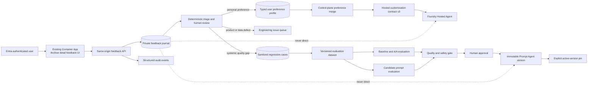
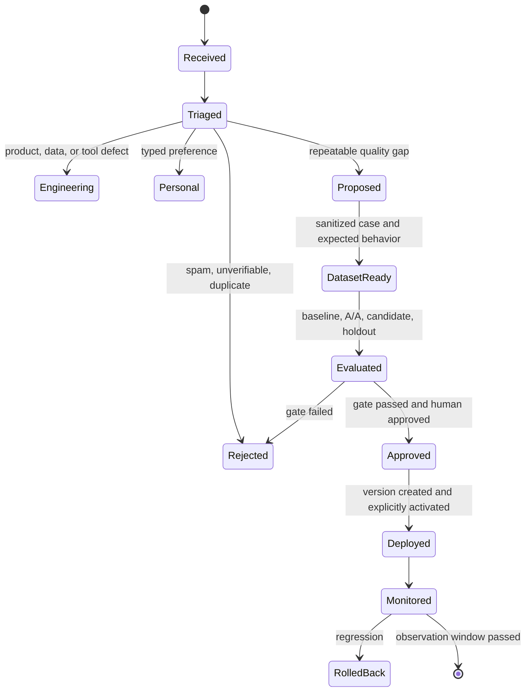

# 사용자 피드백 기반 지속 개선 체계

> Status: Proposed
>
> Date: 2026-08-30
>
> 이 문서는 목표 아키텍처와 단계별 구현 경계를 정의한다. 현재 런타임에 피드백 수집,
> 사용자 메모리, 자동 프롬프트 변경 기능이 이미 존재한다는 의미가 아니다.

## 1. 결정 요약

AzBrief Enterprise의 사용자 피드백은 다음 세 경로로 분리한다.

1. **보고서 인스턴스 피드백**은 재현 가능한 품질 회귀 사례가 된다.
2. **내 향후 보고서 선호**는 타입이 제한된 사용자별 표현 선호로 저장한다.
3. **전체 서비스 개선 의견**은 프롬프트 변경 제안이 되며, 고정 데이터셋 평가와 사람의 승인을
   통과한 새 Prompt Agent 버전으로만 배포한다.

어떤 경로에서도 사용자가 입력한 자유 텍스트를 그대로 SYSTEM instruction, LangGraph state,
`pattern_memory`, Prompt Agent instruction에 삽입하지 않는다. 투표 수만으로 사실을 결정하거나
프롬프트를 자동 승격하지도 않는다.

피드백 저장과 정책 결정은 Container Apps 제어면이 소유한다. Hosted Agent는 계속 유일한 분석
오케스트레이터이고, 현재 여섯 Prompt Agent 역할도 유지한다.

## 2. 현재 구조에서 지켜야 할 제약

- canonical archive v1은 `extra="forbid"`인 고정 계약이며 create-only Blob이다. 피드백을 기존
  문서에 덧붙이지 않는다.
- `$HOME/.azbrief`의 history와 pattern memory는 Hosted Agent 세션 로컬 최적화 상태다. 사용자별
  또는 조직 전체의 내구성 메모리로 사용할 수 없다.
- 구독자 맞춤 보고서는 전송 후 폐기되며 canonical archive에는 저장되지 않는다.
- Prompt Agent 버전은 불변이지만, Foundry의 기본 traffic policy는 최신 버전 사용이다. 후보
  버전을 안전하게 만들려면 운영 Agent를 먼저 특정 버전에 고정해야 한다.
- 같은 Agent 안에서는 버전별 traffic split을 지원하지 않는다. canary는 별도 staging project
  또는 별도 staging Agent에서 수행한다.
- Korea Central에서는 Foundry 평가 데이터 생성이 지원되지 않는 것이 확인되었다. 운영
  피드백에서 직접 큐레이션한 JSONL 데이터셋을 기본 경로로 사용한다.
- Foundry Human Evaluation과 Agent Optimizer는 preview다. 보조 도구로 사용할 수 있지만 운영
  피드백의 시스템 오브 레코드나 자동 배포 권한을 맡기지 않는다.

## 3. 목표와 비목표

### 목표

- 한 번의 의견도 안전 문제나 사실 오류라면 즉시 조사할 수 있게 한다.
- 반복되는 품질 결함을 동일한 입력과 근거로 재현하는 회귀 사례로 만든다.
- 사용자가 명시적으로 선택한 표현 선호만 이후 맞춤 보고서에 반영한다.
- 프롬프트 변경 전후를 같은 데이터셋, evaluator, 모델, 코드로 비교한다.
- 어떤 피드백이 어떤 변경과 Agent 버전에 영향을 주었는지 감사할 수 있게 한다.
- 품질 개선이 faithfulness, 조치 안전성, 지연 시간, 비용을 악화시키지 않게 한다.

### 비목표

- 사용자 투표로 Azure 사실이나 테넌트 상태를 결정하지 않는다.
- raw feedback을 RAG 문서처럼 매 분석에 주입하지 않는다.
- 사용자별로 서로 다른 조사·근거 수집 정책을 만들지 않는다.
- 일곱 번째 Prompt Agent나 별도 자율 학습 Agent를 추가하지 않는다.
- fine-tuning을 초기 개선 수단으로 사용하지 않는다. 데이터가 충분히 쌓이기 전에는 버전 관리되는
  instruction과 typed preference가 더 설명 가능하고 되돌리기 쉽다.

## 4. 목표 아키텍처



핵심 경계는 `Journal -> Triage -> Dataset -> Gate -> Version`이다. `Journal -> Prompt` 직통 경로는
존재하지 않는다.

### 호스팅 결정

피드백 UI와 API는 **기존 AzBrief Container App**에 함께 호스팅한다. 현재 앱이 이미 FastAPI,
`/archive`, `/admin`, EasyAuth, principal allow-list, nonce CSP, private networking, rate limiting,
control-plane UAMI를 소유하므로 별도 웹앱이나 별도 Container App을 만들 이유가 없다.

| Surface | 기존 Container App 경로 | 역할 |
|---|---|---|
| 사용자 입력 | `/archive/{archive_id}` 하단 panel | 보고서를 읽던 동일 화면에서 피드백 제출 |
| 제출 API | `POST /api/archive/analyses/{archive_id}/feedback` | same-origin 인증, 검증, journal 기록 |
| 사용자 선호 | `/archive/preferences`와 `/api/archive/preferences` | typed preference 조회, 변경, 초기화 |
| 운영 검토 | `/admin/feedback`와 `/api/admin/feedback/*` | triage, cluster, regression case 승인 |

이 배치는 다음 이점이 있다.

- Archive ID와 로그인 principal을 서버가 직접 결합하므로 클라이언트가 신원이나 출처를 주장하지
  않는다.
- 기존 EasyAuth session과 same-origin CSP를 재사용해 별도 OAuth client, CORS, token 전달 경로가
  생기지 않는다.
- 기존 control-plane UAMI로 private feedback container에 접근하고 Hosted Agent identity에는
  feedback data-plane 권한을 주지 않는다.
- 기존 control-plane image와 배포 pipeline을 유지해 운영 표면과 비용을 늘리지 않는다.

기본 `vnetInjection` 배포에서 `internalIngressOnly=true`이면 피드백 화면도 Archive와 마찬가지로
VNet 내부에서만 접근할 수 있다. 외부 이메일 구독자에게 피드백을 받을 필요가 있으면 먼저 기존
Container App ingress와 EasyAuth 정책을 그 사용자 집단에 맞게 확장한다. 익명 인터넷 피드백,
별도 tenant, 독립적인 SLA·확장·보존 정책처럼 **신뢰 경계가 실제로 달라질 때만** 별도 앱을
검토한다.

## 5. 피드백 경험

Archive 상세 화면 하단에 다음 컨트롤을 둔다.

- 전체 평가: `도움이 됨` / `개선 필요`
- 이유: `사실 오류`, `근거 부족`, `영향 판단 오류`, `조치가 실행 불가`, `조치가 위험함`,
  `직무와 맞지 않음`, `너무 길거나 짧음`, `문장이 부자연스러움`, `기타`
- 적용 범위:
  - `이 보고서만 평가`
  - `내 향후 보고서 선호에 반영`
  - `전체 서비스 개선 의견으로 제출`
- 선택 입력: 잘못된 구절, 기대한 내용, 보충 설명
- 선택 차원 점수: actionability, faithfulness, job relevance, structure,
  architectural depth의 1-5점

피드백 제출은 반드시 명시적 `POST`로 처리한다. 이메일의 링크나 Archive의 `GET` 요청에서 투표를
기록하지 않는다. 메일 보안 제품과 링크 스캐너가 `GET` URL을 자동 방문하기 때문이다.

1차 릴리스는 현재 Archive reader인 Entra principal만 제출할 수 있게 한다. 이후 일반 구독자까지
넓힐 때는 별도 `FEEDBACK_ALLOWED_PRINCIPALS` 또는 Entra group을 추가한다. 인증되지 않은
one-click feedback token은 도입하지 않는다.

## 6. 피드백 분류와 라우팅

| 입력 | 기본 경로 | 자동 반영 가능 여부 | 비고 |
|---|---|---:|---|
| 사실 오류, 누락된 근거, 잘못된 리소스 | 회귀 사례 + 조사 | 불가 | Azure 문서와 당시 evidence snapshot으로 확인 |
| 위험하거나 실행 불가능한 조치 | 즉시 release blocker + 회귀 사례 | 불가 | 한 건이어도 심각도에 따라 차단 가능 |
| 도구 실패, 오래된 데이터, 잘못된 API 결과 | engineering issue | 불가 | 프롬프트로 가리지 않음 |
| 더 간결하게, CLI 우선, 보안 중심 | typed personal preference | 가능 | 허용된 enum 값만 저장 |
| 역할에 맞지 않는 설명 | personal preference 또는 report-writer 후보 | 조건부 | 개인 문제인지 반복 문제인지 구분 |
| 번역체, 반복 표현, 구조 문제 | prompt change proposal | 불가 | 언어별 holdout으로 검증 |
| 단순 좋아요 | positive preservation case | 불가 | 현재 동작을 보존하는 회귀 사례 후보 |
| 자유 텍스트의 명령 또는 instruction | raw feedback only | 불가 | untrusted content로 취급 |

다음 규칙을 적용한다.

- 사실성과 안전성 문제는 사용자 수가 한 명이어도 triage한다.
- 일반 품질 문제는 기본적으로 14일 안에 서로 다른 주체 3명 이상 또는 서로 다른 보고서 5건
  이상에서 반복될 때 전역 후보로 올린다. 임계값은 설정 가능해야 한다.
- 동일 주체가 같은 archive에 반복 제출한 값은 하나의 최신 의견으로 집계하되, 원 이벤트는 감사
  목적으로 보존한다.
- 다수결은 우선순위 신호일 뿐 사실 판정이 아니다.

## 7. 데이터 계약

### 7.1 클라이언트 입력

클라이언트는 평가 내용만 제출한다. 신원, 시각, Agent 버전, trace ID는 서버가 채운다.

```json
{
  "schema_version": "1",
  "target": "canonical_report",
  "scope": "global_candidate",
  "sentiment": "needs_improvement",
  "reason_codes": ["missing_evidence", "job_relevance"],
  "dimension_ratings": {
    "faithfulness": 3,
    "job_relevance": 2
  },
  "excerpt": "검토 대상 문장",
  "comment": "어떤 근거와 관점이 빠졌는지 설명"
}
```

제한:

- `reason_codes`는 enum이고 최대 3개다.
- `excerpt`는 1,000자, `comment`는 4,000자로 제한한다.
- HTML과 Markdown 실행 의미는 제거하고 평문으로 저장한다.
- path의 `archive_id`와 body의 참조가 다르면 거부한다.
- `scope=personal_preference`는 별도의 typed preference payload가 없으면 일반 의견으로만 저장한다.

### 7.2 서버 소유 이벤트

`FeedbackEventV1`은 다음 필드를 추가한다.

| 필드 | 설명 |
|---|---|
| `feedback_id` | 서버가 생성한 UUID |
| `archive_id` | canonical 분석 버전 |
| `submitted_at` | UTC 시각 |
| `actor_key` | `HMAC-SHA256(deployment_key, tenant_id + object_id)` 가명 식별자 |
| `channel` | `archive_ui`, `email_deep_link`, `admin_import` |
| `source_trace_id` | archive 문서의 trace ID |
| `analysis_release_id` | Hosted/code/prompt bundle을 가리키는 release manifest ID |
| `status` | `received`, `triaged`, `withdrawn`, `exported` |
| `supersedes_feedback_id` | 사용자가 의견을 수정했을 때 이전 이벤트 참조 |
| `sanitization` | PII/secret 검사 결과와 제거 항목 수 |

UPN, 이메일, 표시 이름, access token, cookie는 이벤트에 저장하지 않는다. 단순 SHA-256은 UPN을
사전 대입으로 복원할 수 있으므로 사용하지 않는다.

### 7.3 사용자 선호 프로필

사용자 메모리는 자유 텍스트가 아닌 `UserReportPreferencesV1`로 제한한다.

```json
{
  "schema_version": "1",
  "detail_level": "concise",
  "emphasis": ["security", "operations"],
  "action_style": "cli_first",
  "max_action_items": 3,
  "include_concept_boxes": false,
  "updated_at": "2026-08-30T00:00:00Z",
  "source_feedback_ids": ["..."]
}
```

사용자 선호는 다음 항목을 절대 변경할 수 없다.

- 구독과 resource group 접근 범위
- Azure evidence 도구와 조사 깊이
- 사실성 및 안전 gate
- 위험 명령 withholding 정책
- 중요성, 영향도, 직무 연관성의 근거 기반 판정
- 관리자 지정 역할과 전송 정책

### 7.4 프롬프트 변경 제안

`PromptChangeProposalV1`은 다음을 묶는다.

- 원인이 된 feedback ID와 cluster
- 대상 역할과 source prompt 파일
- 하나의 검증 가능한 가설
- 변경 전후 instruction diff
- 개선해야 할 `expected_behavior`
- 보존해야 할 anchor와 금지되는 회귀
- training/evaluation/holdout dataset 버전
- baseline/candidate release manifest
- evaluator와 threshold
- 사람 검토자, 승인 시각, 배포/롤백 결과

## 8. 저장소와 보존 정책

기존 Entra-only Storage account에 목적이 다른 세 container를 둔다.

| Container | 내용 | 쓰기 방식 | 기본 보존 |
|---|---|---|---|
| `azbrief-feedback` | raw `FeedbackEventV1` | create-only event | 90일 |
| `azbrief-user-memory` | 사용자별 typed preference materialized view | ETag 조건부 갱신 | 구독 종료 또는 철회까지 |
| `azbrief-learning` | 비식별 regression case, dataset, proposal, eval 결과, release manifest | 새 버전만 생성 | 장기 |

객체 이름 예시:

```text
azbrief-feedback/events/2026/08/30/{archive_id}/{feedback_id}.json
azbrief-feedback/withdrawals/2026/08/30/{feedback_id}.json
azbrief-user-memory/profiles/{actor_key}.json
azbrief-learning/cases/{case_id}/v1.json
azbrief-learning/datasets/feedback-regression/v3.jsonl
azbrief-learning/proposals/{proposal_id}/candidate.json
azbrief-learning/releases/{release_id}.json
```

raw comment는 민감 데이터일 수 있다. credential, bearer token, connection string, private key 등은
저장 전에 제거한다. 리소스 이름과 subscription ID는 triage에 필요할 수 있으므로 raw 영역에서만
기밀 데이터로 취급하고, 장기 evaluation case로 승격할 때 안정적인 placeholder로 치환한다.

사용자 철회는 withdrawal 이벤트를 기록하고 materialized view와 집계에서 즉시 제외한다. 법적
삭제 요청은 immutable 감사 요구보다 우선할 수 있으므로, raw container에는 Azure Storage의 법적
보존 잠금을 기본 적용하지 않고 제한된 privacy-admin 삭제 절차를 둔다.

## 9. 인증, CSRF, 악용 방지

- `POST /api/archive/analyses/{archive_id}/feedback`은 EasyAuth principal과 feedback allow-list를
  모두 요구한다.
- 서버가 archive 존재 여부를 확인한 뒤 이벤트를 저장한다.
- 서버 렌더링 시 principal, archive ID, 만료 시각에 묶인 서명 CSRF token을 발급하고
  `X-AzBrief-CSRF`로 돌려받는다. `Origin`도 `ARCHIVE_BASE_URL`과 일치해야 한다.
- `Content-Type: application/json`, 요청 크기 제한, actor/archive별 rate limit,
  `Idempotency-Key`를 강제한다.
- raw comment, excerpt, principal display name은 structlog와 Application Insights에 남기지 않는다.
  로그에는 feedback ID, archive ID, reason code, scope, 상태만 기록한다.
- feedback은 외부 tool result와 같은 untrusted content다. Web Search, Azure MCP, Azure API,
  Resource Graph 또는 Prompt Agent instruction에 그대로 전달하지 않는다.
- 집계 시 actor별 가중치는 1로 제한하고 자동화된 반복 제출과 비정상 패턴을 격리한다.

## 10. 사용자별 메모리 적용

개인 선호는 제어면에서 구독자 맞춤화 요청 직전에 읽는다.

적용 우선순위는 다음과 같다.

1. 제품 안전 정책과 관리자 정책
2. 관리자 지정 `Subscriber` 역할, 범위, 언어, alert level
3. 사용자가 명시적으로 저장한 표현 선호
4. 현재 요청에만 적용되는 일회성 옵션

`HostedCustomizationRequest`의 현재 계약은 `extra="forbid"`인 v2다. 구현 시 계약을 v3로 올리고
`HostedReportPreferences` 타입을 추가한다. 제어면은 profile을 enum과 숫자로 검증한 뒤에만 v3
요청을 만든다. Report Writer에는 렌더링된 제한 값만 전달하며 raw feedback text는 전달하지 않는다.

이 메모리는 `customize_for_subscriber` 단계에서 표현과 우선순위만 바꾼다. planning, Resource
Graph, Azure MCP, Azure API evidence collection에는 영향을 주지 않는다. 따라서 한 사용자의 선호가
테넌트 사실이나 다른 사용자의 보고서를 바꾸지 않는다.

## 11. 전역 프롬프트 개선 수명 주기



### 11.1 Triage

- 안전, 사실성, 데이터 결함을 먼저 분리한다.
- prompt로 해결할 수 없는 도구/API/권한 문제는 engineering issue로 보낸다.
- Quality Reviewer는 cluster 요약과 proposal 초안을 제안할 수 있지만 최종 분류 권한은 없다.
- 동일 문제의 positive/negative 사례를 함께 수집한다. 부정 사례만 최적화하면 이미 잘 되던 동작을
  잃기 쉽다.

### 11.2 회귀 데이터셋

승인된 사례를 JSONL로 버전 관리한다. 각 행에는 다음이 필요하다.

- 업데이트 입력과 당시의 sanitized evidence snapshot
- canonical output 또는 재현 가능한 expected behavior
- category, language, role, Azure service, 영향 유무
- feedback reason과 사람이 확인한 correction
- 원본 archive/release 추적 ID
- dataset split: `train`, `evaluation`, `holdout`

동일한 archive에서 파생된 행은 한 split에만 둔다. positive preservation case도 포함한다. 데이터셋
행을 삭제하거나 evaluator를 약화해 점수를 회복하지 않는다.

### 11.3 평가 gate

모든 후보는 동일한 입력, evidence snapshot, evaluator, 모델 설정으로 baseline과 비교한다.

1. unit/import/prompt assembly/roster 검증
2. rule-based mechanical evaluator
3. 현재 5차원 G-Eval
4. action safety와 command withholding 회귀 검사
5. language-specific 품질 검사
6. indirect prompt injection과 malicious feedback 회귀 검사
7. 동일 설정 A/A 실행으로 noise floor 측정
8. paired A/B와 미사용 holdout 평가
9. latency, token, tool-call 수 비교

AzBrief에서 측정한 현재 A/A minimum detectable effect는 약 0.15점이다. 따라서 전체 G-Eval 개선을
주장하려면 paired delta가 0.15 이상이어야 한다. 0.10점 차이를 보려면 최소 약 24개 update를
사용한다. 그보다 작은 sample에서는 aggregate score보다 대상 결함의 0/N 발생 횟수, critical flaw,
unsafe action 같은 countable signal을 우선한다.

승격 조건:

- targeted defect가 사라지거나 사전 정의 threshold 이상 감소
- faithfulness critical flaw 0건
- unsafe action과 잘못된 command 증가 0건
- affected-resource 및 evidence completeness 회귀 0건
- 영향받는 모든 언어의 holdout 통과
- p95 latency/token 증가는 기본 10% 이내, 초과 시 명시적 비용 승인
- aggregate score가 A/A noise 밖에서 악화되지 않음
- 사람이 diff, 사례별 결과, 비용을 검토하고 승인

Agent Optimizer를 사용할 경우 후보 생성기로만 취급한다. optimizer 결과의 별표나 composite score는
자동 승격 권한이 아니다.

## 12. Prompt Agent 버전, 승격, 롤백

운영 배포 전에 여섯 Prompt Agent 모두 `version_selector`를 특정 검증 버전에 고정한다. Foundry의
기본값인 `Always use latest` 상태에서는 새 후보 version 생성 즉시 운영 traffic이 바뀔 수 있다.

권장 절차:

1. 현재 여섯 역할의 active version, instruction SHA-256, tool schema SHA-256, model, Hosted Agent
   version, code commit을 `release manifest`로 기록한다.
2. production Prompt Agent는 특정 active version에 고정한다.
3. candidate는 staging project 또는 staging Agent name에서 생성한다.
4. agent-target batch evaluation은 baseline과 candidate의 명시적 version을 대상으로 실행한다.
5. 승인 후 production Agent에 새 immutable version을 만들되 아직 활성화하지 않는다.
6. drift check와 smoke evaluation이 통과하면 active version selector를 변경한다.
7. Hosted Agent와 여섯 역할의 최종 조합을 새 release manifest에 기록한다.
8. 회귀 시 selector를 이전 검증 version으로 되돌리고 같은 smoke suite를 다시 실행한다.

Foundry는 같은 Agent 내 비율 기반 traffic split을 제공하지 않으므로 production에서 5% canary 같은
설계를 가정하지 않는다. 별도 staging endpoint가 canary 역할을 한다.

현재 `scripts/provision_foundry_agents.py --check`는 latest definition 중심이다. 구현 시에는 desired
release manifest의 **active pinned version**과 instruction/tool/schema hash도 검증하도록 확장해야 한다.

## 13. 관측성과 운영 지표

### 이벤트

- `feedback_received`
- `feedback_triaged`
- `feedback_withdrawn`
- `preference_updated`
- `regression_case_created`
- `prompt_candidate_evaluated`
- `prompt_release_approved`
- `prompt_release_activated`
- `prompt_release_rolled_back`

모든 이벤트는 `feedback_id`, `proposal_id`, `release_id`, `archive_id` 같은 비식별 상관 ID를 사용한다.

### 지표

- feedback participation rate와 제출 완료율
- reason code별 비율, language/role/service별 cluster
- 사실성·안전성 피드백의 triage SLA
- proposal 채택률과 평균 lead time
- release 전후 targeted defect 발생률
- positive preservation case 회귀율
- personal preference 적용 전후 동일 사용자 만족도
- G-Eval 5차원, critical flaw, action safety
- p50/p95 latency, token, tool-call 수, update당 비용
- rollback 횟수와 복구 시간

좋아요 비율 하나를 north-star metric으로 쓰지 않는다. 짧고 피상적인 보고서가 더 많은 좋아요를
받는 reward hacking이 생길 수 있기 때문이다.

## 14. 단계별 구현 계획

### Phase 0: 버전 재현성

- Prompt Agent 여섯 역할을 explicit version selector로 고정한다.
- active-version-aware roster check와 release manifest를 추가한다.
- canonical archive를 v2로 올리거나 immutable provenance sidecar를 추가해
  `analysis_release_id`를 분석 시점에 기록한다.

완료 조건: archive ID 하나에서 Hosted version, 여섯 specialist version, prompt/tool hash, code commit을
정확히 복원할 수 있다.

### Phase 1: 수집만 하는 안전한 피드백

- `src/feedback/`에 model, auth, service, router를 추가한다.
- `src/services/feedback.py`에 inert/File/Blob backend를 추가한다.
- 기존 FastAPI Container App의 Archive detail에 POST 기반 feedback form을 추가하고 같은 앱에
  feedback router를 mount한다. 새 Container App, ingress, image는 만들지 않는다.
- `src/i18n/labels/ko.py`에 canonical label key를 먼저 추가하고 다른 bundle을 번역한다.
- `src/config.py`, `.env.example`, Bicep source와 compiled template에 private container 설정을 추가한다.
- raw feedback은 어떤 분석이나 prompt에도 사용하지 않는다.

완료 조건: 인증, CSRF, rate limit, idempotency, create-only write, PII/secret redaction, withdrawal,
no-log-content 테스트가 통과한다.

### Phase 2: triage와 회귀 데이터셋

- Admin에 feedback queue, reason filter, 상태 변경, 비식별 preview를 추가한다.
- `scripts/export_feedback_dataset.py`로 승인된 사례만 sanitized JSONL로 내보낸다.
- dataset manifest에 source feedback, split, version, redaction, release lineage를 기록한다.
- 기존 `evaluate_batch.py`와 G-Eval에 고정 evidence snapshot 실행 모드를 추가한다.

완료 조건: 같은 dataset/release를 다시 실행했을 때 입력과 evaluator 구성이 동일하다.

### Phase 3: typed personal memory

- `UserReportPreferencesV1`과 ETag 기반 profile store를 추가한다.
- Hosted contract를 v3로 올리고 `HostedReportPreferences`를 추가한다.
- control plane에서 정책, Subscriber, 사용자 선호 순으로 merge한다.
- 사용자에게 현재 선호 보기, 수정, 초기화 기능을 제공한다.

완료 조건: 한 사용자의 선호가 다른 사용자나 evidence collection에 영향을 주지 않는 concurrency
테스트가 통과한다.

### Phase 4: 평가 기반 prompt release

- `PromptChangeProposalV1`, baseline/candidate/holdout orchestration, approval gate를 추가한다.
- candidate 생성과 production 활성화를 분리한다.
- active version pin, smoke suite, release manifest, rollback을 하나의 비대화형 release command로
  묶는다.
- CI는 승인된 proposal과 dataset version 없이는 prompt drift를 배포하지 못하게 한다.

완료 조건: 실패 후보는 운영 traffic을 받지 않고, 승인 후보는 이전 버전으로 즉시 rollback할 수
있다.

### Phase 5: 선택적 Foundry 기능

- Foundry Human Evaluation 결과를 보조 import source로 사용한다.
- Agent Optimizer는 candidate proposal 생성에만 사용한다.
- 지원 region 또는 기존 dataset을 사용해 batch/continuous evaluation을 연결한다.
- preview 기능 장애 시 자체 journal, dataset, G-Eval, release gate가 계속 동작해야 한다.

## 15. 예상 파일 경계

| 책임 | 파일 또는 디렉터리 |
|---|---|
| feedback 계약, auth, API, application service | `src/feedback/` |
| Blob/File data access | `src/services/feedback.py` |
| Archive feedback UI | `src/archive/page.py` |
| 설정과 validation | `src/config.py`, `.env.example` |
| v3 customization contract | `src/agent/hosted_contract.py`, `src/agent/hosted_client.py` |
| preference-aware rendering | `src/agent/prompts/subscriber.py` |
| prompt release/version pin | `scripts/provision_foundry_agents.py`, 별도 release script |
| dataset export/evaluation | `scripts/export_feedback_dataset.py`, `scripts/evaluate_batch.py` |
| storage/network/RBAC | `infra/enterprise/main.bicep` 및 compiled ARM template |
| focused tests | `tests/test_feedback.py`, archive/config/hosted/provisioning/evaluation tests |

서비스 계층은 data access만 소유한다. triage, preference merge, proposal, release gate 같은 business
logic은 `src/feedback/` application layer에 둔다.

## 16. 거부한 대안

| 대안 | 거부 이유 |
|---|---|
| raw feedback을 다음 SYSTEM prompt에 바로 추가 | prompt injection, 사용자 간 오염, 재현 불가 |
| Hosted `$HOME/.azbrief`를 전역 메모리로 사용 | 세션 로컬, 소실 가능, control-plane audit 불가 |
| archive v1 문서에 feedback을 append | immutable/frozen schema와 canonical 의미 훼손 |
| 좋아요가 많은 문장을 자동 학습 | 사실성과 인기 혼동, reward hacking |
| 새 Feedback Agent 추가 | 여섯 역할 계약을 깨고 승인 책임을 LLM에 위임 |
| Agent Optimizer 결과 자동 배포 | preview 의존, evaluator Goodhart 위험, human gate 부재 |
| 이메일 GET 링크로 즉시 투표 | 보안 scanner가 거짓 투표 생성 가능 |
| free-text personal memory | 장기 prompt injection과 비결정적 personalization |
| production 최신 버전 자동 추종 | 후보 생성만으로 traffic 변경 가능 |

## 17. 수용 기준

이 체계는 다음이 모두 증명되어야 완료로 본다.

- 모든 피드백은 archive와 release에 추적 가능하다.
- canonical archive와 subscriber PII 분리 원칙이 유지된다.
- raw user text가 runtime prompt에 들어가는 코드 경로가 없다.
- 사용자는 자신의 preference를 조회, 수정, 초기화, 철회할 수 있다.
- 동일 사용자/보고서 중복 제출이 aggregate를 왜곡하지 않는다.
- 승인된 모든 prompt 변경에 versioned dataset, paired baseline, holdout, 사람 승인이 있다.
- 새 Prompt Agent version 생성만으로 production traffic이 바뀌지 않는다.
- rollback 후 roster, smoke evaluation, archive provenance가 이전 정상 release와 일치한다.
- preview Foundry 기능이 없어도 핵심 수집, 평가, 승인, 롤백 체계가 동작한다.

## 18. 공식 참고 자료

- [Configure and share your agent](https://learn.microsoft.com/azure/foundry/agents/how-to/configure-agent)
  - immutable Agent version, `version_selector`, production version pinning
- [Evaluation datasets in Microsoft Foundry](https://learn.microsoft.com/azure/foundry/observability/how-to/evaluation-datasets)
  - 재사용 가능한 JSONL dataset과 version 비교
- [Evaluate your AI agents](https://learn.microsoft.com/azure/foundry/observability/how-to/evaluate-agent)
  - rubric evaluator, agent-target batch evaluation, CI/CD gate
- [Set up human evaluation for your agents](https://learn.microsoft.com/azure/foundry/observability/how-to/human-evaluation)
  - thumbs, slider, multiple choice, free text 기반 human review. Preview이므로 보조 수단으로만 사용
- [Agent optimizer overview](https://learn.microsoft.com/azure/foundry/agents/concepts/agent-optimizer-overview)
  - baseline, dataset, evaluator, candidate 비교와 새 version 승격. Preview이므로 자동 배포 금지
