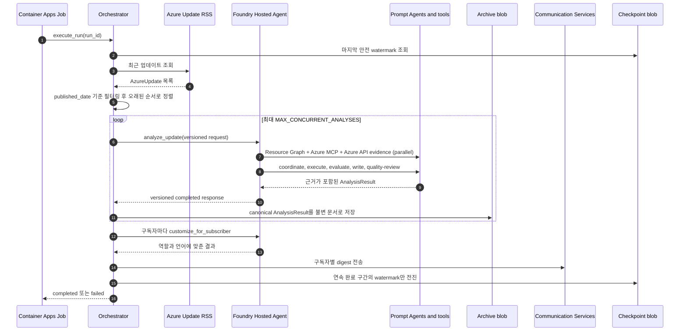
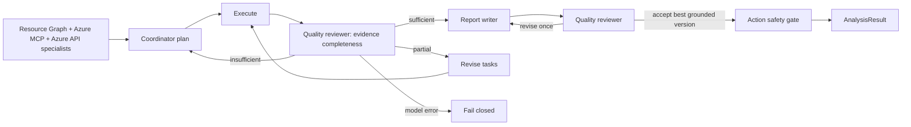

<div align="center">

# AzBrief Enterprise

[English](README.md) | **한국어**

**Azure 업데이트를 실제 환경에 맞게 분석해 받은 편지함으로 전달합니다.**

[](https://www.python.org/downloads/)
[](https://learn.microsoft.com/azure/foundry/agents/concepts/hosted-agents)
[](https://github.com/langchain-ai/langgraph)
[](https://learn.microsoft.com/azure/container-apps/)
[](LICENSE)

Container Apps Job (cron) → Microsoft Foundry Hosted Agent → Communication Services
· Container App 제어면 + `/admin` + `/mcp` · 기본값은 VNet 주입 + Private Endpoint

[](https://portal.azure.com/#create/Microsoft.Template/uri/https%3A%2F%2Fraw.githubusercontent.com%2FNetworkdog%2FAzBriefEnterprise%2Fmain%2Finfra%2Fazbrief-enterprise-deploy.json)

</div>

---

> **Standard 에디션을 찾고 계신가요?** Automation Runbook 배포는
> [Networkdog/AzBrief](https://github.com/Networkdog/AzBrief)에 있습니다. Standard와
> Enterprise는 같은 AzBrief 제품의 두 에디션이며, 동일한 미션과 분석 코어를 공유합니다.

<!-- TABLE OF CONTENTS -->
<details>
<summary>목차</summary>

- [제품 정체성](#제품-정체성)
- [AzBrief Enterprise가 필요한 이유](#azbrief-enterprise가-필요한-이유)
- [제공 기능](#제공-기능)
- [아키텍처](#아키텍처)
- [엔드투엔드 동작](#엔드투엔드-동작)
- [빠른 시작](#빠른-시작)
- [배포](#배포)
  - [원클릭 배포](#원클릭-배포)
  - [네트워크 격리](#네트워크-격리-networkisolationmode)
  - [배포 후 단계](#배포-후-단계)
  - [예약 실행 운영](#예약-실행-운영)
- [멀티 에이전트 파이프라인](#멀티-에이전트-파이프라인)
- [관리자 콘솔](#관리자-콘솔)
- [분석 아카이브](#분석-아카이브)
- [분석 동작 방식](#분석-동작-방식)
- [구독자별 보고서](#구독자별-보고서)
- [구성](#구성)
- [API](#api)
- [개발](#개발)
- [프로젝트 구조](#프로젝트-구조)
- [디렉터리 가이드](#디렉터리-가이드)
- [기술 스택](#기술-스택)
- [문제 해결](#문제-해결)
- [라이선스](#라이선스)

</details>

## 제품 정체성

AzBrief Enterprise는 [AzBrief](https://github.com/Networkdog/AzBrief)의 Enterprise 에디션이며,
목적이 다른 별도 제품이 아닙니다. 두 에디션은 같은 분석 코어와 제품 정체성을 공유합니다.
이 저장소는 그 기반에 거버넌스가 적용된 Microsoft Foundry 런타임, 프라이빗 네트워킹,
내구성 상태 저장소와 엔터프라이즈 운영 기능을 더합니다.

### 개요

AzBrief는 Azure 관리자를 위한 **Azure Update Intelligence Agent**입니다. Azure 업데이트를
수집하고 테넌트의 실제 리소스와 연계해 각 업데이트의 중요성, 영향도, 직무 연관성을 독립적으로
평가합니다. 그 결과를 근거와 구체적인 조치가 포함된 역할별 일일 digest로 만듭니다.

### 미션

**일반적인 Azure 공지를 현재 환경에 어떤 의미가 있으며 담당 운영자가 다음에 무엇을 해야
하는지로 변환합니다.** AzBrief는 Azure가 바뀌었다는 사실을 아는 단계와 적시에 근거 있는 운영
결정을 내리는 단계 사이의 간극을 메웁니다.

### 제품 방향

| 원칙 | 방향 |
|---|---|
| **일반 요약보다 환경 우선** | 테넌트의 실제 리소스, 구성, 상태, 정책, 비용, 지역 가용성을 근거로 결론을 내립니다 |
| **알림보다 조치 우선** | 변경 설명을 넘어 범위가 명확한 절차, 명령, 기한, 위험 경고를 제공합니다 |
| **암묵적 필터링 없는 전체 범위** | 수집한 모든 업데이트를 분석해 근거 수집 전에 은퇴, 보안 위험, 도입 기회를 버리지 않습니다 |
| **하나의 업데이트, 여러 책임** | 동일한 근거를 인프라, 보안, 아키텍처 등 각 담당자의 역할과 언어에 맞게 조정합니다 |
| **자율성보다 신뢰 우선** | 근거를 추적할 수 있게 하고 실행 가능한 조치를 검증하며, 신원·권한·모델 기능이 불명확하면 fail closed합니다 |
| **설계 단계부터 적용한 엔터프라이즈 거버넌스** | Entra 전용 접근, 관리되는 Prompt Agent, 기본 프라이빗 네트워킹, 관측성, 복구 가능한 상태로 같은 인텔리전스 미션을 수행합니다 |

### 목표

- 많은 Azure 업데이트 피드를 매일 읽고 분류하는 작업을 줄입니다.
- 추론에만 의존하지 않고 테넌트 근거에서 영향을 받는 리소스, 위험, 기회를 식별합니다.
- 서비스, 보안, 비용, 거버넌스 문제를 피할 수 있도록 안전하고 구체적인 다음 조치를 제때
  전달합니다.
- 핵심 조사를 중복하지 않으면서 각 이해관계자의 역할에 맞는 브리핑을 제공합니다.
- 관련성, 실행 가능성, 언어 품질을 낮추지 않고 기존 AzBrief 경험을 규제 환경까지 확장합니다.

### 비전

Azure 변경 인텔리전스를 일상적인 운영 역량으로 정착시킵니다. 모든 Azure 팀이 하루를 시작할
때 **무엇이 바뀌었고, 어디에 영향을 주며, 왜 중요하고, 다음에 무엇을 해야 하는지**를 자기
환경에 맞게 알 수 있어야 합니다. 이 미래에서 Azure 업데이트는 읽어야 할 공지 하나가 아니라,
담당자가 바로 활용할 수 있는 근거 기반 의사결정 정보입니다.

<p align="right">(<a href="#azbrief-enterprise">맨 위로</a>)</p>

## AzBrief Enterprise가 필요한 이유

Azure는 매주 수십 건의 업데이트를 게시합니다. 새 기능, 서비스 은퇴, 보안 패치, 가격 변경은
각각 운영 환경에 영향을 줄 수 있지만, 이를 모두 따라가기는 어렵습니다.

- **많은 양.** 매년 수백 건의 업데이트가 나오지만 그중 실제로 관련 있는 항목은 일부뿐입니다.
  이를 찾으려면 매일 피드를 읽어야 합니다.
- **맥락 부족.** Azure는 *무엇이* 바뀌었는지는 알려 주지만, *내 리소스 중 무엇이 영향을
  받는지*, *어떤 조치를 해야 하는지*까지 알려 주지는 않습니다.
- **하나의 설명으로 모두를 만족시킬 수 없음.** 인프라 엔지니어에게는 마이그레이션 단계가,
  보안 담당자에게는 규정 준수 영향이 필요합니다. 같은 공지라도 필요한 관점은 다릅니다.

AzBrief는 Azure 업데이트를 수집하고 Resource Graph를 통해 테넌트의 실제 리소스와 대조합니다.
각 항목을 중요성, 영향도, 직무 연관성으로 분류하고 CLI 명령, 절차, 기한이 포함된 통합 일일
digest를 팀 구성원의 받은 편지함으로 전달합니다.

**Enterprise** 에디션은 이 분석에 규제 환경에 필요한 기능을 더합니다.

| | |
|---|---|
| **거버넌스가 적용된 전문가 팀** | 하나의 Foundry Hosted Agent가 전체 LangGraph 런타임을 소유하고, 서로 다른 여섯 Prompt Agent가 조정, Resource Graph, Azure MCP, Azure API, 보고서 작성, 품질 검토 전문성을 제공합니다 |
| **모델 API 키 없음** | Foundry는 Entra 전용(`disableLocalAuth`)으로 동작하며 상태 계정도 Entra 전용입니다. Container App API/MCP 접근은 범위가 제한된 별도의 제어면 키를 사용합니다 |
| **기본값은 프라이빗** | `vnetInjection`이 에이전트 컴퓨트를 위임 서브넷에 주입하고 Container Apps를 같은 VNet에 통합하며 Foundry, Key Vault, 상태 계정을 Private Endpoint 뒤에 둡니다 |
| **관리형 분석 컴퓨트** | Foundry가 세션마다 격리된 Hosted Agent sandbox를 프로비저닝하고 endpoint, 수명 주기, 확장, 신원, 관측성을 관리합니다 |
| **관리자 콘솔** | 명시적인 principal 허용 목록과 Entra ID 로그인을 적용한 `/admin`에서 실행 시작, 구성 확인, 실행 이력 검토가 가능합니다 |
| **분석 아카이브** | `/archive`가 canonical 분석의 모든 버전을 private Blob Storage에 보존하고, 구독자 PII를 저장하지 않으면서 인증된 검색, 필터, 딥링크, 감사 출처를 제공합니다 |
| **MCP 제어면** | `/mcp`의 인증된 Streamable HTTP가 분석 로직을 Container Apps로 되돌리지 않으면서 최근 업데이트, Hosted Agent 분석, digest 실행 상태를 제공합니다 |
| **내구성 체크포인트** | "분석 완료 시점" watermark를 실행 완료 후에만 앞으로 이동하는 blob으로 저장하므로 중단된 실행은 업데이트를 건너뛰지 않고 같은 구간을 반복합니다 |

<p align="right">(<a href="#azbrief-enterprise">맨 위로</a>)</p>

## 제공 기능

- **모든 업데이트 분석** — 사전 필터링 없이 모든 업데이트를 전체 분석합니다.
- **3축 평가** — 각 업데이트를 서로 독립적인 세 축으로 평가합니다.
  - **중요성(Importance)** — Azure 생태계에서 업데이트 자체가 지니는 중요도
  - **영향도(Impact)** — Resource Graph 조회를 바탕으로 실제 리소스에 미치는 영향
  - **직무 연관성(Job relevance)** — 구독자의 구체적인 역할과의 연관성
- **테넌트 전체 연계** — 접근 가능한 모든 구독을 대상으로 Resource Graph를 조회합니다.
- **문서에서 검증한 명령** — 업데이트가 가리키는 Learn 페이지를 가져와 `<pre>` 명령 블록을
  본문과 별도로 추출합니다. 실제 `az`/PowerShell 명령이 컨텍스트 예산에서 사라져 단순히
  "Portal에서 확인"하라는 문구로 약화되지 않습니다.
- **실무자 의견** — [Azure Weekly](https://azureweekly.info) digest에서 주제와 일치하는 글을
  가져와 공식 문서에 없는 실무상의 주의점을 제공합니다.
  `COMMUNITY_INSIGHTS_ENABLED=false`로 끌 수 있습니다.
- **세 차례 검증하는 조치 항목** — 독자가 운영 환경에서 그대로 실행할 수 있는 보고서 부분은
  조치 항목뿐이므로 세 단계 안전 gate를 통과합니다. 결정론적 정적 gate는 rollback 없는 파괴적
  명령, 무인 `--yes`/`--force`, 미해결 `<placeholder>`, 근거에 없는 리소스 이름, 조작된 기한을
  검사합니다. 같은 근거를 사용한 독립적인 적대적 LLM 교차 검증과 정책 gate가 이어지며, 실패한
  항목에서는 **명령을 제거**합니다. 각 항목에는 검증 완료 / 주의 필요 / 실행 보류 / 교차 검증
  미수행 badge가 붙습니다. 상태를 변경하지 않는 평가는 `advisory_review`로 검토하므로 CLI나
  rollback이 필수가 아닙니다. go/no-go 확인이 불완전하면 `caution`이 될 수 있지만 명령이 없다는
  이유만으로 차단되지는 않습니다. 명령과 상태를 바꾸는 Portal 절차는 계속 fail closed합니다.
- **역할 기반 보고서** — 같은 업데이트를 구독자의 역할에 맞는 관점으로 제공합니다.
- **다국어** — 플러그형 registry에서 구독자별 언어를 선택합니다. 한국어, 영어, 일본어는
  엄선된 style guide를 제공하며, 다른 언어도 fallback label과 생성된 style guide로 렌더링합니다.

<p align="right">(<a href="#azbrief-enterprise">맨 위로</a>)</p>

## 아키텍처

```
Container Apps Job  ──  cron (0 2 * * * UTC), python -m src.scheduler
  │
  ├─ Azure Update RSS ──────── digest 처리 구간 선택
  ├─ Hosted Agent endpoint ─── 업데이트마다 전체 분석 한 번 수행
  ├─ Storage blob ──────────── 불변 분석 아카이브 저장 후 정방향 전용 체크포인트 기록
  └─ Communication Services ── 구독자별 이메일

Microsoft Foundry Hosted Agent  ──  hosted_agent_main.py → src/hosted_agent.py
  ├─ LangGraph ──────────────── Plan → Execute → Evaluate → Report
  ├─ Prompt Agents ──────────── coordinator / Resource Graph / Azure MCP / Azure API / report / quality
  ├─ Microsoft Learn MCP ────── 기본 공식 문서 출처
  ├─ Web Search ─────────────── 최신 공개 근거 보완
  ├─ Azure MCP Server ───────── Container Apps를 통한 읽기 전용 테넌트 근거
  ├─ Cost/Advisor/Health/Policy/Region 근거 도구
  └─ 구독자 맞춤화

Azure MCP Container App  ──  Entra 인증 HTTPS remote MCP
  ├─ direct leaf tools ───────── group/resourcehealth/advisor만 제공
  ├─ --read-only ────────────── create/update/delete 도구 없음
  └─ managed identity ───────── 구독 Reader만 부여

Container App  ──  제어면 이미지와 신원
  ├─ /admin ─────────────────  Entra ID 로그인 + principal 허용 목록
  ├─ /archive ──────────────── canonical 분석 browser + reader 허용 목록
  ├─ /api/* ─────────────────  orchestration API (X-API-Key)
  └─ /mcp ──────────────────── 인증된 MCP Streamable HTTP
```

Job과 App은 같은 **제어면 이미지**를 사용합니다. 피드 선택, canonical archive 영속화,
체크포인트, 이메일 전달, Admin, API, MCP를 담당하지만 `AzureUpdateAnalyzer`를 만들지는 않습니다.
둘 다 `HostedAgentAnalyzer`를 사용하며 Hosted Agent endpoint가 구성되지 않으면 fail closed합니다.

AzBrief의 분석 런타임은 **Foundry Hosted Agent**입니다. 소스는 `azure.yaml`에서 직접 배포하고,
Foundry가 이미지를 빌드해 전용 endpoint와 Entra identity를 가진 불변 버전을 생성합니다. Hosted
Agent는 프로젝트 범위 Responses API를 통해 서로 다른 여섯 개의 영속 Prompt Agent를 조정합니다.
Resource Graph, Azure MCP, Azure API 전문가가 상호 보완적인 근거를 수집하고, Coordinator가 남은
작업을 계획하며, Report Writer가 브리핑을 작성합니다. 독립적인 Quality Reviewer는 범위가 제한된
수정을 한 번 요청할 수 있습니다. Azure 근거 도구는 Hosted Agent identity로 실행됩니다.
파일 기반 이력과 패턴 최적화는 세션 동안 유지되는 `$HOME/.azbrief` 디렉터리를 사용합니다.
배포된 `/app` 애플리케이션 패키지는 읽기 전용이기 때문입니다. 책임 경계와 검증 근거는
[아키텍처 평가](.github/skills/foundry-agent-architecture/references/assessment.md)를 참고하십시오.
제안된 [사용자 피드백 및 지속 개선 설계](.github/skills/foundry-agent-architecture/references/feedback-learning-system.md)는
타입이 제한된 사용자별 선호와 평가 gate를 통과하는 전역 프롬프트 릴리스를 분리합니다. 아직
런타임 기능은 아닙니다.

<p align="right">(<a href="#azbrief-enterprise">맨 위로</a>)</p>

## 엔드투엔드 동작

AzBrief Enterprise는 **제어면(control plane)** 과 **분석 런타임(analysis runtime)** 을
의도적으로 분리합니다. Container App과 Container Apps Job은 어떤 업데이트를 언제 처리하고
누구에게 전달할지 결정합니다. Microsoft Foundry Hosted Agent는 업데이트 한 건의 조사,
테넌트 영향 평가, 보고서 생성, 구독자 맞춤화를 담당합니다.

| 경계 | 소유하는 상태와 동작 | 소유하지 않는 것 |
|---|---|---|
| Container Apps Job (`src.scheduler`) | 예약 프로세스의 수명과 성공/실패 종료 코드 | LangGraph, Prompt Agent, 분석 도구 |
| Orchestrator (`src.orchestrator`) | RSS 처리 구간, 동시성, 실행 기록, digest 조립, 체크포인트 | 개별 업데이트의 분석 판단 |
| Archive (`src.archive`, `src.services.archive`) | 공용 원본 문서, 불변 버전, 목록 metadata, Entra reader API/UI | 구독자별 맞춤본과 이메일 주소 |
| Hosted proxy (`src.agent.hosted_client`) | 버전이 지정된 요청/응답 계약과 원격 호출 제한 시간 | 로컬 분석 대체 경로 |
| Hosted Agent (`src.hosted_agent`) | 계약 검증, 분석기 수명, 분석/맞춤화 작업 분기 | 스케줄, digest 체크포인트, 이메일 전송 |
| Analyzer (`src.agent.analyzer`) | 조사 계획, 도구 실행, 근거 완전성 평가, 보고서, 안전 검증 | 수신자별 전송 결과와 처리 구간 commit |

### 한 번의 예약 실행



1. `python -m src.scheduler`가 `HostedAgentAnalyzer`, `EmailService`,
  `AzureUpdateParser`를 만들고 하나의 `RunRecord`를 시작합니다. 실행이 `completed`이면
  scheduler는 프로세스 코드 `0`, 그렇지 않으면 `1`로 종료합니다.
2. Orchestrator는 명시적인 `since` 값이 있으면 이를 사용합니다. 없으면 checkpoint blob,
  로컬 개발용 checkpoint file, 현재 시각에서 24시간 전 순서로 시작점을 선택합니다.
  Checkpoint를 읽지 못해도 실행은 계속되므로 작업이 반복될 수는 있지만 업데이트가 조용히
  누락되지는 않습니다.
3. RSS 항목 중 시작점보다 새 항목만 남기고 `published_date` 오름차순으로 정렬합니다.
  완료 순서가 뒤섞여도 이 순서를 기준으로 안전한 checkpoint를 계산합니다.
4. 업데이트는 `MAX_CONCURRENT_ANALYSES` semaphore 안에서 병렬 처리합니다. 각 작업을 시작하기
  전에 `RUN_TIME_BUDGET_S`와 지금까지 관측한 가장 느린 분석 시간을 비교합니다. 남은 시간이
  부족하면 새 분석을 시작하지 않고 해당 항목을 `deferred`로 남겨 다음 실행으로 넘깁니다.
5. 단건 실패는 다른 업데이트와 격리합니다. 영구적으로 실패하는 한 항목이 checkpoint를
  계속 붙잡지 않도록 실패 항목도 처리 완료로 간주합니다. 다만 연속 실패가 3건에 이르면 새
  원격 분석을 중단하며, 아직 시작하지 않은 항목은 watermark 뒤에 남습니다.
6. Hosted 결과는 구독자 맞춤화 전에 `azbrief-archive`의 불변 문서로 저장합니다. Archive가
  구성된 환경에서 저장에 실패하면 해당 항목은 watermark 완료로 표시되지 않으며 digest와
  checkpoint도 중단됩니다. 따라서 처리 구간이 archive보다 앞서갈 수 없습니다.
7. 저장된 결과를 하나의 digest 후보 목록으로 모읍니다. 기본 digest는 관련성과 관계없이
  분석한 모든 업데이트를 보여 주며, `should_notify`는 관련 항목 수와 badge 계산에 사용합니다.
  이메일의 공용 canonical 분석 링크는 맞춤화 전에 저장한 문서를 가리킵니다.
8. 구독자가 있으면 같은 근거 기반 결과를 Hosted Agent에 다시 보내 역할과 언어에 맞게 병렬
  맞춤화합니다. 개별 맞춤화가 실패하면 원본 분석을 사용하고, 한 이메일의 실패는 다른
  구독자의 전송을 막지 않습니다. 한 명 이상에게 전달되면 `email_sent`는 true입니다.

### 완료 상태의 정확한 의미

`RunRecord.status == "completed"`는 orchestration 함수가 끝까지 실행됐다는 뜻이며, 모든 단건
분석과 이메일이 성공했다는 뜻은 아닙니다. Scheduler의 프로세스 종료 코드도 이 status만
기준으로 결정하므로 운영 검증에서는 다음 필드를 함께 확인해야 합니다.

| 필드 | 의미 |
|---|---|
| `analyzed` | Hosted Agent가 유효한 결과를 반환한 항목 수 |
| `archived` | canonical 분석 문서가 내구성 저장소에 기록된 항목 수 |
| `archive_failed` | 분석은 끝났지만 archive 저장에 실패해 전체 실행이 fail closed된 항목 수 |
| `failed` | 격리된 단건 실패 수. 영구적인 checkpoint 고정을 막기 위해 실패 항목도 처리된 것으로 간주합니다 |
| `deferred` | 실행 시간 예산 때문에 시작하지 않고 다음 window로 넘긴 항목 수 |
| `pending` | 연속 완료 prefix 뒤에 남아 checkpoint가 아직 포함하지 못한 항목 수 |
| `email_sent` | 구독자가 없을 때 기본 digest가 전송됐는지, 구독자가 있을 때 한 명 이상에게 전달됐는지 여부 |
| `checkpoint_committed` | 계산한 watermark가 durable store에서 실제로 전진했는지 여부 |

현재 checkpoint는 **분석 window의 처리 상태**를 추적하며 delivery queue가 아닙니다. Archive
저장 실패는 digest와 checkpoint를 모두 막지만 digest 전송 실패는 별개입니다. 따라서 digest
전송이 실패해 `email_sent=false`여도 분석된 연속 prefix는 commit될 수 있고, 다음 예약 실행은
이메일만 재시도하지 않습니다. 더 강한 전달 보장이 필요하면 별도의 outbox 또는 delivery
checkpoint가 필요합니다. 운영 경보는 `completed` 하나가 아니라 위 카운터와 전송 로그를 함께
사용해야 합니다.

### 단건 Hosted Agent 호출

Container App과 Job은 도메인 객체를 그대로 직렬화하지 않습니다.
`src.agent.hosted_contract`의 Pydantic 모델이 업데이트, 작업 종류, 계약 버전, trace ID, 결과를
정의합니다. Proxy는 이 내부 계약을 Foundry Responses 요청의 입력 텍스트로 넣고 `store=false`로
호출합니다. 응답은 다음 순서로 검증합니다.

1. Responses API HTTP 요청의 성공 여부를 확인합니다. 분석 요청의 일시적인 HTTP 또는 네트워크
  오류는 지수 backoff로 최대 세 번 시도합니다. 구독자 맞춤화는 overload 증폭을 피하기 위해
  한 번만 시도합니다.
2. 출력 텍스트를 `HostedAgentResponse`로 파싱합니다.
3. 요청과 응답의 trace ID와 operation이 각각 일치하는지 확인합니다.
4. 내부 status가 `completed`이고 result가 존재하는지 확인합니다.
5. Result를 최종 `AnalysisResult`로 다시 검증합니다.

계약 불일치, 비활성 Hosted Agent 버전, 제한 시간 초과, 원격 오류는 모두 호출 실패입니다.
제어면은 이 경우 `AzureUpdateAnalyzer`를 로컬에서 만들지 않습니다. 이 fail-closed 경계는 개발
환경과 운영 환경이 서로 다른 분석 경로를 조용히 사용하지 못하게 합니다.

출시 전 평가는 별도의 `evaluate_update` operation을 사용합니다. 같은 Hosted graph를 실행하고
canonical 분석과 제한된 G-Eval, trajectory, action-verification 요약만 반환합니다. 원시 tenant
evidence와 judge의 비공개 reasoning은 이 wire 경계를 통과하지 않습니다. Campaign artifact는 응답
`trace_id`를 보존하므로 Application Insights의 Hosted/Prompt Agent lifecycle, tool, 점수, 안전성,
latency event와 결과를 연결할 수 있습니다.

Hosted Agent는 요청을 받으면 `AZBRIEF_PROMPT_*` 환경 변수를 Prompt Agent 역할 설정으로
해석하고 내부 설정에서 `FOUNDRY_HOSTED_AGENT_NAME`을 지웁니다. 따라서 Hosted Agent 안의
`AzureUpdateAnalyzer`가 자기 자신을 다시 호출할 수 없습니다. 분석기는 첫 요청에서 지연
생성되며 이후 같은 sandbox 세션에서 재사용됩니다.

### 업데이트 한 건의 분석 상태 머신



**전문가 근거 수집.** `resource_graph`, `azure_mcp`, `azure_api` Prompt Agent가 서로 다른 근거
영역을 병렬로 조사합니다. Resource Graph 전문가는 KQL 작성과 결과 해석을 담당합니다. Azure
MCP 전문가는 인증된 읽기 전용 MCP를 통해 resource group, Resource Health, Advisor를 분석합니다.
Azure API 전문가는 ARM, Policy, Activity Log, Cost Management/Billing 근거를 담당합니다. 각
결과는 stable claim ID, evidence URI, confidence, gap을 가진 strict JSON입니다. 한 전문가의
실패는 `partial` gap으로 남아 downstream 단계가 이를 "영향 없음"으로 오인하지 않습니다.
세 전문가가 모두 구성되지 않았거나 한 Agent 이름을 여러 역할에 재사용하면 Hosted Agent는
fail closed합니다.

**Plan.** Coordinator가 업데이트 본문과 Microsoft Learn 문서를 먼저 읽고 조사 목표와
`AnalysisTask` 목록을 구조화합니다. Planning 도구는 문서 조사로 제한되므로 근거가 없는
상태에서 테넌트 영향에 관한 결론을 내리지 않습니다.

**Execute.** 계획한 도구를 이름으로 찾아 Pydantic 입력 계약에 따라 호출합니다. 읽기 전용이며
동시 실행에 안전하다고 선언된 도구는 병렬로 처리합니다. 쓰기 도구와 안전 여부를 판정할 수
없는 도구는 직렬로 처리합니다. 업데이트 유형에 따라 Resource Health, Policy, Service Health,
Advisor, 구성 profile, dependency, 지역 가용성처럼 놓치기 쉬운 검사를 첫 실행 pass에서 자동으로
추가합니다.

**Evaluate and revise.** Evaluator는 도구의 성공 여부뿐 아니라 공식 사실, 테넌트 영향,
리소스 식별, 지역/구성 데이터, **근거 완전성**을 각각 검토합니다. 근거가 충분하면 보고서로
진행합니다. 일부만 확보됐으면 필요한 task만 수정해 다시 실행하고, 조사 계획 자체가 부족하면
planning으로 돌아갑니다. 계획 수정, task 수정, 전체 iteration에 각각 상한을 두어 무한 루프를
막습니다.

**Report.** Reporter가 근거를 `AnalysisResult` 스키마로 종합합니다. 중요성은 공지 자체의
중요도, 영향도는 현재 환경에 미치는 효과, 직무 연관성은 구독자의 책임과의 관련성을 나타내며
각각 독립적으로 기록합니다. 이 경계에서 URL 정규화, JSON 복구, 출력 길이 제한에 걸렸을 때의
이어쓰기 복구를 적용합니다.

**안전 및 품질 gate.** 실행 명령이 포함된 조치 항목은 결정론적 규칙, 독립 LLM 검증, 정책
gate를 통과해야 합니다. 파괴적 명령, 미해결 placeholder, 근거에 없는 리소스, rollback 없는
위험 명령은 원문 그대로 전달하지 않습니다. 구성에 따라 trajectory 평가와 G-Eval 품질 평가도
수행하며, runtime G-Eval은 점수가 개선된 경우에만 한 번의 재작성 결과를 채택합니다.

### 큰 도구 결과의 근거 보존

도구 출력이 `TOOL_RESULT_BUDGET_CHARS`를 넘더라도 버리지 않습니다. 전체 문자열은 trace 범위의
`context_store`에 저장하고 prompt에는 preview와 `[ref=Rn]` handle을 넣습니다. Evaluator는
preview만 보고 리소스 부재를 결론 내릴 수 없습니다. `query_tool_result`로 전체 결과를 검색한
뒤에만 부재를 확정할 수 있습니다. 저장소는 항목별 크기, 전체 크기, 오래된 항목 우선 퇴출
정책을 적용하며 분석이 끝나면 해당 trace의 결과를 지웁니다.

### 체크포인트가 보장하는 것

병렬 분석에서는 다섯 번째 업데이트가 두 번째보다 먼저 끝날 수 있습니다. 가장 최근에 끝난
항목의 시간을 저장하면 다음 실행이 아직 끝나지 않은 두 번째 항목 뒤에서 시작해 그 항목을
영구히 건너뜁니다. `_WatermarkCursor`는 그래서 **오래된 순서로 끊김 없이 완료된 prefix**에서만
전진합니다.

- 분석 성공과 격리된 단건 실패는 cursor를 전진시킵니다.
- 시간 부족으로 미룬 항목과 연속 실패 차단 뒤에 시작하지 않은 항목은 cursor를 전진시키지
  않습니다.
- Dry run은 checkpoint를 쓰지 않습니다.
- Blob 저장 값은 기존 값보다 뒤로 갈 수 없으며 조건부 ETag 요청으로 동시 실행 간 경쟁을
  방지합니다.
- Checkpoint 쓰기 실패는 digest 실행 자체를 실패시키지 않습니다. 다음 실행에서 작업을
  반복하는 편이 업데이트를 누락하는 것보다 안전하기 때문입니다.

Admin의 "run now"와 외부 API가 시작한 실행도 같은 `execute_run()`을 사용하므로 의미가
같습니다. `/mcp`의 `analyze_azure_update`는 digest 실행을 만들지 않고 단건 Hosted Agent 분석을
위임합니다. `get_recent_digest_runs`는 메모리의 최근 실행 기록을 읽습니다. 실행 기록은 관측을
위한 것이며, 내구성이 필요한 처리 상태는 checkpoint만 소유합니다.

<p align="right">(<a href="#azbrief-enterprise">맨 위로</a>)</p>

## 빠른 시작

로컬 개발에서는 Azure CLI identity로 Microsoft Foundry 프로젝트에 이미 배포된 Agent를
호출합니다. Azure OpenAI/OpenAI endpoint 또는 API key fallback은 없습니다.

```bash
git clone https://github.com/Networkdog/AzBriefEnterprise.git
cd AzBriefEnterprise
python -m venv .venv && .venv/Scripts/Activate.ps1  # or: source .venv/bin/activate
pip install -r requirements.txt
cp .env.example .env
```

`.env`에는 최소한 다음 값을 설정합니다.

```env
AZURE_TENANT_ID=your-tenant-id
AZURE_CLIENT_ID=
AZURE_SUBSCRIPTION_ID=your-subscription-id
FOUNDRY_PROJECT_ENDPOINT=https://your-resource.services.ai.azure.com/api/projects/your-project
FOUNDRY_HOSTED_AGENT_NAME=azbrief-analysis-hosted
FOUNDRY_COORDINATOR_AGENT_NAME=azbrief-coordinator
FOUNDRY_RESOURCE_GRAPH_AGENT_NAME=azbrief-resource-graph
FOUNDRY_AZURE_MCP_AGENT_NAME=azbrief-azure-mcp
FOUNDRY_AZURE_API_AGENT_NAME=azbrief-azure-api
FOUNDRY_REPORT_WRITER_AGENT_NAME=azbrief-report-writer
FOUNDRY_QUALITY_REVIEWER_AGENT_NAME=azbrief-quality-reviewer
```

Hosted Agent 내부에서는 여섯 Prompt Agent 이름이 모두 필요하며 서로 달라야 합니다. Container
App 또는 scheduler를 실행할 때는 `FOUNDRY_HOSTED_AGENT_NAME`이 필요합니다. Hosted Agent가
없을 때 제어면은 로컬 분석으로 fallback하지 않으며, Hosted Agent도 누락된 전문가 역할을 하나의
범용 Agent로 합치지 않습니다.

로컬 개발에서는 `AZURE_CLIENT_ID`를 비워 두고 로그인한 다음 구독을 선택합니다.

```powershell
az login --tenant <tenant-id>
az account set --subscription <subscription-id>
```

그런 다음 실행합니다.

```bash
python -m scripts.test_local list                                    # list recent updates
python -m scripts.test_local analyze --latest                        # analyze the newest one
python -m scripts.test_local analyze --from 2026-02-01 --to 2026-02-10
python -m scripts.test_local analyze --latest --jsonl results.jsonl  # export, skip email
python -m scripts.test_local resources                               # view your resource summary
```

> **과거 날짜 범위:** 실시간 Azure Update RSS 피드는 최근 약 200개 항목만 제공하므로 오래된 달은
> 직접 조회해도 결과가 없습니다. 날짜 범위 분석(`--from`/`--to`)에서는 AzBrief가 로컬에서
> 수집한 이력 archive(`data/azure_updates_history.jsonl`)를 실시간 피드와 ID 기준으로 중복 제거해
> 병합합니다. `python -m scripts.crawl_azure_updates`로 새로 수집할 수 있습니다.

<p align="right">(<a href="#azbrief-enterprise">맨 위로</a>)</p>

## 배포

### 원클릭 배포

Foundry 계정과 모델 배포가 포함된 프로젝트, Container App(API + Admin + MCP), 일일 digest를
실행하는 Container Apps Job, Key Vault, 상태 저장소, Communication Services로 구성된 Azure
기반과 제어면을 배포합니다. Prompt Agent와 Hosted Agent는 Foundry 데이터 평면 객체이므로
배포 후 단계에서 별도로 배포합니다.

[](https://portal.azure.com/#create/Microsoft.Template/uri/https%3A%2F%2Fraw.githubusercontent.com%2FNetworkdog%2FAzBriefEnterprise%2Fmain%2Finfra%2Fazbrief-enterprise-deploy.json)

**배포되는 항목**([infra/azbrief-enterprise-deploy.json](infra/azbrief-enterprise-deploy.json),
[infra/enterprise/main.bicep](infra/enterprise/main.bicep)에서 작성):

| 리소스 | 이름 | 비고 |
|----------|------|-------|
| User Assigned Managed Identity | `id-{baseName}` | Container App과 scheduler Job이 공유 |
| Microsoft Foundry account | `aif-{baseName}-{suffix}` | `AIServices` · `allowProjectManagement` · **`disableLocalAuth`** |
| Foundry project | `{baseName}-agents` | Hosted Agent와 Prompt Agent의 데이터 평면 작업 공간 |
| Model deployment | `gpt-4o`(변경 가능) | GlobalStandard, 기본 200K TPM |
| Key Vault | `kv-{baseName}-{suffix}` | RBAC 전용, 모든 런타임 secret 보관 |
| Storage account + `azbrief-state` container | `st{baseName}{suffix}` | Checkpoint blob, **`allowSharedKeyAccess: false`** |
| Container Apps Environment | `cae-{baseName}-{suffix}` | 기본값에서 VNet 통합 |
| Container App | `ca-{baseName}` | 제어면 API + `/admin` + `/archive` + 인증된 `/mcp` |
| Container Apps Job | `caj-{baseName}` | Cron schedule, Hosted Agent 호출, archive, checkpoint, email |
| Hosted Agent(후속 `azd deploy`) | `{baseName}-analysis-hosted` | 전체 LangGraph 분석과 구독자 맞춤화, 전용 Entra identity |
| Container App authConfig | `current` | Client ID를 제공했을 때만 생성되는 Entra ID 로그인 |
| Communication Services + Email | `acs-{baseName}-{suffix}` | Azure 관리 도메인 자동 연결 |
| Log Analytics + Application Insights | `log-` / `appi-` | 구조화 로그와 tracing |
| 제어면 role assignment | 5개 | Key Vault Secrets User · Storage Blob Data Contributor · Foundry User · Monitoring Metrics Publisher · RG Reader |

**보안 설계(안전한 기본값):**

- **Foundry에는 로컬 키가 없습니다.** `disableLocalAuth: true`가 Entra ID token만 허용하므로
  유출되거나 교체할 모델 키가 없습니다.
- **상태 저장소도 Entra 전용입니다.** Storage account는 `allowSharedKeyAccess: false`를 사용하며,
  관리 ID의 쓰기 권한은 해당 계정 하나로 제한됩니다. Checkpoint는 secret이 아니므로 실제
  secret을 보관하는 vault의 쓰기 권한을 부여하지 않습니다. `azbrief-archive` container도 public
  access 없이 같은 identity만 사용합니다.
- **런타임 secret은 Key Vault에만 보관합니다.** Container App과 scheduler Job은 managed
  identity로 값을 참조하며, template output이나 API response에 값이 나타나지 않습니다.
- **관리자 콘솔은 두 조건을 모두 충족해야 열립니다.** Entra app registration
  (`adminEntraClientId` + secret)과 명시적인 허용 목록(`adminAllowedPrincipals`)이 모두
  필요합니다. 하나라도 비어 있으면 `/admin`은 404를 반환합니다.
- **분석 Archive도 명시적으로 열어야 합니다.** 같은 Entra app을 사용하지만
  `archiveAllowedPrincipals` 또는 Admin allow-list가 있어야 `/archive`가 활성화됩니다.
- **Orchestrator API는 생성된 키로 보호합니다.** 필요하면 `allowedIpRanges`로 ingress를 CIDR
  단위로 제한할 수 있습니다.
- **두 identity를 구분합니다.** Container Apps managed identity는 checkpoint, email,
  Admin/MCP 제어면에 사용합니다. Hosted Agent는 배포 시 생성되는 별도 identity로 tenant
  evidence를 조회합니다. 구독 Reader와 서비스별 data-plane 역할은 **Hosted Agent identity**에
  부여해야 하며 template은 광범위한 권한을 자동으로 부여하지 않습니다.

### 네트워크 격리 (`networkIsolationMode`)

| 값 | 변경 내용 | 선택 기준 |
|----|----------------|------------|
| `vnetInjection` **(기본값)** | Foundry agent compute가 위임 subnet에 주입되고, Container Apps environment가 같은 VNet에 연결되며, Foundry·Key Vault·상태 계정은 **Private Endpoint로만** 접근할 수 있습니다 | 트래픽이 VNet 밖으로 나가면 안 되는 엔터프라이즈 환경의 기본 선택 |
| `perimeter` | Endpoint는 공개로 유지하지만 Foundry·Key Vault·Log Analytics·상태 계정을 **Network Security Perimeter** 안에 배치해 유출 경로를 차단합니다 | 새 VNet을 만들 수 없거나 PaaS 경계만 필요할 때 |
| `public` | Endpoint를 공개하고 Entra token, API key, 허용 목록만 경계로 사용합니다 | 평가·데모 환경 전용 |

> **`vnetInjection`이 기본값인 이유:** Foundry network injection은 **계정을 만들 때만** 구성할
> 수 있습니다. `public`으로 배포한 계정은 나중에 injection으로 바꿀 수 없고 삭제 후 purge해야
> 합니다. 따라서 되돌리기 어려운 선택을 기본값으로 둡니다.

**`vnetInjection`이 추가로 만드는 리소스**

| 리소스 | 이름 | 비고 |
|--------|------|------|
| Virtual Network | `vnet-{baseName}-{suffix}` | `existingVnetResourceId`를 제공하면 기존 VNet을 변경하지 않고 사용 |
| Foundry agent subnet | `snet-foundry-agent` (`/24`) | `Microsoft.App/environments`에 위임하며 Foundry 계정 하나가 독점 |
| Container Apps subnet | `snet-container-apps` (`/24`) | Workload profiles environment용으로 `Microsoft.App/environments`에 위임 |
| Private endpoint subnet | `snet-private-endpoints` (`/27`) | 위임 없음 |
| Private DNS zone 5개 | `privatelink.services.ai.azure.com` · `privatelink.openai.azure.com` · `privatelink.cognitiveservices.azure.com` · `privatelink.vaultcore.azure.net` · `privatelink.blob.core.windows.net` | VNet에 연결 |
| Private Endpoint 3개 | `pe-aif-…` · `pe-kv-…` · `pe-st…` | Foundry(`account`) · Key Vault(`vault`) · Storage(`blob`) |
| Foundry project capability host | `caphostproj` | Network-injected account에 필요 |

- **주소 공간은 RFC1918이어야 합니다.** Foundry agent subnet은 `10.0.0.0/8`,
  `172.16-31.0.0/12`, `192.168.0.0/16` 밖의 범위를 거부합니다.
- **Key Vault와 상태 계정은 `publicNetworkAccess: Disabled`를 사용합니다.** Container App과
  scheduler Job은 managed identity로 Private Endpoint를 통해 secret과 checkpoint를 읽고
  씁니다. Template이 선언한 secret 쓰기는 trusted-service exception을 통해 계속 동작합니다.
- **기존 VNet을 사용할 때는** 세 subnet이 모두 존재하고 필요한 위임이 설정돼 있어야 합니다.
  Template은 자신이 소유하지 않은 subnet policy를 덮어쓰지 않습니다.
- **`internalIngressOnly: true`를 사용하면** ingress가 VNet 전용이 되고 environment 기본
  도메인을 가리키는 Private DNS zone이 자동으로 만들어집니다. Scheduler는 app ingress가
  아니라 Foundry Hosted Agent endpoint를 직접 호출하므로 **일일 실행은 계속 동작합니다.**
  `/admin`, `/archive`, `/api/*`, `/mcp`는 VNet 안에서만 접근할 수 있습니다.

**`perimeter`가 추가로 만드는 리소스**

| 리소스 | 이름 | 비고 |
|--------|------|------|
| Network Security Perimeter | `nsp-{baseName}-{suffix}` | |
| Profile | `azbrief` | Inbound 및 outbound rule 집합 |
| Inbound rule(subscription) | `inbound-subscriptions` | Container App이 Foundry를 호출할 수 있도록 기본값은 배포 subscription |
| Inbound rule(IP) | `inbound-ip` | `perimeterInboundIpRanges`가 채워졌을 때만 생성 |
| Outbound rule(FQDN) | `outbound-fqdn` | 기본값은 `azure.microsoft.com`, `learn.microsoft.com` |
| Resource association 4개 | `assoc-foundry` · `assoc-keyvault` · `assoc-loganalytics` · `assoc-storage` | |
| Diagnostic setting | `nsp-access-logs` | `NSPAccessLogs`를 Log Analytics로 전송 |

- **기본 mode는 `Learning`(Transition)** 으로 요청을 차단하지 않고 기록합니다.
  `NSPAccessLogs` table에서 차단됐을 요청을 검토한 뒤 `perimeterAccessMode: Enforced`로
  재배포하거나 output의 `enforcePerimeterCommand`를 실행하십시오.
- Container Apps와 Communication Services는 아직 NSP에 onboard되지 않았습니다. 이 앞단은
  계속 ingress IP 제한과 API key로 보호합니다.

### 배포 후 단계

1. **Azure MCP Server 배포** — `infra/azure-mcp-server`는 검증된 공식 Azure MCP
   `3.0.0-beta.38` 이미지를 별도 Container App에 배포합니다. Bicep의 `azureMcpImage` parameter로
   버전을 명시적으로 올립니다. 서버는 Entra 인증을 유지하고 `--mode all`,
   `--namespace group|resourcehealth|advisor`, `--read-only`로 실행합니다. 따라서 동적 `azure`
   proxy 없이 세 namespace의 direct tool만 노출하며, managed identity에는 대상 subscription의
   `Reader`만 부여합니다. 기본 크기는 0.5 vCPU/1 GiB입니다.
   ```powershell
   cd infra/azure-mcp-server
   azd env new production
   azd env set AZURE_SUBSCRIPTION_ID '<subscription-id>'
   azd env set AZURE_LOCATION 'koreacentral'
   azd env set AZURE_RESOURCE_GROUP 'RG-AZBRIEF-ENTERPRISE-2'
   azd env set AZURE_MCP_CONTAINER_APP_NAME 'ca-azbrief-mcp'
   azd env set FOUNDRY_PROJECT_RESOURCE_ID '<project-arm-resource-id>'
   azd env set SERVICE_MANAGEMENT_REFERENCE ''
   azd up --no-prompt
   ```
2. **Azure MCP project connection 생성** — Azure MCP 배포 output의 HTTPS URL과 Entra
   application identifier URI를 사용합니다. Project Managed Identity token이 MCP API의
   audience로 발급되고, Bicep이 해당 identity에 MCP app role을 부여합니다.
   ```powershell
   azd ai connection create azbrief-azure-mcp-read-only `
     --kind remote-tool `
     --target '<AZURE_MCP_SERVER_URL>' `
     --auth-type project-managed-identity `
     --audience '<AZURE_MCP_ENTRA_APP_IDENTIFIER_URI>' `
     --project-endpoint '<project-endpoint>'
   ```
3. **Foundry Prompt Agent 생성** — ARM은 Agent 데이터 평면 객체를 만들 수 없습니다.
   Coordinator는 Microsoft Learn MCP를 기본 출처로 사용하고 Web Search를 보완 수단으로
   사용합니다. Resource Graph 전문가는 KQL, schema, result retrieval FunctionTool만 받습니다.
   Azure API 전문가는 ARM, Health, Policy, Advisor, Activity Log, Cost Management FunctionTool만
   받습니다. Azure MCP 전문가는 위 remote MCP connection만 사용하며 local ARM fallback은
   없습니다. Hosted Agent는 모든 Azure MCP/API 요청에 정확한 tenant GUID와 구성된 subscription
   GUID를 넣고 literal `default`를 금지합니다. Remote leaf tool은 tenant가 누락되거나
   `default`이면 이를 tenant 표시 이름으로 해석해 거부할 수 있습니다. Azure MCP image를 올린
   뒤에는 direct tool schema와 read-only inventory smoke test를 먼저 검증합니다. MCP mode,
   namespace, scope 계약이 바뀌면 Azure MCP specialist와 Hosted Agent의 새 immutable version을
   함께 게시해야 합니다. `.env`에 endpoint, 여섯 Agent 이름, provisioning model, 다음 설정을
   넣은 뒤 실행합니다.
   ```env
   FOUNDRY_COORDINATOR_WEB_SEARCH_ENABLED=true
   AZURE_MCP_SERVER_URL=<AZURE_MCP_SERVER_URL>
   AZURE_MCP_PROJECT_CONNECTION_NAME=azbrief-azure-mcp-read-only
   ```
   ```bash
   python -m scripts.provision_foundry_agents --dry-run   # preview instructions
   python -m scripts.provision_foundry_agents             # create or update
   ```
   일부 역할만 갱신할 때는 `--roles resource_graph azure_api`와 같이 지정합니다. 이어서
   `python -m scripts.provision_foundry_agents --check`가 여섯 Agent, FunctionTool, server tool,
   instruction, schema에 drift가 없는 상태로 통과하는지 확인합니다. 한 Agent 이름을 여러 역할에
   재사용하면 provisioning과 check가 모두 실패합니다. 이 검사는 Foundry가 MCP URL에 추가하는
   trailing slash와 저장된 `allowed_tools.tool_names` 표현을 정규화한 뒤 의미상 같은지 비교합니다.
4. **Hosted Agent 구성 및 배포** — 기존 Foundry project endpoint와 ARM resource ID를 azd
   environment에 연결하고 Prompt Agent 이름 alias를 설정합니다. `azure.yaml`에
   `codeConfiguration`이 있으므로 `azd deploy`가 소스를 ZIP으로 업로드하고 Foundry가 이미지를
   빌드합니다. 이 단계에는 Docker와 ACR이 필요하지 않습니다.
   ```powershell
   $env:AZURE_DEV_USER_AGENT='microsoft_foundry_skill'
   azd env set AZURE_AI_PROJECT_ENDPOINT '<project-endpoint>'
   azd env set AZURE_AI_PROJECT_ID '<project-arm-resource-id>'
   azd env set AZURE_SUBSCRIPTION_ID '<subscription-id>'
   azd env set AZBRIEF_PROMPT_COORDINATOR_AGENT_NAME 'azbrief-coordinator'
   azd env set AZBRIEF_PROMPT_RESOURCE_GRAPH_AGENT_NAME 'azbrief-resource-graph'
   azd env set AZBRIEF_PROMPT_AZURE_MCP_AGENT_NAME 'azbrief-azure-mcp'
   azd env set AZBRIEF_PROMPT_AZURE_API_AGENT_NAME 'azbrief-azure-api'
   azd env set AZBRIEF_PROMPT_REPORT_WRITER_AGENT_NAME 'azbrief-report-writer'
   azd env set AZBRIEF_PROMPT_QUALITY_REVIEWER_AGENT_NAME 'azbrief-quality-reviewer'
   azd deploy azbrief-analysis-hosted --no-prompt
   azd ai agent show --output json
   ```
5. **Hosted Agent identity에 권한 부여** — `azd ai agent show --output json` 또는 Foundry
   Portal에서 새 Hosted Agent identity의 principal ID를 확인합니다. 분석할 모든 subscription에
   Reader를 부여하고, Log Analytics와 Cost Management 같은 도구가 요구하는 최소 data-plane
   역할만 추가합니다. `list_billing_accounts` 또는 `list_billing_profiles`를 사용하려면 관련
   billing account 범위에서 이 identity에 **Billing Reader** 또는 동등한 읽기 권한을 부여합니다.
   Billing 접근 권한은 subscription Reader에 포함되지 않으며 resource group 범위의 Bicep
   배포가 대신 부여할 수도 없습니다. Container Apps용 `grantReaderCommand`를 사용하면 잘못된
   identity에 권한이 부여됩니다.
6. **Container Apps 제어면 이미지 배포** — Template은 placeholder image로 시작합니다.
   `deployContainerImageCommand` 또는 `deploy-container-app.yml`로 Container App과 scheduler
   Job을 **함께** 갱신합니다. 둘 다 `FOUNDRY_HOSTED_AGENT_NAME`이 없거나 endpoint가 비활성이면
   로컬 분석으로 fallback하지 않고 실패합니다.
7. **선택 사항: 관리자 콘솔과 Archive 활성화** — Entra app을 등록한 뒤
  `adminEntraClientId`, `adminEntraClientSecret`, `adminAllowedPrincipals` 및 필요하면
  별도 `archiveAllowedPrincipals`를 채워 다시 배포합니다.

> **검증 범위:** Template은 resource type, API version, property name에 대한 Bicep type check를
> 통과했습니다. 개발 환경의 MFA 요구 때문에 subscription 수준 ARM preflight
> (`az deployment group validate`)는 실행하지 못했으므로 첫 배포 전에 한 번 실행하십시오.

### 예약 실행 운영

| 목적 | 방법 |
|-------------|------|
| 실행 시각 변경 | `scheduleCronExpression`(UTC cron, 기본 `0 2 * * *`)으로 다시 배포 |
| 즉시 실행 | 배포 output의 `runNowCommand`(`az containerapp job start`) 또는 `/admin`의 실행 버튼 사용 |
| 한 실행의 최대 시간 조정 | `jobReplicaTimeoutSeconds` 설정(기본 12시간, 최대 7일). `RUN_TIME_BUDGET_S`는 자동으로 이 값보다 한 시간 짧게 설정됩니다 |
| 분석 window 초기화 | Output의 `checkpointBlobUrl`에 있는 blob을 삭제해 기본 24시간 window로 복귀 |
| 실행 이력 확인 | Log Analytics 또는 `az containerapp job execution list` 사용 |

> Job은 재시도하지 않습니다(`replicaRetryLimit: 0`). 실패한 실행은 checkpoint를 옮기지 않았으므로
> 다음 schedule이 같은 window를 다시 처리합니다. 같은 밤에 같은 분석 비용을 두 번 지불하지
> 않기 위한 선택입니다.

<p align="right">(<a href="#azbrief-enterprise">맨 위로</a>)</p>

## 멀티 에이전트 파이프라인

외부 런타임은 `azbrief-analysis-hosted` **Hosted Agent**입니다. 격리된 sandbox 안에서
`AzureUpdateAnalyzer`가 전체 LangGraph 상태 머신, 도구 실행, 재시도, context store, 전달에
안전한 결과 계약을 소유합니다. 여섯 개의 영속 Prompt Agent가 전문가 추론을 제공합니다.
Hosted Agent만 orchestrator이며 Prompt Agent끼리는 서로 호출하거나 작업을 예약하지 않습니다.

```env
FOUNDRY_COORDINATOR_AGENT_NAME=azbrief-coordinator
FOUNDRY_RESOURCE_GRAPH_AGENT_NAME=azbrief-resource-graph
FOUNDRY_AZURE_MCP_AGENT_NAME=azbrief-azure-mcp
FOUNDRY_AZURE_API_AGENT_NAME=azbrief-azure-api
FOUNDRY_REPORT_WRITER_AGENT_NAME=azbrief-report-writer
FOUNDRY_QUALITY_REVIEWER_AGENT_NAME=azbrief-quality-reviewer
```

| 전문가 | 실행 지점 | 책임과 도구 경계 |
|---|---|---|
| `coordinator` | Planning 및 범위가 제한된 task 수정 | 업데이트와 Microsoft Learn을 먼저 읽고 전문가 결과를 조정하며 최소 근거 계획을 만듭니다. Learn MCP와 선택적 Web Search를 받지만 tenant 변경 도구는 받지 않습니다 |
| `resource_graph` | 병렬 근거 수집 pass, 실행 중 KQL 복구 | 제한된 dialect의 Resource Graph KQL을 작성하고 schema 및 빈 filter를 탐색하며, query를 실행하고 반환된 property 값을 해석합니다. Resource Graph/schema/result-retrieval FunctionTool만 받습니다 |
| `azure_mcp` | 병렬 근거 수집 pass | Entra 인증 읽기 전용 Azure MCP Server에서 resource group, Resource Health, Advisor를 사용합니다. 해당 managed MCP connection만 받으며 local ARM fallback은 없습니다 |
| `azure_api` | 병렬 근거 수집 pass | Resource Graph 또는 Azure MCP에서 얻을 수 없는 사실을 위해 읽기 전용 ARM, Policy, Health, Advisor, Activity Log, Cost Management, Billing 도구를 사용합니다 |
| `report_writer` | 근거 완전성이 승인된 뒤 | 검증된 근거만 사용해 구조화된 보고서와 구독자별 언어·역할 맞춤본을 만듭니다 |
| `quality_reviewer` | 근거 평가, 보고서 G-Eval, 조치 안전성 검토 | 불완전한 근거를 거부하고 faithfulness, actionability, readability, depth를 평가하며, 최대 한 번의 제한된 재작성을 요청하고 실행 가능한 조치를 독립적으로 검사합니다 |

세 근거 전문가는 동시에 실행하며 역할 prefix가 붙은 stable claim ID, evidence URI, confidence,
명시적인 gap을 가진 strict JSON을 반환합니다. Timeout, 권한 오류, 잘못된 response는 사라지거나
영향 없음으로 해석되지 않고 `partial` gap이 됩니다. Coordinator는 그 뒤 누락된 작업을
계획합니다. 기존 Execute/Evaluate loop는 이름이 지정된 gap을 닫는 데 필요한 호출만 추가로
수행하고 수익이 감소하면 중단합니다.

Report Writer는 Quality Reviewer가 근거 완전성을 승인한 뒤에만 실행합니다. 이어서 Quality
Reviewer는 보고서와 같은 근거 snapshot을 대상으로 semantic G-Eval을 수행합니다. 점수가 목표에
미달하거나 치명적인 결함이 있으면 근거 위치가 명시된 feedback을 Report Writer에 정확히 한 번
보냅니다. 수정본은 점수가 개선됐을 때만 유지하며 Reviewer는 새 사실을 추가할 수 없습니다.
최종적으로 유지한 보고서에 조치 항목 안전 gate를 적용합니다.

여섯 이름은 모두 필요하며 서로 달라야 합니다. Roster가 불완전하거나 하나의 Prompt Agent를
여러 역할에 재사용하면 `src.hosted_agent.get_analysis_runtime()`은 fail closed합니다. Hosted
Agent는 `azure.yaml`의 예약되지 않은 `AZBRIEF_PROMPT_*` alias를 통해 이름을 받으며, 같은 설정이
정확한 tenant ID와 구성된 subscription ID도 전달합니다. 런타임 준비 상태에는 이 여섯 역할
alias만 참여하며 누락되거나 알 수 없는 설정으로 gate를 충족할 수 없습니다.

다음 명령으로 roster를 만들거나 갱신합니다.

```bash
python -m scripts.provision_foundry_agents --dry-run
python -m scripts.provision_foundry_agents
python -m scripts.provision_foundry_agents --roles resource_graph azure_api
python -m scripts.provision_foundry_agents --check
python -m scripts.provision_foundry_agents --delete
```

각 Agent의 기본 standing instruction은 `src/agent/foundry_backend.py`의
`RUNTIME_AGENT_INSTRUCTIONS` 또는 `SPECIALIST_PROMPTS`에서 옵니다. `.github/skills/` 아래 일곱
도메인 문서에도 범위가 제한된 `Foundry Runtime Guidance` 섹션이 있습니다. Provisioning은 이
압축된 섹션만 읽어 역할별 집합을 immutable Foundry Agent instruction으로 컴파일합니다.
Resource Graph에는 KQL guidance, Azure API에는 service-integration guidance, Report Writer에는
report/language/email guidance, Quality Reviewer에는 evaluation rubric을 제공합니다. 개발 절차,
파일 경로, test 명령은 모델 context에 들어가지 않습니다. Runtime guidance 변경은 `--check`에서
instruction drift로 나타나며 새 Prompt Agent version이 필요합니다.

이 결정론적 instruction 컴파일은 public-preview Foundry Skills API에 의존하지 않습니다. Native
versioned Skill과 toolbox MCP discovery는 향후 선택 가능한 전달 경로입니다. 도입할 때는 검증한
Skill version을 고정하고 private-network 지원과 runtime 동작이 운영 준비를 마칠 때까지 컴파일된
instruction을 운영 fallback으로 유지하십시오.

전체 경로는 Azure 리소스에 대해 **읽기 전용**입니다. Model, strict output format, application
FunctionTool 선언, 선택적 managed tool, guardrail, memory는 Foundry Agent definition에 있습니다.
Application FunctionTool은 Hosted Agent identity로 실행합니다. AzBrief는 직접 Azure
OpenAI/OpenAI chat client를 만들지 않습니다.

<p align="right">(<a href="#azbrief-enterprise">맨 위로</a>)</p>

## 관리자 콘솔

`https://<container-app>/admin`에서 구성 상태, 구독자, 최근 Azure 업데이트, 실행 이력을 확인하고
분석을 즉시 시작할 수 있습니다.

| 경로 | 설명 |
|------|------|
| `GET /admin` | 관리자 콘솔(server-rendered, 외부 리소스 없음, nonce 기반 CSP) |
| `GET /api/admin/status` | Secret을 제외한 유효 구성 요약 |
| `GET /api/admin/subscribers` | 구독자 목록 |
| `GET /api/admin/updates` | 최근 Azure 업데이트 |
| `GET /api/admin/runs` · `GET /api/admin/runs/{id}` | 실행 이력 및 단건 실행 조회 |
| `POST /api/admin/runs` | 분석 시작, 동시 실행 한 건으로 제한 |
| `POST /mcp` | 최근 업데이트, Hosted 분석, digest 상태용 MCP Streamable HTTP tool |

Container Apps 기본 제공 인증(EasyAuth)이 로그인을 처리합니다. Sidecar가 Entra ID token을
검증하고 `X-MS-CLIENT-PRINCIPAL*` header를 주입하며 외부에서 들어온 같은 header는 제거합니다.
Application은 해당 identity를 `ADMIN_ALLOWED_PRINCIPALS` 허용 목록과 대조합니다. 목록이 비어
있으면 인증된 사용자도 거부합니다. 콘솔이 꺼져 있을 때 `/admin`은 403이 아니라 **404**를
반환합니다. 잠긴 배포는 해당 surface의 존재도 드러내지 않아야 합니다.

MCP는 공식 Python SDK v2의 stateless Streamable HTTP transport를 사용합니다. 모든 MCP 요청은
payload를 parsing하기 전에 `X-API-Key`를 검증하며, `API_KEY`가 설정되지 않았으면 서버가
**503으로 fail closed**합니다. 노출하는 tool은 `list_recent_azure_updates`,
`analyze_azure_update`, `get_recent_digest_runs`입니다. 분석 tool은 Container App에서 LangGraph를
실행하지 않고 `HostedAgentAnalyzer`를 통해 Foundry endpoint로 위임합니다.

Platform 인증은 **AllowAnonymous** mode로 구성합니다. Platform 수준의 "인증 필수"는 예외 없이
*모든* 요청에 적용되어 API key 호출도 로그인 페이지로 보냅니다. 대신 sidecar는 제시된 token을
검증하고 application이 authorization을 수행합니다. 로그인하지 않은 browser가 `/admin`을
요청하면 application이 `/.auth/login/aad`로 redirect하고 `/api/*`는 API key로 보호합니다.

`ADMIN_REQUIRE_AUTH=false`는 로컬 개발 전용입니다. Ingress가 container로 들어가는 유일한
경로가 아닌 곳에서 이 값을 끄면 header spoofing이 가능해집니다.

<p align="right">(<a href="#azbrief-enterprise">맨 위로</a>)</p>

## 분석 아카이브

`https://<container-app>/archive`는 Hosted Agent가 만든 **공용 canonical 분석 원본**을 검색하고
다시 읽는 운영 화면입니다. 구독자별 번역 또는 역할 맞춤본, 이름, 이메일 주소는 저장하지
않습니다. 같은 Azure Update를 다시 분석해도 이전 문서를 덮어쓰지 않고 새 버전으로 보존합니다.

직무연관성은 구독자별 전달 맥락이므로 이메일 발송에만 사용합니다. Archive 문서, Blob metadata,
목록·상세 API 응답, browser 화면과 query filter에서는 제외합니다.

| 경로 | 설명 |
|---|---|
| `GET /archive` · `GET /archive/{archive_id}` | Nonce 기반 CSP를 적용한 반응형 browser shell |
| `GET /api/archive/analyses` | 제목, 요약, 서비스, 범주, 중요성, 영향도, 관련성, 출처, 날짜를 대상으로 하는 cursor 검색. 개인화 항목인 직무연관성은 제외 |
| `GET /api/archive/analyses/{archive_id}` | Schema와 hash를 검증한 canonical 문서 상세 |

저장소는 기존 Entra 전용 Storage account의 private `azbrief-archive` container입니다. 각 분석
버전은 `entries/{reverse_timestamp}-{uuid}.json` 경로의 Block Blob 하나이며,
`If-None-Match: *`를 사용해 create-only로 씁니다. 같은 PUT의 Blob metadata에 목록 projection이
들어가므로 상세 문서와 검색 index가 서로 어긋날 수 없습니다. Metadata limit을 넘는 projection은
표시한 뒤 목록 조회 중 full document로 복원하므로 제목, 요약, 서비스 검색이 누락되지 않습니다.
Timeout 후 재시도할 때 동일한 byte가 이미 존재하면 멱등 성공으로 처리하고, 같은 ID에 다른
byte가 있으면 충돌로 실패합니다. 상세 조회는 SHA-256과 update, report, resource, action,
reference nested 계약까지 고정한 strict schema v1을 검증합니다.

Archive Page는 Container Apps EasyAuth가 검증한 identity만 허용합니다. Reader는
`ARCHIVE_ALLOWED_PRINCIPALS`에 있는 UPN, object ID, group ID와 모든 Admin principal의
합집합이며 빈 합집합은 모두 거부합니다. `internalIngressOnly=true`이면 이메일 deep link도
VNet 안에서만 열립니다. Blob URL, SAS token, storage credential은 API response에 노출하지
않습니다. Storage bearer token은 검증된 Azure Blob container endpoint에만 전송합니다. 합성
evaluator는 금지 PII key와 nested free text의 email-like 값을 모두 검사합니다.

<p align="right">(<a href="#azbrief-enterprise">맨 위로</a>)</p>

## 분석 동작 방식

각 업데이트는 Hosted Agent가 소유하는 [LangGraph](https://github.com/langchain-ai/langgraph)
상태 머신을 통과합니다.

1. **Specialists** — Resource Graph, Azure MCP, Azure API 근거 수집 pass를 병렬로 실행합니다.
2. **Plan** — Coordinator가 업데이트와 전문가 gap을 읽고 조사 계획을 만듭니다.
3. **Execute** — Resource Graph query, Learn 검색, 비용 조회, Advisor 권고, resource health,
  policy compliance, 지역 가용성 등 남은 도구를 병렬로 실행합니다.
4. **Evaluate** — Quality Reviewer가 완전성을 검사하고 Coordinator가 범위가 제한된 gap을
  수정합니다.
5. **Report** — Report Writer가 구조화된 분석과 조치 항목을 만듭니다.
6. **Improve** — Quality Reviewer가 근거 기반 재작성을 한 번 요청할 수 있으며, 점수가 개선된
  결과만 유지합니다.
7. **Protect** — 전달하기 전에 실행 가능한 조치를 독립적으로 검증합니다.
8. **Customize** — Report Writer가 같은 근거를 구독자와 언어별로 조정합니다.

Resource Graph query가 실패하면 Agent가 query를 다시 작성하고 최대 20회 재시도합니다. 너무
엄격한 filter 때문에 성공한 query가 빈 결과를 반환하면 이를 "영향받는 리소스 없음"으로
받아들이지 않고 실제 데이터로 probe해 수정합니다. Service builder는 의사결정에 필요한
property를 명시적으로 project합니다. AKS의 Azure Files/Disk CSI 상태는
`storageProfile.fileCSIDriver` / `diskCSIDriver`에서 가져옵니다. Key Vault secrets-provider
add-on은 별도로 유지하며 storage CSI 상태의 대리 신호로 사용하지 않습니다.

Prompt 예산보다 큰 도구 결과도 버리지 않습니다. 전체 텍스트를 주소로 접근 가능한 저장소에
보관하고 Agent가 `query_tool_result`로 나머지를 조회합니다. 따라서 cutoff 뒤의 항목도 찾을 수
있으며 부재를 가정하지 않고 *확인*할 수 있습니다.

<p align="right">(<a href="#azbrief-enterprise">맨 위로</a>)</p>

## 구독자별 보고서

각 구독자는 자신의 역할과 언어에 맞게 다시 작성된 같은 업데이트를 받습니다.

```json
[
  {"email": "infra@co.com", "name": "Alice", "role": "VM and networking", "language": "en"},
  {"email": "sec@co.com",   "name": "Bob",   "role": "Security & compliance", "language": "en"},
  {"email": "ops@co.com",   "name": "Carol", "role": "Cloud Architect", "language": "ko"}
]
```

이 값을 `SUBSCRIBERS` 환경 변수로 설정합니다. ARM template에서는 `subscribers` parameter로
받습니다.

### 언어 추가

`src/i18n/`은 단일 source of truth이며, 코드베이스의 다른 곳에서는 언어 code를 열거하지
않습니다. Registry 한 줄만 추가하면 새 언어를 사용할 수 있고 나머지는 선택 사항입니다.

1. `src/i18n/__init__.py`에 **등록합니다.**
  ```python
  register_language(LanguageSpec(code="fr", english_name="French", native_name="Français"))
  ```
  이제 `REPORT_LANGUAGE` 또는 구독자의 `language` field에서 해당 언어를 선택할 수 있습니다.
2. **UI label을 번역합니다(선택).** `LABELS` dict가 있는 `src/i18n/labels/fr.py`를 추가합니다.
  일부만 번역해도 안전합니다. 누락된 key는 fallback chain을 따르므로 rendering 중 누락된
  key 때문에 `KeyError`가 발생하지 않습니다.
3. **Style guide를 작성합니다(선택).** `STYLE_GUIDE`와 필요한 경우 `TRANSLATION_NOTES`가 있는
  `src/agent/prompts/languages/fr.py`를 추가합니다.

지역 tag는 자동으로 정규화되며(`fr-FR` → `fr`), `missing_label_keys("fr")`로 아직 번역하지 않은
항목을 확인할 수 있습니다.

<p align="right">(<a href="#azbrief-enterprise">맨 위로</a>)</p>

## 구성

<details>
<summary>환경 변수</summary>

| 변수 | 설명 | 필수 | 기본값 |
|----------|-------------|:--------:|---------|
| `AZURE_TENANT_ID` | Tenant ID | 예 | — |
| `AZURE_CLIENT_ID` | User-assigned managed identity client ID. 로컬 `az login`에서는 비워 둡니다 | | — |
| `AZURE_SUBSCRIPTION_ID` | Subscription. 설정하지 않으면 전체를 대상으로 합니다 | | — |
| `FOUNDRY_PROJECT_ENDPOINT` | Foundry project endpoint | 예 | — |
| `FOUNDRY_HOSTED_AGENT_NAME` | Container App과 scheduler가 호출하는 전체 분석 런타임 | 예¹ | — |
| `FOUNDRY_HOSTED_AGENT_TIMEOUT_S` | Hosted Agent 작업 한 건의 제한 시간 | | `1800` |
| `AZBRIEF_DATA_DIR` | Hosted Agent 이력/pattern 디렉터리. `$HOME/.azbrief`로 자동 설정됩니다 | | runtime-managed |
| `FOUNDRY_COORDINATOR_AGENT_NAME` | 근거 계획 및 범위가 제한된 task 수정 Prompt Agent | 예² | — |
| `FOUNDRY_RESOURCE_GRAPH_AGENT_NAME` | Resource Graph KQL 작성, 복구, 결과 분석 Prompt Agent | 예² | — |
| `FOUNDRY_AZURE_MCP_AGENT_NAME` | 읽기 전용 Azure MCP tenant 분석 Prompt Agent | 예² | — |
| `FOUNDRY_AZURE_API_AGENT_NAME` | ARM, Health, Policy, Advisor, Cost Management/Billing Prompt Agent | 예² | — |
| `FOUNDRY_REPORT_WRITER_AGENT_NAME` | 구조화된 보고서 및 구독자 맞춤화 Prompt Agent | 예² | — |
| `FOUNDRY_QUALITY_REVIEWER_AGENT_NAME` | 근거, 보고서 품질, 조치 안전성 Prompt Agent | 예² | — |
| `FOUNDRY_MODEL_DEPLOYMENT` | Agent definition을 provisioning할 때만 사용하는 model | * | — |
| `FOUNDRY_COORDINATOR_WEB_SEARCH_ENABLED` | Coordinator의 기본 Microsoft Learn MCP 출처 뒤에 Web Search 추가 | | `false` |
| `AZURE_MCP_SERVER_URL` | 읽기 전용 Azure MCP Container App의 HTTPS endpoint | Azure MCP specialist용 | — |
| `AZURE_MCP_PROJECT_CONNECTION_NAME` | Azure MCP 인증에 사용하는 Foundry project connection | Azure MCP specialist용 | — |
| `FOUNDRY_AGENT_TIMEOUT_S` | Agent별 제한 시간 | | `180` |
| `CHECKPOINT_BLOB_URL` | Digest checkpoint를 저장하는 blob | | — |
| `CHECKPOINT_FILE_PATH` | Blob URL이 없을 때만 사용하는 로컬 checkpoint file | | — |
| `ARCHIVE_BLOB_CONTAINER_URL` | 불변 canonical 분석 버전용 private container | Enterprise | — |
| `ARCHIVE_FILE_PATH` | Blob URL이 없을 때 사용하는 로컬 archive 디렉터리 | | — |
| `ARCHIVE_BASE_URL` | 인증된 이메일 deep link에 사용하는 Container App base URL | | — |
| `ARCHIVE_UI_ENABLED` | `/archive`와 `/api/archive/*` 제공 여부 | | `false` |
| `ARCHIVE_REQUIRE_AUTH` | EasyAuth principal 요구 여부. `false`는 로컬 개발 전용입니다 | | `true` |
| `ARCHIVE_ALLOWED_PRINCIPALS` | 쉼표로 구분한 reader UPN/object/group ID. Admin도 포함됩니다 | | — |
| `RUN_TIME_BUDGET_S` | 한 실행의 wall-clock 예산. Job replica timeout보다 짧아야 합니다 | | `39600` |
| `MAX_CONCURRENT_ANALYSES` | 병렬로 분석하는 업데이트 수 | | `3` |
| `ORCHESTRATOR_ENDPOINT` | 외부 scheduler가 호출하는 Container App URL(HTTPS 전용) | | — |
| `ORCHESTRATOR_API_KEY` | 외부 scheduler가 `X-API-Key`로 전달하는 key | | — |
| `API_KEY` | `/api/*`와 `/mcp`용 key. 설정하지 않으면 MCP는 503을 반환합니다 | 예³ | — |
| `ADMIN_UI_ENABLED` | `/admin`과 `/api/admin/*` 제공 여부 | | `false` |
| `ADMIN_REQUIRE_AUTH` | 인증된 principal 요구 여부. `false`는 로컬 개발 전용입니다 | | `true` |
| `ADMIN_ALLOWED_PRINCIPALS` | 쉼표로 구분한 UPN/object ID 허용 목록. 비어 있으면 모두 거부합니다 | | — |
| `COMMUNICATION_SERVICES_CONNECTION_STRING` | Email service | | — |
| `COMMUNICATION_SERVICES_ENDPOINT` | Managed identity를 통한 email endpoint. 저장한 secret이 필요 없습니다 | | — |
| `EMAIL_SENDER_ADDRESS` / `EMAIL_RECIPIENT_ADDRESS` | 보내는 주소 / fallback 받는 주소 | | — |
| `SUBSCRIBERS` | 구독자 목록(JSON) | | — |
| `REPORT_LANGUAGE` | 기본 보고서 언어 | | `ko` |
| `LOG_ANALYTICS_WORKSPACE_ID` | 운영 query용 Log Analytics workspace | | — |
| `CUSTOM_SYSTEM_PROMPT` | 추가 분석 instruction | | — |
| `LOG_LEVEL` | Log level | | `INFO` |
| `REPORT_FILTERING_ENABLED` | Email에서 `not_relevant` 보고서 제외(`false`면 모두 전달) | | `false` |
| `REQUIRE_APPROVAL_BEFORE_SEND` | 자동 발송을 보류하고 사람의 승인을 위해 preview와 log 저장 | | `false` |
| `GEVAL_ENABLED` | G-Eval 품질 judge 활성화 | | `true` |
| `GEVAL_TARGET_SCORE` | 1~5 척도의 통과 점수 | | `4.5` |
| `GEVAL_RUNTIME_ENABLED` | `analyze_update` 안에서 Quality Reviewer와 최대 한 번의 Report Writer 재작성 활성화 | | `true` |
| `TRAJECTORY_EVAL_ENABLED` | 각 분석 뒤 규칙 기반 Agent process 품질 평가 | | `true` |
| `ACTION_VERIFICATION_ENABLED` | 세 단계 조치 항목 안전 gate | | `true` |
| `COMMUNITY_INSIGHTS_ENABLED` | Azure Weekly 실무자 의견 | | `true` |
| `OTEL_ENABLED` | Application Insights로 보내는 OpenTelemetry tracing | | `false` |
| `APPLICATIONINSIGHTS_CONNECTION_STRING` | Span export용 App Insights connection string | | — |

\* `FOUNDRY_MODEL_DEPLOYMENT`는 `--model`을 지정하지 않으면
`scripts.provision_foundry_agents.py`에 필요합니다. 실행 중인 application은 이 값을 읽지 않습니다.

¹ Container App과 scheduler에 필요합니다. ² 여섯 값 모두 Hosted Agent 내부에서 필요하고 서로
다른 Agent 이름으로 확인돼야 하며, 직접 로컬 분석을 실행하는 script에도 필요합니다.
³ MCP를 노출할 때 필요합니다. 설정하지 않았을 때 기존 `/api/*` 동작은 로컬 호환성을 위해
계속 열려 있습니다.

</details>

<p align="right">(<a href="#azbrief-enterprise">맨 위로</a>)</p>

## API

```
POST /api/analyze                  Azure Update URL 분석
POST /api/rss/check                아직 처리하지 않은 업데이트 목록
POST /api/batch/analyze            최대 10개 URL 분석
POST /api/orchestrate/run          Checkpoint를 인식하는 digest 실행 시작
GET  /api/orchestrate/runs/{id}    메모리의 실행 기록 한 건 조회
GET  /health                       상태 확인
GET  /                             서비스 정보
POST /mcp                          MCP Streamable HTTP (X-API-Key 필수)

GET  /archive                      인증된 canonical 분석 browser
GET  /archive/{archive_id}         분석 버전 한 건의 browser deep link
GET  /api/archive/analyses         Cursor pagination metadata 검색
GET  /api/archive/analyses/{id}    검증된 canonical 분석 문서

GET  /admin                        관리자 콘솔(Entra ID 로그인)
GET  /api/admin/status             Secret을 제외한 유효 구성
GET  /api/admin/subscribers        구독자 목록
GET  /api/admin/updates            최근 Azure 업데이트
GET  /api/admin/runs               실행 이력
GET  /api/admin/runs/{id}          단건 실행
POST /api/admin/runs               실행 시작(동시에 한 건)
```

Machine-facing 분석/orchestration route는 `API_KEY`가 설정된 경우 `X-API-Key`를 요구합니다.
`/api/admin/*`와 `/api/archive/*`는 대신 EasyAuth principal과 명시적인 허용 목록을 사용합니다.
`/mcp`는 항상 fail closed합니다. 구성이 없으면 503, key가 없으면 401, key가 잘못됐으면 403을
반환합니다.

<p align="right">(<a href="#azbrief-enterprise">맨 위로</a>)</p>

## 개발

### 테스트 실행

```bash
python -m pytest tests/ -o "addopts=" -q      # full suite
python -c "import src"                        # import check — must pass before committing
```

### 컨테이너 이미지

```bash
docker build -t azbrief-enterprise:local .
docker run -p 8000:8000 --env-file .env azbrief-enterprise:local  # API + Admin + MCP
docker run --env-file .env azbrief-enterprise:local python -m src.scheduler  # control-plane run; analysis is remote
```

Foundry Agent adapter를 통해 Hosted Agent를 로컬에서 실행합니다.

```powershell
$env:AZURE_DEV_USER_AGENT='microsoft_foundry_skill'
azd ai agent run azbrief-analysis-hosted --no-client
azd ai agent invoke azbrief-analysis-hosted --local --input-file <request.json>
```

`azd ai agent invoke`에서 `<request.json>`에는 외부 OpenAI Responses envelope가 아니라
AzBrief의 내부 versioned contract(`operation`, `update`, `trace_id`)를 넣습니다. 운영 환경에서는
Container Apps proxy가 외부 envelope를 구성합니다.

### 인프라

`infra/azbrief-enterprise-deploy.json`은 **컴파일된 output**입니다. Bicep을 수정하고 다시
컴파일하십시오.

```bash
az bicep build --file infra/enterprise/main.bicep \
  --outfile infra/azbrief-enterprise-deploy.json
```

Deploy 버튼이 JSON을 가리키므로 컴파일된 template이 Bicep source와 다르면 CI가 실패합니다.

### 보고서 품질

```bash
# Generate a real-data report, score it, and iterate toward the target
python -m scripts.evaluate_report --latest --with-html --iterate 3

# Rule-based mechanical scoring only (no LLM judge)
python -m scripts.evaluate_report --latest --no-geval
```

전체 집합 측정은 고정된 seed로 여러 범주의 업데이트를 층화 추출합니다. 같은 seed는 같은
업데이트를 선택하므로 변경 전후를 유효하게 비교할 수 있습니다.

```bash
python -m scripts.evaluate_batch --months 6 --sample 12 --seed 42
```

출시 전 장기 개선은 source를 바꾸기 전에 기간과 untouched holdout을 고정합니다. 변경하지 않은
A/A 두 run으로 judge/model noise를 측정하고 candidate를 case별로 비교합니다. 평균 점수가 올라도
critical flaw, failed trajectory, generation error, blocked action이 늘면 후보를 거부합니다.

```bash
python -m scripts.quality_campaign prepare --from 2026-06-01 --to 2026-08-29 \
  --sample 24 --seed 42 --holdout-ratio 0.25 --output eval_runs/campaign-q3
python -m scripts.quality_campaign run --campaign eval_runs/campaign-q3 \
  --tag baseline-a --runtime local --split diagnosis --concurrency 1 --use-azd-env
python -m scripts.quality_campaign run --campaign eval_runs/campaign-q3 \
  --tag baseline-a --runtime local --split diagnosis --concurrency 1 --use-azd-env \
  --resume-run eval_runs/campaign-q3/runs/<interrupted-baseline-a>
python -m scripts.quality_campaign compare --baseline <baseline-run> \
  --candidate <candidate-run> --noise-floor 0.15 --output eval_runs/comparison.json
```

`local`은 배포 전 현재 source와 실제 여섯 Prompt Agent roster를 평가합니다. 각 완료 case는
각 시도는 `attempts/`에 보존하고 최종 case 결과만 `records/` 아래에 원자적으로 checkpoint됩니다.
`run.json`은 case 순서, concurrency, source hash,
immutable Agent version을 고정하고 `progress.json`은 완료 상태를 기록합니다. 각 분석이 이미 세
evidence specialist를 병렬 호출하므로 별도 capacity 측정 전 campaign concurrency는 1로 유지합니다.
분석 여러 건을 겹치면 Prompt Agent rate limit이 증폭될 수 있습니다. Source hash는 HEAD commit,
tracked binary diff, Git이 ignore하지 않은 모든 untracked 파일의 경로와 byte를 포함합니다.
`--resume-run`은 누락 case만 실행하며 고정한 lineage가 하나라도 달라지면 fail closed합니다.
일시적인 연결/rate-limit 오류와 report-generation placeholder는 전체 첫 pass 뒤 한 번 재시도하므로
짧은 장애 때문에 성공 case까지 다시 실행하지 않습니다. 재시도 후에도 남은 case 오류와 G-Eval
dimension 오류는 release blocker이며 평균 점수로 상쇄할 수 없습니다.
Runner schema, rubric, threshold, Hosted contract가 달라졌다면 campaign을 새로 준비해야 합니다.
승인된 Hosted 배포 뒤에는
`--runtime hosted`로 다시 실행합니다. 표본 run은 진단용이며, 출시 판정은 전체 기간
(`--sample 0 --split all`)의 deployed Hosted summary가 `release_eligible=true`여야 합니다. 루브릭과
연구 근거는 [품질 campaign reference](.github/skills/report-evaluation/references/quality-campaign-rubric.md)에
있습니다.

Archive 정확성과 규모는 Azure를 호출하지 않고 평가합니다. 기본 corpus는 불변 버전 10,000개를
만들고 cursor 중복/누락, 정렬 drift, filter 오류, schema/hash 유실, PII key, 과도한 response,
높은 로컬 P95 latency가 있으면 실패합니다.

```bash
python -m scripts.evaluate_archive --records 10000
```

<p align="right">(<a href="#azbrief-enterprise">맨 위로</a>)</p>

## 프로젝트 구조

```
AzBriefEnterprise/
├── src/
│   ├── config.py               # pydantic-settings (env → Settings)
│   ├── main.py                 # Container Apps control plane — API + /admin + /archive + /mcp
│   ├── mcp_server.py           # authenticated MCP Streamable HTTP tools
│   ├── hosted_agent.py         # Foundry Hosted Agent entry point (full analysis runtime)
│   ├── scheduler.py            # Container Apps Job control-plane entry point
│   ├── orchestrator.py         # Run registry, watermark cursor, checkpoint commit
│   ├── middleware.py           # API key auth + per-IP rate limiting
│   ├── admin/                  # Admin console (auth, page, router)
│   ├── archive/                # versioned contracts, reader auth, API, responsive browser
│   ├── agent/                  # LangGraph agent, tools, prompts
│   │   ├── analyzer.py         # Plan-Execute-Evaluate state machine
│   │   ├── foundry_backend.py  # Prompt Agent adapter + specialist collaboration
│   │   ├── hosted_client.py    # Container Apps → Hosted Agent proxy
│   │   ├── hosted_contract.py  # strict versioned request/response wire models
│   │   ├── tools.py            # Tool definitions (LangChain BaseTool)
│   │   ├── context_store.py    # Addressable store for oversized tool results
│   │   ├── action_verification.py  # Three-layer action-item safety gate
│   │   ├── geval.py            # G-Eval LLM-as-a-Judge report quality
│   │   ├── resilience.py       # Retry, circuit breaker, run deadline
│   │   └── prompts/            # Phase-specific prompt assembly package
│   ├── i18n/                   # Language registry (single source of truth)
│   ├── rss/                    # Azure Update RSS parser
│   ├── email/                  # EmailService + HTML templates
│   └── services/               # Azure data access (incl. checkpoint.py + archive.py)
├── infra/
│   ├── enterprise/main.bicep           # source of truth — edit here
│   ├── enterprise/modules/             # modules inlined into the compiled template
│   └── azbrief-enterprise-deploy.json  # compiled ARM template (Deploy button)
├── scripts/                    # Local CLI, crawler, Foundry agent provisioning, quality eval
├── tests/
├── hosted_agent_main.py        # root bootstrap referenced by azure.yaml
├── azure.yaml                  # Foundry Hosted Agent direct-code deployment
├── .agentignore                # Hosted Agent deployment package exclusions
├── Dockerfile
├── pyproject.toml
└── requirements.txt
```

## 디렉터리 가이드

각 README는 해당 디렉터리의 목적, runtime 연결, 실제 사용 예, 변경할 때 지켜야 할 불변식,
집중 검증 명령을 설명합니다. Git에서 유지하는 first-party 경계만 개별 가이드를 둡니다. Secret,
dependency, cache, 실행 산출물 디렉터리는 아래 별도 정책을 따릅니다.

### 애플리케이션과 테스트

| 디렉터리 | 가이드 | 핵심 책임 |
|---|---|---|
| `src` | [`src/README.md`](src/README.md) | 제어면과 Hosted Agent Python package 지도 |
| `src/admin` | [`src/admin/README.md`](src/admin/README.md) | EasyAuth, 허용 목록, nonce CSP, 수동 실행 |
| `src/agent` | [`src/agent/README.md`](src/agent/README.md) | LangGraph, Foundry adapter, 도구, 복원력, 안전성, 평가 |
| `src/agent/prompts` | [`src/agent/prompts/README.md`](src/agent/prompts/README.md) | 단계별 prompt 조립 |
| `src/agent/prompts/languages` | [`src/agent/prompts/languages/README.md`](src/agent/prompts/languages/README.md) | 언어별 style guide와 translation note |
| `src/agent/prompts/report` | [`src/agent/prompts/report/README.md`](src/agent/prompts/report/README.md) | Report schema와 category frame |
| `src/email` | [`src/email/README.md`](src/email/README.md) | 반응형 HTML/plain text와 ACS 전달 |
| `src/i18n` | [`src/i18n/README.md`](src/i18n/README.md) | Language registry와 fallback chain |
| `src/i18n/labels` | [`src/i18n/labels/README.md`](src/i18n/labels/README.md) | Canonical 및 번역된 UI label bundle |
| `src/rss` | [`src/rss/README.md`](src/rss/README.md) | Live RSS, 이력 병합, URL 정규화 |
| `src/services` | [`src/services/README.md`](src/services/README.md) | Azure/public API data access와 checkpoint |
| `scripts` | [`scripts/README.md`](scripts/README.md) | 로컬 분석, provisioning, evaluation, optimization CLI |
| `tests` | [`tests/README.md`](tests/README.md) | 영역별 pytest suite와 fixture |

### 인프라와 저장소 운영

| 디렉터리 | 가이드 | 핵심 책임 |
|---|---|---|
| `infra` | [`infra/README.md`](infra/README.md) | Enterprise 및 Azure MCP IaC 배포 단위 색인 |
| `infra/enterprise` | [`infra/enterprise/README.md`](infra/enterprise/README.md) | 제품 topology의 Bicep source of truth |
| `infra/enterprise/modules` | [`infra/enterprise/modules/README.md`](infra/enterprise/modules/README.md) | Internal ingress용 runtime-name Private DNS module |
| `infra/azure-mcp-server` | [`infra/azure-mcp-server/README.md`](infra/azure-mcp-server/README.md) | 읽기 전용 Azure MCP `azd` 배포 단위 |
| `infra/azure-mcp-server/infra` | [`infra/azure-mcp-server/infra/README.md`](infra/azure-mcp-server/infra/README.md) | MCP Container App, Entra, RBAC 구성 |
| `infra/azure-mcp-server/infra/modules` | [`infra/azure-mcp-server/infra/modules/README.md`](infra/azure-mcp-server/infra/modules/README.md) | MCP 기능별 Bicep module |
| `.github` | [`.github/README.md`](.github/README.md) | 저장소 정책, 자동화, prompt, skill |
| `.github/prompts` | [`.github/prompts/README.md`](.github/prompts/README.md) | 장시간 작업용 VS Code Chat prompt |
| `.github/workflows` | [`.github/workflows/README.md`](.github/workflows/README.md) | CI, App/Job image rollout, 품질 workflow |
| `.github/skills` | [`.github/skills/README.md`](.github/skills/README.md) | 작업 유형별 저장소 지식 색인 |
| `.vscode` | [`.vscode/README.md`](.vscode/README.md) | 공유 editor, task, debug, MCP 구성과 현재 제약 |

### 도메인 Skill 가이드

| Skill | 가이드 | 사용 시점 |
|---|---|---|
| Azure service integration | [README](.github/skills/azure-service-integration/README.md) | Data-access service와 Agent tool 추가 |
| Email template | [README](.github/skills/email-template/README.md) | Email layout, label, ACS 경로 변경 |
| Foundry architecture | [README](.github/skills/foundry-agent-architecture/README.md) | Hosted/Prompt Agent 및 identity 경계 감사 |
| Foundry references | [README](.github/skills/foundry-agent-architecture/references/README.md) | 시점별 평가와 live evidence 검토 |
| KQL Resource Graph | [README](.github/skills/kql-resource-graph/README.md) | ARG query 작성·복구·완전성 개선 |
| Language naturalness | [README](.github/skills/language-naturalness/README.md) | Corpus 근거로 ko/en/ja 문체 개선 |
| Report evaluation | [README](.github/skills/report-evaluation/README.md) | G-Eval과 holdout 평가 실행 |
| Report quality | [README](.github/skills/report-quality/README.md) | 결정론적 구조와 완전성 검사 |

### 로컬 및 생성 디렉터리

다음 디렉터리는 설치, 실행, 평가 중에 만들어지며 Git이 유지하는 문서 경계가 아닙니다.
README를 추가하면 현재 `.gitignore` 정책에 따라 추적되지 않거나 생성 산출물을 source로
오인하게 할 수 있으므로 해당 목적은 여기에서만 설명합니다.

| 경로 | 내용 | 관리 방법 |
|---|---|---|
| `.venv/` | Python virtual environment | 삭제하고 requirements에서 다시 생성 |
| `.azure/`, `infra/azure-mcp-server/.azure/` | 로컬 `azd` environment state | Secret이 포함될 수 있으므로 commit 금지 |
| `data/` | Update 이력과 로컬 analysis/pattern/retirement state | Crawler/runtime이 생성하며 필요한 source data만 별도 정책으로 관리 |
| `logs/` | 구조화된 로컬 실행 log | 진단 뒤 보존 정책에 따라 삭제 |
| `eval_runs/` | Report, HTML, G-Eval score artifact | 재현 가능한 평가 output이며 commit 금지 |
| `out/` | Best-effort email preview | 전달 성공의 source of truth로 사용하지 않음 |
| `.pytest_cache/`, `__pycache__/`, `.coverage`, `htmlcov/` | Test/interpreter cache와 coverage | 언제든 다시 생성 가능 |
| `*.egg-info/`, `build/`, `dist/` | Packaging artifact | Source distribution 중 다시 생성 |
| `docs/` | 현재 무시되는 로컬 문서/실험 공간 | 제품 문서는 추적되는 README 또는 명시적인 docs 정책으로 이동 |

## 기술 스택

| 영역 | 기술 |
|------|-----------|
| 언어 | Python 3.10+ |
| AI framework | `langchain-core`, `langgraph`, `azure-ai-projects` 2.5+ Responses API |
| Agent runtime | Microsoft Foundry Hosted Agent + persisted Prompt Agents |
| Web/MCP framework | FastAPI + Uvicorn + MCP Python SDK v2 Streamable HTTP |
| 설정 | pydantic-settings |
| Logging | structlog(JSON) + OpenTelemetry → Application Insights |
| Azure SDK | `azure-identity`, `azure-mgmt-resourcegraph`, `azure-mgmt-costmanagement`, `azure-communication-email`, `azure-monitor-query` |
| HTTP | httpx(async) |
| HTML parsing | `html.parser`를 사용하는 BeautifulSoup4(stdlib, **lxml 아님**) |
| IaC | Bicep → ARM |
| Compute | Foundry Hosted Agent(분석) + Container Apps Job(schedule/control) + Container App(API/Admin/MCP) |
| CI/CD | GitHub Actions |

<p align="right">(<a href="#azbrief-enterprise">맨 위로</a>)</p>

## 문제 해결

| 증상 | 원인 | 해결 방법 |
|---------|-------|-----|
| 분석 보고서에 영향받는 리소스가 없음 | Hosted Agent identity에 subscription Reader가 없음 | Container Apps identity가 아니라 Hosted Agent 전용 principal에 Reader 부여 |
| `/admin`이 404 반환 | 콘솔이 비활성화됨 | `adminEntraClientId` + secret과 `adminAllowedPrincipals`를 모두 제공한 뒤 재배포 |
| Container App 시작 시 Hosted Agent 구성 오류 | `FOUNDRY_HOSTED_AGENT_NAME` 또는 project endpoint 누락 | Hosted Agent를 배포하고 두 값을 정확히 설정. 로컬 analyzer fallback은 없음 |
| Hosted Agent가 completed response를 반환하지 않음 | Agent version, 전용 identity RBAC, network 또는 specialist Prompt Agent dependency 실패 | Roster `--check` 실행, `azd ai agent show`/monitor 확인, Hosted identity에 필요한 역할 부여 |
| `/mcp`가 503 반환 | `API_KEY` 미설정 | 제어면 API key 설정. MCP는 익명으로 열리지 않음 |
| `azd ai agent eval generate`가 `Data generation is not supported in this region` 반환 | Korea Central에서 Foundry 평가 데이터 생성을 지원하지 않음 | 지원하는 평가 region을 사용하거나 기존 dataset 등록. Hosted runtime에는 영향 없음 |
| Resource Graph specialist 사용 불가 | `FOUNDRY_RESOURCE_GRAPH_AGENT_NAME`이 없는 Agent/version을 가리킴 | 해당 Agent를 수정해 provisioning. Hosted 분석은 KQL을 범용 fallback으로 보내지 않고 fail closed함 |
| Billing 근거가 403을 반환하거나 account가 보이지 않음 | Hosted Agent identity에 billing 범위 접근 권한이 없거나 account 유형에서 해당 profile 작업을 제공하지 않음 | 관련 billing account에 Billing Reader를 부여하고 지원하지 않는 account 유형은 명시적인 gap으로 유지 |
| `vnetInjection`으로 전환할 수 없음 | Foundry network injection은 생성할 때만 설정 가능 | Foundry account를 **삭제하고 purge**한 뒤 다시 배포 |
| 야간 digest가 이전 build를 실행 | Job이 App과 함께 갱신되지 않음 | App과 Job을 모두 갱신하는 `deploy-container-app.yml`로 다시 배포 |
| Email이 전송되지 않고 console에 출력됨 | Communication Services 구성 없음 | `COMMUNICATION_SERVICES_ENDPOINT`(managed identity) 또는 connection string 설정 |
| 같은 window가 두 번 분석됨 | 이전 실행이 commit 전에 실패 | 예상된 동작. Checkpoint는 완료된 실행 뒤에만 전진함 |

## 라이선스

MIT — [LICENSE](LICENSE)를 참고하십시오.