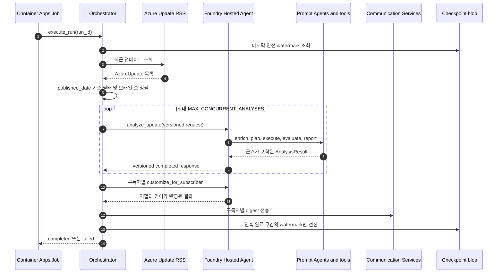
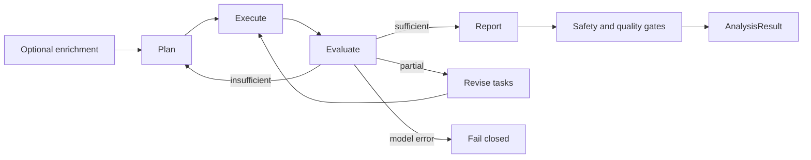

<div align="center">

# AzBrief Enterprise

**Azure updates, analyzed for your environment, delivered to your inbox.**

[](https://www.python.org/downloads/)
[](https://learn.microsoft.com/azure/foundry/agents/concepts/hosted-agents)
[](https://github.com/langchain-ai/langgraph)
[](https://learn.microsoft.com/azure/container-apps/)
[](LICENSE)

Container Apps Job (cron) → Microsoft Foundry Hosted Agent → Communication Services
· Container App control plane + `/admin` + `/mcp` · VNet injection + Private Endpoint by default

[](https://portal.azure.com/#create/Microsoft.Template/uri/https%3A%2F%2Fraw.githubusercontent.com%2FNetworkdog%2FAzBriefEnterprise%2Fmain%2Finfra%2Fazbrief-enterprise-deploy.json)

</div>

---

> **Looking for the Standard edition?** The Automation Runbook deployment lives in
> [Networkdog/AzBrief](https://github.com/Networkdog/AzBrief). Standard and Enterprise are
> two editions of the same AzBrief product and share its mission and analysis core.

<!-- TABLE OF CONTENTS -->
<details>
<summary>Table of Contents</summary>

- [Product identity](#product-identity)
- [Why AzBrief Enterprise?](#why-azbrief-enterprise)
- [What you get](#what-you-get)
- [Architecture](#architecture)
- [End-to-end operation](#end-to-end-operation)
- [Quick Start](#quick-start)
- [Deployment](#deployment)
  - [One-click deploy](#one-click-deploy)
  - [Network isolation](#network-isolation-networkisolationmode)
  - [Post-deployment steps](#post-deployment-steps)
  - [Scheduling operations](#scheduling-operations)
- [Multi-agent pipeline](#multi-agent-pipeline)
- [Admin console](#admin-console)
- [How the analysis works](#how-the-analysis-works)
- [Per-subscriber reports](#per-subscriber-reports)
- [Configuration](#configuration)
- [API](#api)
- [Development](#development)
- [Project structure](#project-structure)
- [Directory guides](#directory-guides)
- [Tech stack](#tech-stack)
- [Troubleshooting](#troubleshooting)
- [License](#license)

</details>

## Product identity

AzBrief Enterprise is the enterprise edition of
[AzBrief](https://github.com/Networkdog/AzBrief), not a separate product with a
different purpose. Both editions share the same analysis core and product identity;
this repository extends that foundation with a governed Microsoft Foundry runtime,
private networking, durable state and enterprise operations.

### Overview

AzBrief is an **Azure Update Intelligence Agent** for Azure administrators. It collects
Azure updates, correlates them with the tenant's actual resources, evaluates each update
on the independent axes of importance, impact and job relevance, and turns the findings
into a role-specific daily digest with evidence and concrete actions.

### Mission

**Translate every generic Azure announcement into what it means for this environment and
what the responsible operator should do next.** AzBrief closes the gap between knowing
that Azure changed and making a timely, well-grounded operational decision.

### Product direction

| Principle | Direction |
|---|---|
| **Environment before generic summary** | Ground conclusions in the tenant's real resources, configuration, health, policy, cost and regional availability |
| **Action over notification** | Go beyond describing a change to provide scoped procedures, commands, deadlines and risk warnings |
| **Coverage without silent filtering** | Analyze every collected update so retirements, security risks and adoption opportunities are not discarded before evidence is gathered |
| **One update, many responsibilities** | Adapt the same evidence for infrastructure, security, architecture and other roles, in each subscriber's language |
| **Trust before autonomy** | Keep evidence traceable, validate executable actions and fail closed when identity, permissions or model capabilities are unclear |
| **Enterprise governance by design** | Run the same intelligence mission with Entra-only access, governed Prompt Agents, private-by-default networking, observability and recoverable state |

### Goals

- Reduce the daily work of reading and triaging a high-volume Azure update feed.
- Identify affected resources, risks and opportunities from tenant evidence rather than
  inference alone.
- Deliver the next safe, specific action early enough to avoid service, security, cost and
  governance surprises.
- Give every stakeholder a briefing shaped for their role without duplicating the core
  investigation.
- Scale the original AzBrief experience into regulated environments without weakening its
  relevance, actionability or language quality.

### Vision

Make Azure change intelligence a routine operational capability: every Azure team starts
the day knowing **what changed, where it matters, why it matters and what comes next** for
its own environment. In that future, an Azure update is no longer another announcement to
read; it is evidence-backed decision intelligence ready for the people responsible for it.

<p align="right">(<a href="#azbrief-enterprise">back to top</a>)</p>

## Why AzBrief Enterprise?

Azure publishes dozens of updates every week. New features, service retirements, security
patches, pricing changes — each one can affect your production environment. But keeping up
is hard:

- **Volume.** Hundreds of updates per year. Only a fraction matter to you. Finding them
  means reading the feed every day.
- **No context.** Azure tells you *what* changed, but not *which of your resources are
  affected* or *what you need to do about it*.
- **One size doesn't fit all.** An infrastructure engineer needs migration steps. A security
  officer needs compliance impact. The same announcement can't serve both.

AzBrief collects Azure updates, cross-references them against your tenant's actual resources
via Resource Graph, classifies each by importance, impact and job relevance, and delivers a
consolidated daily digest — complete with CLI commands, procedures, and deadlines — straight
to each team member's inbox.

The **Enterprise** edition adds what a regulated environment needs on top of that analysis:

| | |
|---|---|
| **Governed Hosted Agent** | The complete LangGraph Plan-Execute-Evaluate-Report runtime and subscriber customization run as a Foundry Hosted Agent; phase Prompt Agents remain governed data-plane dependencies |
| **No model API keys** | Foundry runs Entra-only (`disableLocalAuth`); the state account is Entra-only too. Container App API/MCP access uses its own scoped control-plane key |
| **Private by default** | `vnetInjection` injects the agent compute into a delegated subnet, integrates Container Apps with the same VNet, and puts Foundry, Key Vault and the state account behind private endpoints |
| **Managed analysis compute** | Foundry provisions an isolated Hosted Agent sandbox per session and owns its endpoint, lifecycle, scaling, identity, and observability |
| **Admin console** | `/admin` behind Entra ID sign-in with an explicit principal allow-list — trigger a run, inspect configuration, review run history |
| **MCP control plane** | Authenticated Streamable HTTP at `/mcp` exposes recent updates, Hosted Agent analysis, and digest-run status without putting analysis logic back in Container Apps |
| **Durable checkpoint** | The "analysed up to" watermark is a blob that only moves forward, written after a run completes, so an interrupted run repeats a window instead of skipping an update |

<p align="right">(<a href="#azbrief-enterprise">back to top</a>)</p>

## What you get

- **All updates analyzed** — No pre-filtering; every update gets a full analysis
- **Three-axis assessment** — Each update independently scored on three orthogonal axes:
  - **중요성 (Importance)** — the update's inherent significance in the Azure ecosystem
  - **영향도 (Impact)** — the effect on your actual resources, from Resource Graph queries
  - **직무연관성 (Job Relevance)** — the fit to the subscriber's specific role
- **Tenant-wide correlation** — Resource Graph queries across every accessible subscription
- **Verified commands from the docs** — The Learn page an update links to is fetched and its
  `<pre>` command blocks are extracted separately from the prose, so real `az`/PowerShell
  commands survive the context budget instead of degrading into "check the Portal"
- **Practitioner commentary** — Topic-matched write-ups from the
  [Azure Weekly](https://azureweekly.info) digest supply real-world caveats that official
  documentation does not carry (opt out with `COMMUNITY_INSIGHTS_ENABLED=false`)
- **Triple-checked action items** — An action item is the only part of the report a reader may
  run verbatim against production, so it passes a three-layer safety gate: a deterministic
  static gate (destructive commands without a rollback, unattended `--yes`/`--force`,
  unresolved `<placeholder>` values, resource names absent from the evidence, fabricated
  deadlines), an independent adversarial LLM cross-check over the same evidence, and a policy
  gate that **strips the command** from any item that fails. Each item ships with its verdict
  badge (검증 완료 / 주의 필요 / 실행 보류 / 교차 검증 미수행)
- **Role-based reports** — Same update, different perspective per subscriber
- **Multilingual** — Per-subscriber language from a pluggable registry (Korean, English and
  Japanese ship curated style guides; any other language still renders through fallback
  labels and a generated style guide)

<p align="right">(<a href="#azbrief-enterprise">back to top</a>)</p>

## Architecture

```
Container Apps Job  ──  cron (0 2 * * * UTC), python -m src.scheduler
  │
  ├─ Azure Update RSS ──────── select the digest window
  ├─ Hosted Agent endpoint ─── one complete analysis per update
  ├─ Storage blob ──────────── digest checkpoint (forward-only watermark)
  └─ Communication Services ── per-subscriber email

Microsoft Foundry Hosted Agent  ──  hosted_agent_main.py → src/hosted_agent.py
  ├─ LangGraph ──────────────── Plan → Execute → Evaluate → Report
  ├─ Prompt Agents ──────────── planner/evaluator/reporter + optional enrichment
  ├─ Microsoft Learn MCP ────── primary official documentation source
  ├─ Web Search ─────────────── supplementary current/public evidence
  ├─ Azure MCP Server ───────── read-only tenant evidence via Container Apps
  ├─ Cost/Advisor/Health/Policy/Region evidence tools
  └─ Subscriber customization

Azure MCP Container App  ──  Entra-authenticated HTTPS remote MCP
  ├─ direct leaf tools ───────── group/resourcehealth/advisor only
  ├─ --read-only ────────────── no create/update/delete tools
  └─ managed identity ───────── subscription Reader only

Container App  ──  control-plane image and identity
  ├─ /admin ─────────────────  Entra ID sign-in + principal allow-list
  ├─ /api/* ─────────────────  orchestration API (X-API-Key)
  └─ /mcp ──────────────────── authenticated MCP Streamable HTTP
```

The job and app use the same **control-plane image**. They own feed selection, checkpointing,
email delivery, Admin, API, and MCP, but never construct `AzureUpdateAnalyzer`. Both use
`HostedAgentAnalyzer`, which fails closed unless the Hosted Agent endpoint is configured.

AzBrief's analysis runtime **is a Foundry Hosted Agent**. Its source is deployed directly from
`azure.yaml`; Foundry builds the image and creates an immutable version with a dedicated
endpoint and Entra identity. The Hosted Agent invokes persisted Prompt Agents through the
project-scoped Responses API and runs Azure evidence tools under its own identity.
File-based history and pattern optimizations use the session-persistent `$HOME/.azbrief`
directory because the deployed application package under `/app` is read-only.
See [the architecture assessment](.github/skills/foundry-agent-architecture/references/assessment.md)
for the responsibility boundary and validation evidence.

<p align="right">(<a href="#azbrief-enterprise">back to top</a>)</p>

## End-to-end operation

AzBrief Enterprise는 **제어면(control plane)** 과 **분석 런타임(analysis runtime)** 을
의도적으로 분리합니다. Container App과 Container Apps Job은 어떤 업데이트를 언제 처리하고
누구에게 전달할지를 결정합니다. Microsoft Foundry Hosted Agent는 업데이트 한 건의 조사,
테넌트 영향 판정, 보고서 생성과 구독자 맞춤화를 책임집니다.

| 경계 | 소유하는 상태와 동작 | 소유하지 않는 것 |
|---|---|---|
| Container Apps Job (`src.scheduler`) | 예약 실행의 프로세스 수명, 성공/실패 종료 코드 | LangGraph, Prompt Agent, 분석 도구 |
| Orchestrator (`src.orchestrator`) | RSS 처리 구간, 동시성, 실행 기록, digest 조립, 체크포인트 | 업데이트 한 건의 분석 판단 |
| Hosted proxy (`src.agent.hosted_client`) | 버전이 지정된 요청/응답 계약, 원격 호출 제한 시간 | 로컬 분석 대체 경로 |
| Hosted Agent (`src.hosted_agent`) | 계약 검증, 분석기 수명, 분석/맞춤화 작업 분기 | 스케줄, digest 체크포인트, 이메일 전송 |
| Analyzer (`src.agent.analyzer`) | 조사 계획, 도구 실행, 근거 완전성 평가, 보고서, 안전 검증 | 수신자별 전송 결과와 처리 구간 커밋 |

### 한 번의 예약 실행



1. `python -m src.scheduler`가 `HostedAgentAnalyzer`, `EmailService`,
  `AzureUpdateParser`를 만들고 하나의 `RunRecord`를 시작합니다. 스케줄러는 실행이
  `completed`이면 프로세스 코드 `0`, 그렇지 않으면 `1`로 종료합니다.
2. Orchestrator는 명시적인 `since`가 있으면 그것을 사용하고, 없으면 checkpoint blob,
  로컬 개발용 checkpoint file, 마지막으로 현재 시각의 24시간 전 순으로 시작점을
  결정합니다. checkpoint 읽기에 실패해도 실행은 계속되므로 일부 작업이 반복될 수는 있어도
  업데이트가 조용히 누락되지는 않습니다.
3. RSS 결과 중 시작점보다 새 항목만 골라 `published_date` 오름차순으로 정렬합니다. 이 순서는
  완료 순서가 뒤섞이더라도 안전한 checkpoint를 계산하는 기준이 됩니다.
4. 업데이트는 `MAX_CONCURRENT_ANALYSES` 세마포어 안에서 병렬 처리됩니다. 각 작업을 시작하기
  전 `RUN_TIME_BUDGET_S`와 지금까지 관측된 가장 느린 분석 시간을 비교합니다. 남은 시간이
  부족하면 새 분석을 시작하지 않고 해당 항목을 `deferred`로 남겨 다음 실행으로 넘깁니다.
5. 단건 실패는 다른 업데이트와 격리됩니다. 영구적으로 실패하는 한 항목이 checkpoint를
  계속 붙잡지 않도록 실패한 항목도 “처리 완료”로 표시하지만, 연속 실패가 3건에 이르면 새
  원격 분석을 중단합니다. 아직 시작하지 않은 항목은 watermark 뒤에 남습니다.
6. 분석 결과는 하나의 digest 후보 목록으로 모입니다. 기본 digest는 관련성에 관계없이 분석된
  모든 업데이트를 보여 주며, `should_notify`는 관련 항목 수와 badge를 계산하는 데 사용됩니다.
7. 구독자가 있으면 같은 근거 기반 결과를 Hosted Agent에 다시 보내 역할과 언어별로 병렬
  맞춤화합니다. 개별 맞춤화가 실패하면 원본 분석을 사용하고, 개별 이메일 실패는 다른
  구독자의 전송을 막지 않습니다. 한 명 이상에게 전달되면 실행의 `email_sent`는 참입니다.

### 완료 상태의 정확한 의미

`RunRecord.status == "completed"`는 orchestration 함수가 끝까지 실행됐다는 뜻이지, 모든 단건
분석과 이메일이 성공했다는 뜻은 아닙니다. scheduler의 process exit code도 이 status만 기준으로
결정되므로 운영 검증에서는 다음 필드를 함께 봐야 합니다.

| 필드 | 해석 |
|---|---|
| `analyzed` | Hosted Agent가 정상 결과를 반환한 항목 수 |
| `failed` | 개별 실패가 격리된 항목 수; 실패한 항목도 영구 pin 방지를 위해 처리된 것으로 간주 |
| `deferred` | 실행 시간 예산 때문에 시작하지 않고 다음 window로 넘긴 항목 수 |
| `pending` | 연속 완료 prefix 뒤에 남아 checkpoint가 아직 덮지 못한 항목 수 |
| `email_sent` | 구독자가 없으면 기본 digest, 구독자가 있으면 한 명 이상에게 전달됐는지 여부 |
| `checkpoint_committed` | 계산된 watermark가 durable store에서 실제로 전진했는지 여부 |

현재 checkpoint는 **분석 window의 처리 상태**이며 delivery queue가 아닙니다. 따라서 digest 전송이
실패해 `email_sent=false`여도 분석된 연속 prefix는 commit될 수 있고 다음 예약 실행이 이메일만
재시도하지는 않습니다. 전송 보장 수준을 높이려면 별도의 outbox/delivery checkpoint가 필요하며,
운영자는 `completed` 하나가 아니라 위 카운터와 전송 로그를 함께 경보 조건으로 사용해야 합니다.

### 단건 Hosted Agent 호출

Container App과 Job은 도메인 객체를 그대로 직렬화하지 않습니다. `src.agent.hosted_contract`의
Pydantic 모델이 업데이트, 작업 종류, 계약 버전, trace ID, 결과를 명시합니다. Proxy는 이 내부
계약을 Foundry Responses 요청의 입력 텍스트로 넣고 `store=false`로 호출합니다. 응답은 다음
순서로 검증됩니다.

1. Responses API의 HTTP 요청이 성공했는지 확인합니다. 분석 요청의 일시적 HTTP/네트워크
  오류는 지수 backoff로 최대 3회 재시도하지만, 구독자 맞춤화는 overload 증폭을 피하려고
  한 번만 시도합니다.
2. 출력 텍스트를 `HostedAgentResponse`로 파싱합니다.
3. 요청과 응답의 trace ID와 operation이 모두 같은지 확인합니다.
4. 내부 status가 `completed`이고 result가 존재하는지 확인합니다.
5. result를 최종 `AnalysisResult`로 다시 검증합니다.

계약 불일치, 비활성 Hosted Agent 버전, 제한 시간 초과, 원격 오류는 모두 호출 실패입니다.
제어면은 이때 `AzureUpdateAnalyzer`를 로컬에서 만들지 않습니다. 이 fail-closed 경계 덕분에
개발 환경과 운영 환경이 서로 다른 분석 경로를 조용히 사용하는 일을 막습니다.

Hosted Agent는 요청을 받으면 `AZBRIEF_PROMPT_*` 환경 변수를 Prompt Agent 역할 설정으로
해석하고 `FOUNDRY_HOSTED_AGENT_NAME`을 내부 설정에서 지웁니다. 즉, Hosted Agent 안의
`AzureUpdateAnalyzer`가 자기 자신을 다시 호출하는 재귀를 구조적으로 차단합니다. 분석기는
첫 요청에서 지연 생성되며 이후 같은 sandbox 세션에서 재사용됩니다.

### 업데이트 한 건의 분석 상태 머신



**선행 enrichment.** 구성된 경우 `research`와 `impact` Prompt Agent가 병렬로 공식 문서와
실제 테넌트 상태를 조사합니다. `action`은 두 결과 뒤에서 실행 가능한 대응을 구성하고,
`review`는 근거가 약하거나 충돌하는 claim을 제거합니다. 이 네 단계는 보강 경로이므로 한
단계의 실패가 전체 분석을 중단시키지 않습니다. 반대로 planner/reporter 같은 필수 런타임
역할이 없으면 분석은 실패합니다.

**Plan.** Planner는 업데이트 본문과 Microsoft Learn 문서를 먼저 읽고 조사 목표와
`AnalysisTask` 목록을 구조화합니다. Planning 단계에서 사용할 수 있는 도구는 문서 검색 계열로
제한되므로, 아직 근거가 없는 상태에서 테넌트 영향 결론을 내리지 않습니다.

**Execute.** 계획된 도구를 이름으로 찾아 Pydantic 입력 계약에 맞춰 실행합니다. 읽기 전용이며
동시 실행에 안전하다고 선언된 도구는 병렬 처리하고, 쓰기 도구 또는 안전 여부를 판정할 수 없는
도구는 직렬 처리합니다. 계획이 놓치기 쉬운 Resource Health, Policy, Service Health, Advisor,
구성 프로파일, dependency, 지역 가용성 확인은 업데이트 종류에 따라 첫 실행 pass에서 자동
보강됩니다.

**Evaluate and revise.** Evaluator는 단순히 도구가 성공했는지가 아니라 공식 사실, 테넌트
영향, 리소스 식별, 지역/구성 정보와 **근거 완전성**을 각각 판정합니다. 충분하면 보고서로
넘어가고, 일부가 비면 필요한 task만 고쳐 다시 실행하며, 조사 계획 자체가 부족하면 planning으로
돌아갑니다. 계획 수정, task 수정, 전체 iteration에는 각각 상한이 있어 무한 루프를 막습니다.

**Report.** Reporter는 수집된 근거를 `AnalysisResult` 스키마로 합성합니다. 중요성은 공지
자체의 중요도, 영향도는 현재 환경에 미치는 효과, 직무연관성은 구독자의 책임과의 관련성으로
서로 독립적으로 기록합니다. URL 정규화, JSON 복구, 출력 길이 초과 시 이어쓰기 복구가 이
경계에서 적용됩니다.

**Safety and quality gates.** 실행 명령이 포함된 action item은 정적 규칙, 독립 LLM 검증,
정책 gate를 통과해야 합니다. 파괴적이거나 placeholder가 남은 명령, 근거에 없는 리소스,
rollback 없는 위험 명령은 그대로 전달되지 않습니다. 설정에 따라 trajectory 평가와 G-Eval
품질 평가도 수행하며, runtime G-Eval은 개선된 경우에만 한 번의 재작성 결과를 채택합니다.

### 큰 도구 결과와 근거 보존

도구 출력은 `TOOL_RESULT_BUDGET_CHARS`보다 크다고 잘라 버리지 않습니다. 전체 문자열은
trace 범위의 `context_store`에 저장되고 prompt에는 앞부분과 `[ref=Rn]` handle이 들어갑니다.
Evaluator는 preview만 보고 리소스가 없다고 결론 내릴 수 없으며, `query_tool_result`로 전체
결과를 검색한 뒤에만 부재를 확정할 수 있습니다. 저장소는 항목/전체 크기 제한과 오래된 항목
퇴출 정책을 가지며, 분석이 끝나면 해당 trace의 결과를 지웁니다.

### 체크포인트가 보장하는 것

병렬 분석에서는 다섯 번째 업데이트가 두 번째보다 먼저 끝날 수 있습니다. 가장 최근에 끝난
항목의 시간을 저장하면 다음 실행이 아직 끝나지 않은 두 번째 항목 뒤에서 시작하여 이를 영구히
건너뜁니다. `_WatermarkCursor`는 그래서 **오래된 순서로 끊김 없이 완료된 prefix**만 전진시킵니다.

- 분석 성공과 격리된 단건 실패는 cursor를 전진시킵니다.
- 시간 부족으로 미룬 항목과 연속 실패 차단 뒤의 미실행 항목은 cursor를 전진시키지 않습니다.
- dry run은 checkpoint를 쓰지 않습니다.
- blob 저장은 기존 값보다 뒤로 갈 수 없고 ETag 조건부 요청으로 동시 실행 경쟁을 막습니다.
- checkpoint 쓰기가 실패해도 digest 실행 자체는 실패시키지 않습니다. 다음 실행의 중복 처리가
  업데이트 누락보다 안전하기 때문입니다.

Admin의 “run now”와 외부 API가 시작한 실행도 같은 `execute_run()`을 사용하므로 위 의미가
동일합니다. `/mcp`의 `analyze_azure_update`는 digest 실행을 만들지 않고 단건 Hosted Agent
분석만 위임하며, `get_recent_digest_runs`는 메모리의 최근 실행 기록을 읽습니다. 이 실행 기록은
관측용이며 내구성이 필요한 처리 상태는 checkpoint만 소유합니다.

<p align="right">(<a href="#azbrief-enterprise">back to top</a>)</p>

## Quick Start

Local development uses your Azure CLI identity to invoke agents already published in a
Microsoft Foundry project. There is no Azure OpenAI/OpenAI endpoint or API key fallback.

```bash
git clone https://github.com/Networkdog/AzBriefEnterprise.git
cd AzBriefEnterprise
python -m venv .venv && .venv/Scripts/Activate.ps1  # or: source .venv/bin/activate
pip install -r requirements.txt
cp .env.example .env
```

Set at minimum in `.env`:

```env
AZURE_TENANT_ID=your-tenant-id
AZURE_CLIENT_ID=
AZURE_SUBSCRIPTION_ID=your-subscription-id
FOUNDRY_PROJECT_ENDPOINT=https://your-resource.services.ai.azure.com/api/projects/your-project
FOUNDRY_PRIMARY_AGENT_NAME=azbrief-primary
FOUNDRY_HOSTED_AGENT_NAME=azbrief-analysis-hosted
```

`FOUNDRY_PRIMARY_AGENT_NAME` is used by direct local analysis and inside the Hosted Agent;
`FOUNDRY_HOSTED_AGENT_NAME` is required when running the Container App or scheduler. The
control plane does not fall back to local analysis when the Hosted Agent is absent.

Leave `AZURE_CLIENT_ID` empty for local development, then sign in and select the subscription:

```powershell
az login --tenant <tenant-id>
az account set --subscription <subscription-id>
```

Then run:

```bash
python -m scripts.test_local list                                    # list recent updates
python -m scripts.test_local analyze --latest                        # analyze the newest one
python -m scripts.test_local analyze --from 2026-02-01 --to 2026-02-10
python -m scripts.test_local analyze --latest --jsonl results.jsonl  # export, skip email
python -m scripts.test_local resources                               # view your resource summary
```

> **Historical date ranges:** The live Azure Update RSS feed only exposes a rolling window of
> the most recent ~200 items, so months that have aged out return nothing when queried
> directly. For date-range analysis (`--from`/`--to`), AzBrief merges a locally crawled
> history archive (`data/azure_updates_history.jsonl`, de-duplicated against the live feed).
> Refresh it with `python -m scripts.crawl_azure_updates`.

<p align="right">(<a href="#azbrief-enterprise">back to top</a>)</p>

## Deployment

### One-click deploy

Deploys the Azure foundation and control plane: a Foundry account and project with a model
deployment, the Container App (API + Admin + MCP), the Container Apps Job that drives the
daily digest, Key Vault, state storage, and Communication Services. Prompt Agents and the
Hosted Agent are Foundry data-plane objects and are deployed in the post-deployment steps.

[](https://portal.azure.com/#create/Microsoft.Template/uri/https%3A%2F%2Fraw.githubusercontent.com%2FNetworkdog%2FAzBriefEnterprise%2Fmain%2Finfra%2Fazbrief-enterprise-deploy.json)

**What gets deployed** ([infra/azbrief-enterprise-deploy.json](infra/azbrief-enterprise-deploy.json),
authored in [infra/enterprise/main.bicep](infra/enterprise/main.bicep)):

| Resource | Name | Notes |
|----------|------|-------|
| User Assigned Managed Identity | `id-{baseName}` | Container App과 스케줄러 Job이 공유 |
| Microsoft Foundry account | `aif-{baseName}-{suffix}` | `AIServices` · `allowProjectManagement` · **`disableLocalAuth`** |
| Foundry project | `{baseName}-agents` | Hosted Agent와 Prompt Agent 데이터 플레인 작업 공간 |
| Model deployment | `gpt-4o` (변경 가능) | GlobalStandard, 기본 200K TPM |
| Key Vault | `kv-{baseName}-{suffix}` | RBAC 전용, 모든 런타임 시크릿 보관 |
| Storage account + `azbrief-state` 컨테이너 | `st{baseName}{suffix}` | 체크포인트 blob, **`allowSharedKeyAccess: false`** |
| Container Apps Environment | `cae-{baseName}-{suffix}` | 기본값에서 VNet 통합 |
| Container App | `ca-{baseName}` | 제어면 API + `/admin` + 인증된 `/mcp` |
| Container Apps Job | `caj-{baseName}` | cron 스케줄, Hosted Agent 호출 + 체크포인트 + 이메일 |
| Hosted Agent (후속 `azd deploy`) | `{baseName}-analysis-hosted` | 전체 LangGraph 분석과 구독자 맞춤화, 전용 Entra identity |
| Container App authConfig | `current` | Entra ID 로그인 (클라이언트 ID 제공 시에만) |
| Communication Services + Email | `acs-{baseName}-{suffix}` | Azure 관리 도메인 자동 연결 |
| Log Analytics + Application Insights | `log-` / `appi-` | 구조화 로그 및 추적 |
| Control-plane role assignments | 5건 | Key Vault Secrets User · Storage Blob Data Contributor · Foundry User · Monitoring Metrics Publisher · RG Reader |

**보안 설계 (기본값이 안전한 쪽):**

- **Foundry는 키가 존재하지 않습니다** — `disableLocalAuth: true`라서 Entra ID 토큰만 통합니다. 유출될 키도, 교체할 키도 없습니다.
- **상태 저장소도 Entra 전용입니다** — Storage 계정은 `allowSharedKeyAccess: false`이고, 관리 ID의 쓰기 권한은 그 계정 하나로 범위가 제한됩니다. 체크포인트는 시크릿이 아니므로 진짜 시크릿이 든 금고에 쓰기 권한을 주지 않습니다.
- **런타임 시크릿은 Key Vault에만** 있습니다. Container App과 스케줄러 Job은 관리 ID로 참조만 하며, 템플릿 출력이나 API 응답에 값이 나타나지 않습니다.
- **관리자 콘솔은 이중 조건**을 모두 만족해야 열립니다 — Entra 앱 등록(`adminEntraClientId` + secret)과 명시적 허용 목록(`adminAllowedPrincipals`). 하나라도 비어 있으면 `/admin`은 404를 반환합니다.
- **오케스트레이터 API는 생성된 키**로 보호되며, 필요하면 `allowedIpRanges`로 인그레스를 CIDR 단위로 제한할 수 있습니다.
- **두 identity를 구분합니다.** Container Apps 관리 ID는 체크포인트·이메일·Admin/MCP
  제어면에 사용됩니다. Hosted Agent는 배포 시 자동 생성되는 별도 identity로 tenant evidence를
  조회합니다. 구독 Reader와 서비스별 data-plane 권한은 **Hosted Agent identity**에 부여해야
  하며 템플릿이 자동으로 넓은 권한을 주지 않습니다.

### Network isolation (`networkIsolationMode`)

| 값 | 무엇이 달라지나 | 언제 고르나 |
|----|----------------|------------|
| `vnetInjection` **(기본)** | Foundry 에이전트 컴퓨트가 위임 서브넷에 주입되고, Container Apps 환경이 같은 VNet에 통합되며, Foundry · Key Vault · 상태 계정은 **프라이빗 엔드포인트로만** 열립니다 | 엔터프라이즈 기본값. 트래픽이 VNet 밖으로 나가면 안 되는 환경 |
| `perimeter` | 엔드포인트는 공개로 두되 Foundry · Key Vault · Log Analytics · 상태 계정을 **Network Security Perimeter**로 묶어 유출 경로를 차단합니다 | VNet을 새로 둘 수 없거나 PaaS 경계만 필요할 때 |
| `public` | 엔드포인트는 공개이고 Entra 토큰 · API 키 · 허용 목록이 유일한 경계입니다 | 검증 · 데모 환경 전용 |

> **기본값이 `vnetInjection`인 이유:** Foundry의 네트워크 주입은 **계정을 만들 때만** 설정됩니다.
> `public`으로 배포한 계정은 나중에 주입으로 바꿀 수 없어 삭제 후 purge가 필요하므로, 되돌리기
> 어려운 쪽을 기본값으로 둡니다.

**`vnetInjection`이 추가로 만드는 리소스**

| 리소스 | 이름 | 비고 |
|--------|------|------|
| Virtual Network | `vnet-{baseName}-{suffix}` | `existingVnetResourceId`를 주면 기존 VNet을 그대로 사용 |
| Foundry 에이전트 서브넷 | `snet-foundry-agent` (`/24`) | `Microsoft.App/environments`에 위임, Foundry 계정 하나가 독점 |
| Container Apps 서브넷 | `snet-container-apps` (`/24`) | `Microsoft.App/environments`에 위임, 워크로드 프로필 환경 |
| 프라이빗 엔드포인트 서브넷 | `snet-private-endpoints` (`/27`) | 위임 없음 |
| Private DNS 존 5개 | `privatelink.services.ai.azure.com` · `privatelink.openai.azure.com` · `privatelink.cognitiveservices.azure.com` · `privatelink.vaultcore.azure.net` · `privatelink.blob.core.windows.net` | VNet에 연결 |
| Private Endpoint 3개 | `pe-aif-…` · `pe-kv-…` · `pe-st…` | Foundry(`account`) · Key Vault(`vault`) · Storage(`blob`) |
| Foundry 프로젝트 capability host | `caphostproj` | 네트워크 주입 계정에 필요 |

- **주소 공간은 RFC1918이어야 합니다.** Foundry 에이전트 서브넷은 `10.0.0.0/8` · `172.16-31.0.0/12` · `192.168.0.0/16` 밖의 범위를 거부합니다.
- **Key Vault와 상태 계정은 `publicNetworkAccess: Disabled`가 됩니다.** Container App과 스케줄러 Job은 관리 ID로 프라이빗 엔드포인트를 통해 시크릿과 체크포인트를 읽고 쓰며, 템플릿이 선언한 시크릿 쓰기는 신뢰할 수 있는 서비스 예외로 계속 동작합니다.
- **기존 VNet을 쓸 때는** 위 세 서브넷이 이미 존재하고 위임까지 끝나 있어야 합니다. 템플릿은 남의 서브넷 정책을 덮어쓰지 않습니다.
- **`internalIngressOnly: true`** 로 두면 인그레스가 VNet 전용이 되고 환경 기본 도메인을 가리키는 Private DNS 존이 자동으로 만들어집니다. 스케줄러는 앱 ingress가 아니라 Foundry Hosted Agent endpoint를 직접 호출하므로 **매일 실행은 그대로 동작합니다**. `/admin`, `/api/*`, `/mcp`는 VNet 안에서만 접근됩니다.

**`perimeter`가 추가로 만드는 리소스**

| 리소스 | 이름 | 비고 |
|--------|------|------|
| Network Security Perimeter | `nsp-{baseName}-{suffix}` | |
| Profile | `azbrief` | 인바운드 · 아웃바운드 규칙 묶음 |
| 인바운드 규칙(구독) | `inbound-subscriptions` | 기본값은 배포 구독 — Container App이 Foundry를 호출할 수 있게 하는 규칙 |
| 인바운드 규칙(IP) | `inbound-ip` | `perimeterInboundIpRanges`를 채웠을 때만 |
| 아웃바운드 규칙(FQDN) | `outbound-fqdn` | 기본값 `azure.microsoft.com` · `learn.microsoft.com` |
| 리소스 연결 4건 | `assoc-foundry` · `assoc-keyvault` · `assoc-loganalytics` · `assoc-storage` | |
| 진단 설정 | `nsp-access-logs` | `NSPAccessLogs`를 Log Analytics로 |

- **기본 모드는 `Learning`(Transition)** 이라 차단하지 않고 기록만 합니다. `NSPAccessLogs` 테이블에서 거부될 뻔한 호출을 확인한 뒤 `perimeterAccessMode: Enforced`로 재배포하거나 출력의 `enforcePerimeterCommand`를 실행하세요.
- Container Apps · Communication Services는 아직 NSP에 온보딩되지 않았습니다. 이 앞단은 계속 인그레스 IP 제한과 API 키가 지킵니다.

### Post-deployment steps

1. **Azure MCP Server 배포** — `infra/azure-mcp-server`는 검증된 공식 Azure MCP
  `3.0.0-beta.38` 이미지를 별도 Container App에 배포합니다. 버전은 Bicep의
  `azureMcpImage` 파라미터로 명시적으로 올립니다. 서버는 Entra 인증을 유지하고 `--mode all`과
  `--namespace group|resourcehealth|advisor`, `--read-only`로 실행됩니다. 따라서
  동적 `azure` 프록시 없이 세 namespace의 direct tools만 노출하며, 관리 ID에는 대상
  구독 `Reader`만 부여합니다. 기본 크기는 0.5 vCPU/1 GiB입니다.
  ```powershell
  cd infra/azure-mcp-server
  azd env new production
  azd env set AZURE_SUBSCRIPTION_ID '<subscription-id>'
  azd env set AZURE_LOCATION 'koreacentral'
  azd env set AZURE_RESOURCE_GROUP 'RG-AZBRIEF-ENTERPRISE-2'
  azd env set AZURE_MCP_CONTAINER_APP_NAME 'ca-azbrief-mcp'
  azd env set FOUNDRY_PROJECT_RESOURCE_ID '<project-arm-resource-id>'
  azd env set SERVICE_MANAGEMENT_REFERENCE ''
  azd up --no-prompt
  ```
2. **Azure MCP project connection 생성** — Azure MCP 출력의 HTTPS URL과 Entra
  application identifier URI를 사용합니다. Project Managed Identity 토큰이 MCP API의
  audience로 발급되며, Bicep이 해당 identity에 MCP app role을 부여합니다.
  ```powershell
  azd ai connection create azbrief-azure-mcp-read-only `
    --kind remote-tool `
    --target '<AZURE_MCP_SERVER_URL>' `
    --auth-type project-managed-identity `
    --audience '<AZURE_MCP_ENTRA_APP_IDENTIFIER_URI>' `
    --project-endpoint '<project-endpoint>'
  ```
3. **Foundry Prompt Agent 생성** — ARM은 Agent 데이터 플레인 객체를 만들 수 없습니다.
  Research에는 Microsoft Learn MCP가 먼저, Web Search가 보완 수단으로 배치됩니다.
  Impact에는 위 Azure MCP connection이 연결됩니다. Hosted Agent는 각 impact 요청에
  정확한 tenant GUID와 설정된 subscription GUID를 동적으로 넣고 literal `default`를
  금지합니다. Remote leaf tool은 tenant가 빠지거나 `default`이면 이를 tenant 표시 이름으로
  해석해 거부할 수 있습니다. Azure MCP image를 올린 뒤에는 direct tool schema와 read-only
  inventory smoke를 먼저 검증합니다. Azure MCP의 mode, namespace, 또는 scope 계약이 바뀌면 Impact
  Agent와 Hosted Agent의 새 immutable version을 함께 발행해야 합니다. `.env`에 endpoint,
  Agent 이름, 프로비저닝 모델과 다음 설정을 넣은 뒤 실행합니다:
  ```env
  FOUNDRY_RESEARCH_WEB_SEARCH_ENABLED=true
  AZURE_MCP_SERVER_URL=<AZURE_MCP_SERVER_URL>
  AZURE_MCP_PROJECT_CONNECTION_NAME=azbrief-azure-mcp-read-only
  ```
   ```bash
   python -m scripts.provision_foundry_agents --dry-run   # 지시문 미리보기
   python -m scripts.provision_foundry_agents             # 생성 또는 갱신
   ```
  `planner`·`evaluator`·`reporter`·`codex`·`fast`는 비워 두면 primary Agent를 사용합니다.
  이어서 `python -m scripts.provision_foundry_agents --check`가 Agent, FunctionTool,
  server tool, instruction, schema drift 없이 통과하는지 확인합니다.
  이 검사는 Foundry가 저장 시 적용하는 MCP URL의 trailing slash와
  `allowed_tools.tool_names` 표현을 정규화한 뒤 의미가 같은지 비교합니다.
4. **Hosted Agent 설정과 배포** — 기존 Foundry 프로젝트의 endpoint와 ARM resource ID를
  azd environment에 연결하고, Prompt Agent 이름 alias를 설정합니다. `azure.yaml`에는
  `codeConfiguration`이 있으므로 `azd deploy`가 소스를 ZIP으로 올리고 Foundry가 이미지를
  빌드합니다. Docker/ACR은 이 단계에 필요하지 않습니다.
  ```powershell
  $env:AZURE_DEV_USER_AGENT='microsoft_foundry_skill'
  azd env set AZURE_AI_PROJECT_ENDPOINT '<project-endpoint>'
  azd env set AZURE_AI_PROJECT_ID '<project-arm-resource-id>'
  azd env set AZBRIEF_PROMPT_PRIMARY_AGENT_NAME 'azbrief-primary'
  azd env set AZBRIEF_ENRICHMENT_AGENT_ROSTER '[{"name":"azbrief-research","stage":"research"},{"name":"azbrief-impact","stage":"impact"},{"name":"azbrief-action","stage":"action"},{"name":"azbrief-review","stage":"review"}]'
  azd deploy azbrief-analysis-hosted --no-prompt
  azd ai agent show --output json
  ```
5. **Hosted Agent identity 권한 부여** — `azd ai agent show --output json` 또는 Foundry Portal에서
  새 Hosted Agent의 identity principal ID를 확인합니다. 분석 대상 각 구독에 Reader를,
  Log Analytics·Cost Management 등 실제 사용 도구에 필요한 최소 data-plane 역할을 부여합니다.
  Container Apps용 `grantReaderCommand`를 대신 사용하면 잘못된 identity에 권한이 갑니다.
6. **Container Apps 제어면 이미지 배포** — 템플릿은 자리표시자 이미지로 시작합니다.
  `deployContainerImageCommand` 또는 `deploy-container-app.yml`로 Container App과 scheduler
  Job을 **함께** 갱신합니다. 둘 다 `FOUNDRY_HOSTED_AGENT_NAME`이 없거나 endpoint가 비활성이면
  로컬 분석으로 우회하지 않고 실패합니다.
7. **(선택) 관리자 콘솔 활성화** — Entra 앱을 등록한 뒤 `adminEntraClientId` ·
  `adminEntraClientSecret` · `adminAllowedPrincipals`를 채워 재배포합니다.

> **검증 범위:** 템플릿은 Bicep 타입 검사(리소스 종류·API 버전·속성명)를 통과했습니다. 구독에 대한
> ARM 프리플라이트(`az deployment group validate`)는 개발 환경의 MFA 요구로 실행하지 못했으므로,
> 첫 배포 전에 직접 한 번 실행해 보시기를 권합니다.

### Scheduling operations

| 하고 싶은 일 | 방법 |
|-------------|------|
| 실행 시각 변경 | `scheduleCronExpression` (UTC cron, 기본 `0 2 * * *`) 로 재배포 |
| 지금 바로 실행 | 배포 출력의 `runNowCommand` — `az containerapp job start`, 또는 `/admin`의 실행 버튼 |
| 한 실행의 최대 시간 조정 | `jobReplicaTimeoutSeconds` (기본 12시간, 최대 7일). `RUN_TIME_BUDGET_S`는 그보다 1시간 짧게 자동 설정됩니다 |
| 분석 범위를 되돌리기 | 출력의 `checkpointBlobUrl` blob을 삭제하면 기본 윈도우(24시간)로 돌아갑니다 |
| 실행 기록 확인 | Log Analytics 또는 `az containerapp job execution list` |

> Job은 재시도하지 않습니다(`replicaRetryLimit: 0`). 실패한 실행은 체크포인트를 옮기지 않았기
> 때문에 다음 스케줄이 같은 구간을 다시 다룹니다 — 같은 밤에 동일한 분석 비용을 두 번 치르지
> 않으려는 선택입니다.

<p align="right">(<a href="#azbrief-enterprise">back to top</a>)</p>

## Multi-agent pipeline

The outer runtime is the `azbrief-analysis-hosted` **Hosted Agent**. Inside its isolated
sandbox, `AzureUpdateAnalyzer` owns the complete LangGraph state machine and every
model-mediated call uses a persisted Foundry Prompt Agent. Optional role overrides separate
phase instructions, model selection, guardrails, and traces; every unset role falls back to
the primary Prompt Agent.

```env
FOUNDRY_PRIMARY_AGENT_NAME=azbrief-primary
FOUNDRY_PLANNER_AGENT_NAME=azbrief-planner      # optional; primary when empty
FOUNDRY_EVALUATOR_AGENT_NAME=azbrief-evaluator  # optional; primary when empty
FOUNDRY_REPORTER_AGENT_NAME=azbrief-reporter    # optional; primary when empty
FOUNDRY_CODEX_AGENT_NAME=azbrief-codex  # optional; primary when empty
FOUNDRY_FAST_AGENT_NAME=azbrief-fast    # optional; primary when empty
```

The Hosted Agent receives these values through non-reserved `AZBRIEF_PROMPT_*` aliases in
`azure.yaml`. `AZBRIEF_ENRICHMENT_AGENT_ROSTER` optionally adds a staged pre-analysis pipeline;
each stage maps to a Prompt Agent governed in Foundry.

```bash
AZBRIEF_ENRICHMENT_AGENT_ROSTER='[{"name":"azbrief-research","stage":"research"},
                                  {"name":"azbrief-impact","stage":"impact"},
                                  {"name":"azbrief-action","stage":"action"},
                                  {"name":"azbrief-review","stage":"review"}]'
```

| Stage | Runs | Job |
|---|---|---|
| `research` | in parallel with `impact` | What actually changed: release stage, dates, prerequisites, official docs |
| `impact` | in parallel with `research` | Which resources, configurations and regions in *this* tenant are touched |
| `action` | after both | Concrete, self-serviceable next steps grounded in the two findings |
| `review` | last | Audits the findings and flags unsupported claims; a clean review adds nothing |

Every enrichment stage is **optional and independently fault-isolated** — a missing, failing
or timed-out stage contributes nothing. Stage output is strict JSON with stable claim IDs,
evidence, confidence, and gaps. Review rejection removes the rejected claim and every action
that depends on it before context reaches the planner. This does not apply to required runtime
Agents, which fail closed.

Research and impact expose a minimal set of app-owned read-only tools as Foundry native
FunctionTools. Research always calls Microsoft Learn MCP before using Web Search as a
supplement. Impact uses the Entra-authenticated, read-only Azure MCP Server first and falls
back to app-owned FunctionTools only for a specific evidence gap. Foundry chooses the calls;
the Hosted Agent validates local function arguments, executes them with its dedicated
identity, returns `function_call_output`, and forces final synthesis after a bounded number
of rounds. Oversized results stay queryable through the trace-scoped context store.

Create or update the roster with:

```bash
python -m scripts.provision_foundry_agents --dry-run          # review the instructions
python -m scripts.provision_foundry_agents                    # runtime + enrichment agents
python -m scripts.provision_foundry_agents --runtime-roles primary codex
python -m scripts.provision_foundry_agents --stages review    # one stage only
python -m scripts.provision_foundry_agents --check            # read-only readiness check
python -m scripts.provision_foundry_agents --delete           # tear the roster down
```

Each Agent's base standing instruction comes from `RUNTIME_AGENT_INSTRUCTIONS` or
`STAGE_PROMPTS` in `src/agent/foundry_backend.py`. The seven domain documents under
`.github/skills/` additionally own a bounded `Foundry Runtime Guidance` section. Provisioning
loads only those compact sections and compiles a role-specific set into the immutable Foundry
Agent instruction: impact receives Azure service/KQL/architecture guidance, reporter receives
report/language/email guidance, evaluator receives the evaluation rubric, and so on. The full
developer workflow, file paths, and test commands never enter the model context. A change to a
runtime section appears as instruction drift in `--check` and requires a new Prompt Agent version.

This deterministic instruction compilation does not depend on the public-preview Foundry Skills
API. Native versioned Skills and toolbox MCP discovery remain an optional future delivery path;
if adopted, pin tested Skill versions and keep the compiled instructions as the production
fallback until private-network support and runtime behavior are production-ready.

The whole path is **read-only** with respect to your Azure resources. Models, strict output
formats, app FunctionTool declarations, optional managed tools, guardrails, and memory live on
the Foundry Agent definitions; app FunctionTools execute under the Hosted Agent identity.
AzBrief never constructs a direct Azure OpenAI/OpenAI chat client.

<p align="right">(<a href="#azbrief-enterprise">back to top</a>)</p>

## Admin console

`https://<container-app>/admin` 에서 구성 상태, 구독자, 최근 Azure 업데이트, 실행 이력을
확인하고 분석을 즉시 실행할 수 있습니다.

| 경로 | 설명 |
|------|------|
| `GET /admin` | 관리 콘솔 (서버 렌더링, 외부 리소스 없음, nonce 기반 CSP) |
| `GET /api/admin/status` | 유효 구성 요약 — 시크릿은 포함하지 않음 |
| `GET /api/admin/subscribers` | 구독자 목록 |
| `GET /api/admin/updates` | 최근 Azure 업데이트 |
| `GET /api/admin/runs` · `GET /api/admin/runs/{id}` | 실행 이력 및 단건 조회 |
| `POST /api/admin/runs` | 분석 실행 시작 (동시 실행 1건으로 제한) |
| `POST /mcp` | MCP Streamable HTTP — 최근 업데이트, Hosted 분석, digest 상태 도구 |

인증은 Container Apps 기본 제공 인증(EasyAuth)이 처리합니다. 사이드카가 Entra ID 토큰을
검증한 뒤 `X-MS-CLIENT-PRINCIPAL*` 헤더를 주입하며, 외부에서 들어온 동일 헤더는 제거합니다.
애플리케이션은 그 신원을 `ADMIN_ALLOWED_PRINCIPALS` 허용 목록과 대조합니다 — 목록이 비어
있으면 인증된 사용자라도 거부됩니다. 콘솔이 꺼져 있으면 `/admin`은 403이 아니라 **404**를
반환합니다. 잠긴 배포는 그 표면이 존재한다는 사실조차 알리지 않아야 하기 때문입니다.

MCP는 공식 Python SDK v2의 stateless Streamable HTTP transport를 사용합니다. 모든 MCP 요청은
payload를 파싱하기 전에 `X-API-Key`를 검증하며, `API_KEY` 자체가 설정되지 않은 경우 **503으로
fail closed**합니다. 노출 도구는 `list_recent_azure_updates`, `analyze_azure_update`,
`get_recent_digest_runs` 세 개입니다. 분석 도구는 Container App에서 LangGraph를 실행하지 않고
`HostedAgentAnalyzer`를 통해 Foundry endpoint로 위임합니다.

플랫폼 인증은 **AllowAnonymous** 모드로 구성됩니다. 플랫폼 수준의 "인증 필수"는 예외 없이
*모든* 요청에 적용되어 API 키 호출까지 로그인 페이지로 돌려보내기 때문입니다. 대신 사이드카는
제시된 토큰만 검증하고, 인가는 애플리케이션이 수행합니다 — 로그인하지 않은 브라우저가
`/admin`에 접근하면 애플리케이션이 `/.auth/login/aad`로 리디렉션하고, `/api/*`는 API 키로
보호됩니다.

`ADMIN_REQUIRE_AUTH=false`는 로컬 개발 전용입니다. 인그레스가 유일한 접근 경로가 아닌 곳에서
이 값을 끄면 헤더 위조가 가능해집니다.

<p align="right">(<a href="#azbrief-enterprise">back to top</a>)</p>

## How the analysis works

Each update runs through a [LangGraph](https://github.com/langchain-ai/langgraph) state
machine, optionally preceded by the Foundry multi-agent enrichment above:

1. **Plan** — Reads the update, searches related docs, builds an investigation plan
2. **Execute** — Runs tools in parallel: Resource Graph queries, Learn searches, cost
   lookups, Advisor recommendations, resource health, policy compliance, region availability
3. **Evaluate** — Checks completeness; re-plans if coverage is insufficient (up to 2 revisions)
4. **Report** — Synthesizes findings into a structured analysis with action items
5. **Classify** — Assigns three independent metrics: importance, impact and job relevance
6. **Customize** — Rewrites the report for each subscriber's role and language, in parallel

If a Resource Graph query fails, the agent rewrites and retries it (up to 20 times). A query
that succeeds but returns nothing from an over-strict filter is probed against real data and
corrected, rather than being accepted as "no affected resources".

Tool results larger than the prompt budget are not discarded: the full text is kept in an
addressable store and the agent retrieves the rest with `query_tool_result`, so a needle past
the cutoff can still be found — and an absence can be *confirmed* instead of assumed.

<p align="right">(<a href="#azbrief-enterprise">back to top</a>)</p>

## Per-subscriber reports

Each subscriber gets the same update rewritten for their role and language:

```json
[
  {"email": "infra@co.com", "name": "Alice", "role": "VM and networking", "language": "en"},
  {"email": "sec@co.com",   "name": "Bob",   "role": "Security & compliance", "language": "en"},
  {"email": "ops@co.com",   "name": "Carol", "role": "Cloud Architect", "language": "ko"}
]
```

Set this as the `SUBSCRIBERS` environment variable (the ARM template takes it as the
`subscribers` parameter).

### Adding a language

`src/i18n/` is the single source of truth — nothing else in the codebase enumerates language
codes. Adding one is a single registry line; everything else is optional.

1. **Register it** in `src/i18n/__init__.py`:
   ```python
   register_language(LanguageSpec(code="fr", english_name="French", native_name="Français"))
   ```
   The language is now selectable via `REPORT_LANGUAGE` or a subscriber's `language` field.
2. **Translate the UI labels** (optional) — add `src/i18n/labels/fr.py` with a `LABELS` dict.
   A partial translation is safe: missing keys fall through the fallback chain, so a missing
   key can never raise `KeyError` at render time.
3. **Write a style guide** (optional) — add `src/agent/prompts/languages/fr.py` with
   `STYLE_GUIDE` and, if useful, `TRANSLATION_NOTES`.

Regional tags normalize automatically (`fr-FR` → `fr`), and `missing_label_keys("fr")`
reports what is still untranslated.

<p align="right">(<a href="#azbrief-enterprise">back to top</a>)</p>

## Configuration

<details>
<summary>Environment variables</summary>

| Variable | Description | Required | Default |
|----------|-------------|:--------:|---------|
| `AZURE_TENANT_ID` | Tenant ID | Yes | — |
| `AZURE_CLIENT_ID` | User-assigned managed identity client ID; empty with local `az login` | | — |
| `AZURE_SUBSCRIPTION_ID` | Subscription (all if unset) | | — |
| `FOUNDRY_PROJECT_ENDPOINT` | Foundry project endpoint | Yes | — |
| `FOUNDRY_HOSTED_AGENT_NAME` | Complete analysis runtime invoked by Container App and scheduler | Yes¹ | — |
| `FOUNDRY_HOSTED_AGENT_TIMEOUT_S` | Timeout for one complete Hosted Agent operation | | `1800` |
| `AZBRIEF_DATA_DIR` | Hosted Agent history/pattern directory; set automatically to `$HOME/.azbrief` | | runtime-managed |
| `FOUNDRY_PRIMARY_AGENT_NAME` | Primary Prompt Agent inside Hosted Agent/direct local analysis | Yes² | — |
| `FOUNDRY_PLANNER_AGENT_NAME` | Analysis planning Prompt Agent | | primary Agent |
| `FOUNDRY_EVALUATOR_AGENT_NAME` | Evidence-completeness Prompt Agent | | primary Agent |
| `FOUNDRY_REPORTER_AGENT_NAME` | Final report and output-recovery Prompt Agent | | primary Agent |
| `FOUNDRY_CODEX_AGENT_NAME` | KQL generation/repair Prompt Agent | | primary Agent |
| `FOUNDRY_FAST_AGENT_NAME` | Lightweight revision/customization Prompt Agent | | primary Agent |
| `FOUNDRY_MODEL_DEPLOYMENT` | Model used only when provisioning Agent definitions | * | — |
| `FOUNDRY_ENRICHMENT_AGENTS` | Optional pre-analysis multi-agent roster (JSON) | | — |
| `FOUNDRY_RESEARCH_WEB_SEARCH_ENABLED` | Add Web Search after the primary Microsoft Learn MCP source | | `false` |
| `AZURE_MCP_SERVER_URL` | HTTPS endpoint of the read-only Azure MCP Container App | For Impact MCP | — |
| `AZURE_MCP_PROJECT_CONNECTION_NAME` | Foundry project connection used to authenticate to Azure MCP | For Impact MCP | — |
| `FOUNDRY_AGENT_TIMEOUT_S` | Per-agent timeout | | `180` |
| `CHECKPOINT_BLOB_URL` | Blob holding the digest checkpoint | | — |
| `CHECKPOINT_FILE_PATH` | Local checkpoint file, used only when the blob URL is unset | | — |
| `RUN_TIME_BUDGET_S` | Wall-clock budget for one run; keep below the job replica timeout | | `39600` |
| `MAX_CONCURRENT_ANALYSES` | Updates analyzed in parallel | | `3` |
| `ORCHESTRATOR_ENDPOINT` | Container App URL an external scheduler calls (https only) | | — |
| `ORCHESTRATOR_API_KEY` | Key an external scheduler presents as `X-API-Key` | | — |
| `API_KEY` | Key for `/api/*` and `/mcp`; MCP returns 503 when unset | Yes³ | — |
| `ADMIN_UI_ENABLED` | Serve `/admin` and `/api/admin/*` | | `false` |
| `ADMIN_REQUIRE_AUTH` | Require an authenticated principal (local dev only when `false`) | | `true` |
| `ADMIN_ALLOWED_PRINCIPALS` | Comma-separated UPN/object-ID allow-list (empty denies all) | | — |
| `COMMUNICATION_SERVICES_CONNECTION_STRING` | Email service | | — |
| `COMMUNICATION_SERVICES_ENDPOINT` | Email via managed identity (no stored secret) | | — |
| `EMAIL_SENDER_ADDRESS` / `EMAIL_RECIPIENT_ADDRESS` | From / fallback To address | | — |
| `SUBSCRIBERS` | Subscriber list (JSON) | | — |
| `REPORT_LANGUAGE` | Default report language | | `ko` |
| `LOG_ANALYTICS_WORKSPACE_ID` | Log Analytics workspace for operational queries | | — |
| `CUSTOM_SYSTEM_PROMPT` | Extra analysis instructions | | — |
| `LOG_LEVEL` | Log level | | `INFO` |
| `REPORT_FILTERING_ENABLED` | Suppress `not_relevant` reports from email (`false` = deliver all) | | `false` |
| `REQUIRE_APPROVAL_BEFORE_SEND` | Withhold auto-dispatch; save preview + log for human approval | | `false` |
| `GEVAL_ENABLED` | Enable the G-Eval quality judge | | `true` |
| `GEVAL_TARGET_SCORE` | Passing score on the 1-5 scale | | `4.5` |
| `GEVAL_RUNTIME_ENABLED` | Judge + one rewrite inside `analyze_update` | | `false` |
| `TRAJECTORY_EVAL_ENABLED` | Rule-based agent process-quality score after each analysis | | `true` |
| `ACTION_VERIFICATION_ENABLED` | Three-layer action-item safety gate | | `true` |
| `COMMUNITY_INSIGHTS_ENABLED` | Azure Weekly practitioner commentary | | `true` |
| `OTEL_ENABLED` | OpenTelemetry tracing to Application Insights | | `false` |
| `APPLICATIONINSIGHTS_CONNECTION_STRING` | App Insights connection string for span export | | — |

\* `FOUNDRY_MODEL_DEPLOYMENT` is required by `scripts.provision_foundry_agents.py` unless
`--model` is supplied. It is not read by the running application.

¹ Required by the Container App and scheduler. ² Required inside the Hosted Agent and by
direct local analysis scripts. ³ Required when exposing MCP; existing `/api/*` behavior remains
open when unset for local compatibility.

</details>

<p align="right">(<a href="#azbrief-enterprise">back to top</a>)</p>

## API

```
POST /api/analyze                  Analyze an Azure Update URL
POST /api/rss/check                List updates not yet processed
POST /api/batch/analyze            Analyze up to 10 URLs
POST /api/orchestrate/run          Start a checkpoint-aware digest run
GET  /api/orchestrate/runs/{id}    Poll one in-memory run record
GET  /health                       Health check
GET  /                             Service info
POST /mcp                          MCP Streamable HTTP (X-API-Key required)

GET  /admin                        Admin console (Entra ID sign-in)
GET  /api/admin/status             Effective configuration — no secrets
GET  /api/admin/subscribers        Subscriber list
GET  /api/admin/updates            Recent Azure updates
GET  /api/admin/runs               Run history
GET  /api/admin/runs/{id}          Single run
POST /api/admin/runs               Start a run (one at a time)
```

Every `/api/*` route requires `X-API-Key` when `API_KEY` is set. `/mcp` always fails closed:
missing configuration returns 503, a missing key returns 401, and an invalid key returns 403.

<p align="right">(<a href="#azbrief-enterprise">back to top</a>)</p>

## Development

### Running tests

```bash
python -m pytest tests/ -o "addopts=" -q      # full suite
python -c "import src"                        # import check — must pass before committing
```

### Container image

```bash
docker build -t azbrief-enterprise:local .
docker run -p 8000:8000 --env-file .env azbrief-enterprise:local  # API + Admin + MCP
docker run --env-file .env azbrief-enterprise:local python -m src.scheduler  # control-plane run; analysis is remote
```

Run the Hosted Agent locally through the Foundry agent adapter:

```powershell
$env:AZURE_DEV_USER_AGENT='microsoft_foundry_skill'
azd ai agent run azbrief-analysis-hosted --no-client
azd ai agent invoke azbrief-analysis-hosted --local --input-file <request.json>
```

For `azd ai agent invoke`, `<request.json>` contains the inner versioned AzBrief contract
(`operation`, `update`, and `trace_id`), not an outer OpenAI Responses envelope. The
Container Apps proxy builds the outer envelope itself in production.

### Infrastructure

`infra/azbrief-enterprise-deploy.json` is **compiled output** — edit the Bicep and recompile:

```bash
az bicep build --file infra/enterprise/main.bicep \
  --outfile infra/azbrief-enterprise-deploy.json
```

CI fails when the compiled template drifts from the Bicep source, because the Deploy button
points at the JSON.

### Report quality

```bash
# Generate a real-data report, score it, and iterate toward the target
python -m scripts.evaluate_report --latest --with-html --iterate 3

# Rule-based mechanical scoring only (no LLM judge)
python -m scripts.evaluate_report --latest --no-geval
```

Fleet-level measurement stratifies updates across categories with a fixed seed, so the same
seed selects the same updates and a before/after comparison stays valid:

```bash
python -m scripts.evaluate_batch --months 6 --sample 12 --seed 42
```

<p align="right">(<a href="#azbrief-enterprise">back to top</a>)</p>

## Project structure

```
AzBriefEnterprise/
├── src/
│   ├── config.py               # pydantic-settings (env → Settings)
│   ├── main.py                 # Container Apps control plane — API + /admin + /mcp
│   ├── mcp_server.py           # authenticated MCP Streamable HTTP tools
│   ├── hosted_agent.py         # Foundry Hosted Agent entry point (full analysis runtime)
│   ├── scheduler.py            # Container Apps Job control-plane entry point
│   ├── orchestrator.py         # Run registry, watermark cursor, checkpoint commit
│   ├── middleware.py           # API key auth + per-IP rate limiting
│   ├── admin/                  # Admin console (auth, page, router)
│   ├── agent/                  # LangGraph agent, tools, prompts
│   │   ├── analyzer.py         # Plan-Execute-Evaluate state machine
│   │   ├── foundry_backend.py  # Foundry Prompt Agent adapter + enrichment pipeline
│   │   ├── hosted_client.py    # Container Apps → Hosted Agent proxy
│   │   ├── hosted_contract.py  # strict versioned request/response wire models
│   │   ├── tools.py            # Tool definitions (LangChain BaseTool)
│   │   ├── context_store.py    # Addressable store for oversized tool results
│   │   ├── action_verification.py  # Three-layer action-item safety gate
│   │   ├── geval.py            # G-Eval LLM-as-a-Judge report quality
│   │   ├── resilience.py       # Retry, circuit breaker, run deadline
│   │   └── prompts/            # Phase-specific prompt assembly package
│   ├── i18n/                   # Language registry (single source of truth)
│   ├── rss/                    # Azure Update RSS parser
│   ├── email/                  # EmailService + HTML templates
│   └── services/               # Azure SDK data access (incl. checkpoint.py)
├── infra/
│   ├── enterprise/main.bicep           # source of truth — edit here
│   ├── enterprise/modules/             # modules inlined into the compiled template
│   └── azbrief-enterprise-deploy.json  # compiled ARM template (Deploy button)
├── scripts/                    # Local CLI, crawler, Foundry agent provisioning, quality eval
├── tests/
├── hosted_agent_main.py        # root bootstrap referenced by azure.yaml
├── azure.yaml                  # Foundry Hosted Agent direct-code deployment
├── .agentignore                # Hosted Agent deployment package exclusions
├── Dockerfile
├── pyproject.toml
└── requirements.txt
```

## Directory guides

각 README는 해당 디렉터리의 목적, runtime 연결, 실제 사용 예시, 변경 시 지켜야 할 불변식과
집중 검증 명령을 설명합니다. Git에서 유지보수하는 first-party 경계만 개별 문서를 두고, secret,
dependency, cache, 실행 산출물 디렉터리는 아래 별도 정책으로 관리합니다.

### Application and tests

| 디렉터리 | 가이드 | 핵심 책임 |
|---|---|---|
| `src` | [`src/README.md`](src/README.md) | 제어면과 Hosted Agent Python package 지도 |
| `src/admin` | [`src/admin/README.md`](src/admin/README.md) | EasyAuth, allow-list, nonce CSP, 수동 run |
| `src/agent` | [`src/agent/README.md`](src/agent/README.md) | LangGraph, Foundry adapter, tools, resilience, safety/evaluation |
| `src/agent/prompts` | [`src/agent/prompts/README.md`](src/agent/prompts/README.md) | phase-specific prompt assembly |
| `src/agent/prompts/languages` | [`src/agent/prompts/languages/README.md`](src/agent/prompts/languages/README.md) | 언어별 style guide와 translation notes |
| `src/agent/prompts/report` | [`src/agent/prompts/report/README.md`](src/agent/prompts/report/README.md) | report schema와 category frame |
| `src/email` | [`src/email/README.md`](src/email/README.md) | responsive HTML/plain text와 ACS delivery |
| `src/i18n` | [`src/i18n/README.md`](src/i18n/README.md) | language registry와 fallback chain |
| `src/i18n/labels` | [`src/i18n/labels/README.md`](src/i18n/labels/README.md) | canonical/translated UI label bundle |
| `src/rss` | [`src/rss/README.md`](src/rss/README.md) | live RSS, history merge, URL normalization |
| `src/services` | [`src/services/README.md`](src/services/README.md) | Azure/public API data access와 checkpoint |
| `scripts` | [`scripts/README.md`](scripts/README.md) | 로컬 분석, provisioning, evaluation, optimization CLI |
| `tests` | [`tests/README.md`](tests/README.md) | 영역별 pytest suite와 fixture |

### Infrastructure and repository operations

| 디렉터리 | 가이드 | 핵심 책임 |
|---|---|---|
| `infra` | [`infra/README.md`](infra/README.md) | Enterprise와 Azure MCP IaC 배포 단위 색인 |
| `infra/enterprise` | [`infra/enterprise/README.md`](infra/enterprise/README.md) | 제품 topology의 Bicep source of truth |
| `infra/enterprise/modules` | [`infra/enterprise/modules/README.md`](infra/enterprise/modules/README.md) | internal ingress의 runtime-name Private DNS module |
| `infra/azure-mcp-server` | [`infra/azure-mcp-server/README.md`](infra/azure-mcp-server/README.md) | read-only Azure MCP `azd` 배포 단위 |
| `infra/azure-mcp-server/infra` | [`infra/azure-mcp-server/infra/README.md`](infra/azure-mcp-server/infra/README.md) | MCP Container App, Entra, RBAC composition |
| `infra/azure-mcp-server/infra/modules` | [`infra/azure-mcp-server/infra/modules/README.md`](infra/azure-mcp-server/infra/modules/README.md) | MCP 기능별 Bicep module |
| `.github` | [`.github/README.md`](.github/README.md) | 저장소 정책, 자동화, prompt, skill |
| `.github/prompts` | [`.github/prompts/README.md`](.github/prompts/README.md) | VS Code Chat 장시간 작업 prompt |
| `.github/workflows` | [`.github/workflows/README.md`](.github/workflows/README.md) | CI, App/Job image rollout, 품질 workflow |
| `.github/skills` | [`.github/skills/README.md`](.github/skills/README.md) | 작업 유형별 저장소 지식 색인 |
| `.vscode` | [`.vscode/README.md`](.vscode/README.md) | 공유 editor/task/debug/MCP 설정과 현재 제약 |

### Domain skill guides

| Skill | 가이드 | 사용할 때 |
|---|---|---|
| Azure service integration | [README](.github/skills/azure-service-integration/README.md) | data-access service와 Agent tool 추가 |
| Email template | [README](.github/skills/email-template/README.md) | 이메일 layout, label, ACS 경로 변경 |
| Foundry architecture | [README](.github/skills/foundry-agent-architecture/README.md) | Hosted/Prompt Agent와 identity 경계 감사 |
| Foundry references | [README](.github/skills/foundry-agent-architecture/references/README.md) | 시점별 평가와 live evidence 확인 |
| KQL Resource Graph | [README](.github/skills/kql-resource-graph/README.md) | ARG query 작성·복구·완전성 개선 |
| Language naturalness | [README](.github/skills/language-naturalness/README.md) | corpus 기반 ko/en/ja 문체 개선 |
| Report evaluation | [README](.github/skills/report-evaluation/README.md) | G-Eval과 holdout 평가 |
| Report quality | [README](.github/skills/report-quality/README.md) | 결정론적 구조·완결성 검사 |

### Local and generated directories

다음 디렉터리는 설치·실행·평가 과정에서 만들어지며 Git의 유지보수 문서 경계가 아닙니다.
README를 넣으면 현재 `.gitignore` 정책상 추적되지 않거나, 생성물을 source처럼 오해하게 만들 수
있어 루트에서만 용도를 설명합니다.

| 경로 | 내용 | 관리 방법 |
|---|---|---|
| `.venv/` | Python virtual environment | 삭제 후 requirements로 재생성 |
| `.azure/`, `infra/azure-mcp-server/.azure/` | 로컬 `azd` environment state | secret 포함 가능; commit 금지 |
| `data/` | update history, analysis/pattern/retirement local state | crawler/runtime이 생성; 필요한 원본만 별도 정책으로 관리 |
| `logs/` | 구조화 local run log | 진단 후 보존 기간에 따라 정리 |
| `eval_runs/` | report, HTML, G-Eval score artifact | 재현 가능한 평가 결과; commit 금지 |
| `out/` | best-effort email preview | 전달 성공의 source of truth로 사용하지 않음 |
| `.pytest_cache/`, `__pycache__/`, `.coverage`, `htmlcov/` | test/interpreter cache와 coverage | 언제든 재생성 가능 |
| `*.egg-info/`, `build/`, `dist/` | packaging 산출물 | source distribution 과정에서 재생성 |
| `docs/` | 현재 ignore된 로컬 문서/실험 공간 | 제품 문서는 추적되는 README 또는 명시적 docs 정책으로 이동 |

## Tech stack

| Area | Technology |
|------|-----------|
| Language | Python 3.10+ |
| AI framework | `langchain-core`, `langgraph`, `azure-ai-projects` 2.5+ Responses API |
| Agent runtime | Microsoft Foundry Hosted Agent + persisted Prompt Agents |
| Web/MCP framework | FastAPI + Uvicorn + MCP Python SDK v2 Streamable HTTP |
| Settings | pydantic-settings |
| Logging | structlog (JSON) + OpenTelemetry → Application Insights |
| Azure SDKs | `azure-identity`, `azure-mgmt-resourcegraph`, `azure-mgmt-costmanagement`, `azure-communication-email`, `azure-monitor-query` |
| HTTP | httpx (async) |
| HTML parsing | BeautifulSoup4 with `html.parser` (stdlib — **not** lxml) |
| IaC | Bicep → ARM |
| Compute | Foundry Hosted Agent (analysis) + Container Apps Job (schedule/control) + Container App (API/Admin/MCP) |
| CI/CD | GitHub Actions |

<p align="right">(<a href="#azbrief-enterprise">back to top</a>)</p>

## Troubleshooting

| Symptom | Cause | Fix |
|---------|-------|-----|
| Analysis reports no affected resources | The Hosted Agent identity has no Reader on the subscription | Grant Reader to the Hosted Agent's dedicated principal, not the Container Apps identity |
| `/admin` returns 404 | The console is disabled | Supply `adminEntraClientId` + secret **and** `adminAllowedPrincipals`, then redeploy |
| Container App startup fails with Hosted Agent configuration error | `FOUNDRY_HOSTED_AGENT_NAME` or project endpoint is missing | Deploy the Hosted Agent, then set both exact values; there is no local analyzer fallback |
| Hosted Agent returns no completed response | Agent version, dedicated identity RBAC, network, or Prompt Agent dependency failed | Inspect `azd ai agent show`/monitor and grant the Hosted identity the required roles |
| `/mcp` returns 503 | `API_KEY` is not configured | Set the control-plane API key; MCP never opens anonymously |
| `azd ai agent eval generate` returns `Data generation is not supported in this region` | Foundry evaluation data generation is unavailable in Korea Central | Use a supported evaluation region or register an existing dataset; the Hosted runtime is unaffected |
| A dedicated KQL Agent is unavailable | `FOUNDRY_CODEX_AGENT_NAME` points to a missing Agent | Fix the name, or leave it empty so KQL uses the primary Agent |
| Cannot switch to `vnetInjection` | Foundry network injection is create-time only | Delete **and purge** the Foundry account, then redeploy |
| The nightly digest runs an old build | The job was not updated with the app | Redeploy via `deploy-container-app.yml`, which now updates both |
| Email is printed to the console instead of sent | No Communication Services configuration | Set `COMMUNICATION_SERVICES_ENDPOINT` (managed identity) or the connection string |
| A window was analysed twice | A previous run failed before committing | Expected: the checkpoint only advances after a completed run |

## License

MIT — see [LICENSE](LICENSE).
