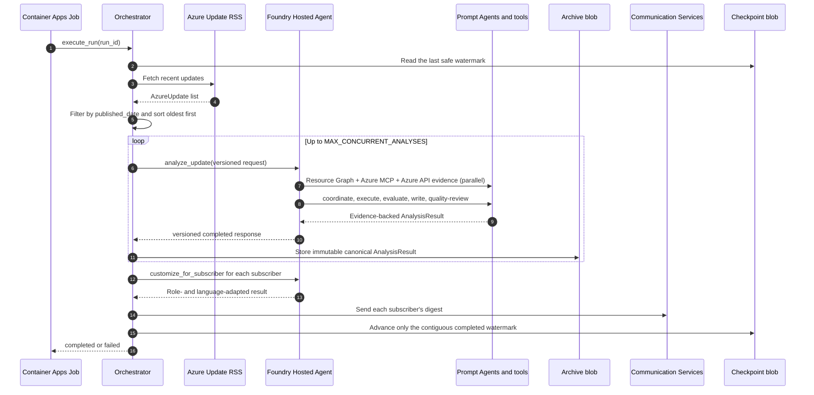
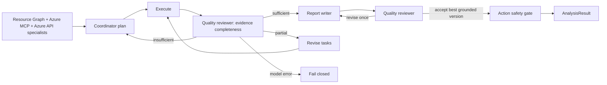

<div align="center">

# AzBrief Enterprise

**English** | [한국어](README.ko.md)

**Azure updates, analyzed for your environment, delivered to your inbox.**

[](https://www.python.org/downloads/)
[](https://learn.microsoft.com/azure/foundry/agents/concepts/hosted-agents)
[](https://github.com/langchain-ai/langgraph)
[](https://learn.microsoft.com/azure/container-apps/)
[](LICENSE)

Container Apps Job (cron) → Microsoft Foundry Hosted Agent → Communication Services
· Container App control plane + `/admin` + `/mcp` · VNet injection + Private Endpoint by default

[](https://portal.azure.com/#create/Microsoft.Template/uri/https%3A%2F%2Fraw.githubusercontent.com%2FNetworkdog%2FAzBriefEnterprise%2Fmain%2Finfra%2Fazbrief-enterprise-deploy.json)

</div>

---

> **Looking for the Standard edition?** The Automation Runbook deployment lives in
> [Networkdog/AzBrief](https://github.com/Networkdog/AzBrief). Standard and Enterprise are
> two editions of the same AzBrief product and share its mission and analysis core.

<!-- TABLE OF CONTENTS -->
<details>
<summary>Table of Contents</summary>

- [Product identity](#product-identity)
- [Why AzBrief Enterprise?](#why-azbrief-enterprise)
- [What you get](#what-you-get)
- [Architecture](#architecture)
- [End-to-end operation](#end-to-end-operation)
- [Quick Start](#quick-start)
- [Deployment](#deployment)
  - [One-click deploy](#one-click-deploy)
  - [Network isolation](#network-isolation-networkisolationmode)
  - [Post-deployment steps](#post-deployment-steps)
  - [Scheduling operations](#scheduling-operations)
- [Multi-agent pipeline](#multi-agent-pipeline)
- [Admin console](#admin-console)
- [Analysis archive](#analysis-archive)
- [How the analysis works](#how-the-analysis-works)
- [Per-subscriber reports](#per-subscriber-reports)
- [Configuration](#configuration)
- [API](#api)
- [Development](#development)
- [Project structure](#project-structure)
- [Directory guides](#directory-guides)
- [Tech stack](#tech-stack)
- [Troubleshooting](#troubleshooting)
- [License](#license)

</details>

## Product identity

AzBrief Enterprise is the enterprise edition of
[AzBrief](https://github.com/Networkdog/AzBrief), not a separate product with a
different purpose. Both editions share the same analysis core and product identity;
this repository extends that foundation with a governed Microsoft Foundry runtime,
private networking, durable state and enterprise operations.

### Overview

AzBrief is an **Azure Update Intelligence Agent** for Azure administrators. It collects
Azure updates, correlates them with the tenant's actual resources, evaluates each update
on the independent axes of importance, impact and job relevance, and turns the findings
into a role-specific daily digest with evidence and concrete actions.

### Mission

**Translate every generic Azure announcement into what it means for this environment and
what the responsible operator should do next.** AzBrief closes the gap between knowing
that Azure changed and making a timely, well-grounded operational decision.

### Product direction

| Principle | Direction |
|---|---|
| **Environment before generic summary** | Ground conclusions in the tenant's real resources, configuration, health, policy, cost and regional availability |
| **Action over notification** | Go beyond describing a change to provide scoped procedures, commands, deadlines and risk warnings |
| **Coverage without silent filtering** | Analyze every collected update so retirements, security risks and adoption opportunities are not discarded before evidence is gathered |
| **One update, many responsibilities** | Adapt the same evidence for infrastructure, security, architecture and other roles, in each subscriber's language |
| **Trust before autonomy** | Keep evidence traceable, validate executable actions and fail closed when identity, permissions or model capabilities are unclear |
| **Enterprise governance by design** | Run the same intelligence mission with Entra-only access, governed Prompt Agents, private-by-default networking, observability and recoverable state |

### Goals

- Reduce the daily work of reading and triaging a high-volume Azure update feed.
- Identify affected resources, risks and opportunities from tenant evidence rather than
  inference alone.
- Deliver the next safe, specific action early enough to avoid service, security, cost and
  governance surprises.
- Give every stakeholder a briefing shaped for their role without duplicating the core
  investigation.
- Scale the original AzBrief experience into regulated environments without weakening its
  relevance, actionability or language quality.

### Vision

Make Azure change intelligence a routine operational capability: every Azure team starts
the day knowing **what changed, where it matters, why it matters and what comes next** for
its own environment. In that future, an Azure update is no longer another announcement to
read; it is evidence-backed decision intelligence ready for the people responsible for it.

<p align="right">(<a href="#azbrief-enterprise">back to top</a>)</p>

## Why AzBrief Enterprise?

Azure publishes dozens of updates every week. New features, service retirements, security
patches, pricing changes — each one can affect your production environment. But keeping up
is hard:

- **Volume.** Hundreds of updates per year. Only a fraction matter to you. Finding them
  means reading the feed every day.
- **No context.** Azure tells you *what* changed, but not *which of your resources are
  affected* or *what you need to do about it*.
- **One size doesn't fit all.** An infrastructure engineer needs migration steps. A security
  officer needs compliance impact. The same announcement can't serve both.

AzBrief collects Azure updates, cross-references them against your tenant's actual resources
via Resource Graph, classifies each by importance, impact and job relevance, and delivers a
consolidated daily digest — complete with CLI commands, procedures, and deadlines — straight
to each team member's inbox.

The **Enterprise** edition adds what a regulated environment needs on top of that analysis:

| | |
|---|---|
| **Governed specialist team** | One Foundry Hosted Agent owns the complete LangGraph runtime while six distinct Prompt Agents provide coordination, Resource Graph, Azure MCP, Azure API, report-writing, and quality-review expertise |
| **No model API keys** | Foundry runs Entra-only (`disableLocalAuth`); the state account is Entra-only too. Container App API/MCP access uses its own scoped control-plane key |
| **Private by default** | `vnetInjection` injects the agent compute into a delegated subnet, integrates Container Apps with the same VNet, and puts Foundry, Key Vault and the state account behind private endpoints |
| **Managed analysis compute** | Foundry provisions an isolated Hosted Agent sandbox per session and owns its endpoint, lifecycle, scaling, identity, and observability |
| **Admin console** | `/admin` behind Entra ID sign-in with an explicit principal allow-list — trigger a run, inspect configuration, review run history |
| **Analysis archive** | `/archive` keeps every canonical analysis version in private Blob Storage and provides authenticated search, filters, deep links, and audit provenance without storing subscriber PII |
| **MCP control plane** | Authenticated Streamable HTTP at `/mcp` exposes recent updates, Hosted Agent analysis, and digest-run status without putting analysis logic back in Container Apps |
| **Durable checkpoint** | The "analysed up to" watermark is a blob that only moves forward, written after a run completes, so an interrupted run repeats a window instead of skipping an update |

<p align="right">(<a href="#azbrief-enterprise">back to top</a>)</p>

## What you get

- **All updates analyzed** — No pre-filtering; every update gets a full analysis
- **Three-axis assessment** — Each update independently scored on three orthogonal axes:
  - **Importance** — the update's inherent significance in the Azure ecosystem
  - **Impact** — the effect on your actual resources, from Resource Graph queries
  - **Job relevance** — the fit to the subscriber's specific role
- **Tenant-wide correlation** — Resource Graph queries across every accessible subscription
- **Verified commands from the docs** — The Learn page an update links to is fetched and its
  `<pre>` command blocks are extracted separately from the prose, so real `az`/PowerShell
  commands survive the context budget instead of degrading into "check the Portal"
- **Practitioner commentary** — Topic-matched write-ups from the
  [Azure Weekly](https://azureweekly.info) digest supply real-world caveats that official
  documentation does not carry (opt out with `COMMUNITY_INSIGHTS_ENABLED=false`)
- **Triple-checked action items** — An action item is the only part of the report a reader may
  run verbatim against production, so it passes a three-layer safety gate: a deterministic
  static gate (destructive commands without a rollback, unattended `--yes`/`--force`,
  unresolved `<placeholder>` values, resource names absent from the evidence, fabricated
  deadlines), an independent adversarial LLM cross-check over the same evidence, and a policy
  gate that **strips the command** from any item that fails. Each item ships with its verdict
  badge (verified / caution required / execution withheld / cross-check not run). A non-mutating evaluation
  action is reviewed as `advisory_review`: no CLI or rollback is required, and an incomplete
  go/no-go check can be `caution` but cannot be blocked merely for lacking a command. Commands
  and state-changing Portal procedures remain fail-closed.
- **Role-based reports** — Same update, different perspective per subscriber
- **Multilingual** — Per-subscriber language from a pluggable registry (Korean, English and
  Japanese ship curated style guides; any other language still renders through fallback
  labels and a generated style guide)

<p align="right">(<a href="#azbrief-enterprise">back to top</a>)</p>

## Architecture

```
Container Apps Job  ──  cron (0 2 * * * UTC), python -m src.scheduler
  │
  ├─ Azure Update RSS ──────── select the digest window
  ├─ Hosted Agent endpoint ─── one complete analysis per update
  ├─ Storage blob ──────────── immutable analysis archive, then forward-only checkpoint
  └─ Communication Services ── per-subscriber email

Microsoft Foundry Hosted Agent  ──  hosted_agent_main.py → src/hosted_agent.py
  ├─ LangGraph ──────────────── Plan → Execute → Evaluate → Report
  ├─ Prompt Agents ──────────── coordinator / Resource Graph / Azure MCP / Azure API / report / quality
  ├─ Microsoft Learn MCP ────── primary official documentation source
  ├─ Web Search ─────────────── supplementary current/public evidence
  ├─ Azure MCP Server ───────── read-only tenant evidence via Container Apps
  ├─ Cost/Advisor/Health/Policy/Region evidence tools
  └─ Subscriber customization

Azure MCP Container App  ──  Entra-authenticated HTTPS remote MCP
  ├─ direct leaf tools ───────── group/resourcehealth/advisor only
  ├─ --read-only ────────────── no create/update/delete tools
  └─ managed identity ───────── subscription Reader only

Container App  ──  control-plane image and identity
  ├─ /admin ─────────────────  Entra ID sign-in + principal allow-list
  ├─ /archive ──────────────── canonical analysis browser + reader allow-list
  ├─ /api/* ─────────────────  orchestration API (X-API-Key)
  └─ /mcp ──────────────────── authenticated MCP Streamable HTTP
```

The job and app use the same **control-plane image**. They own feed selection, canonical archive
persistence, checkpointing, email delivery, Admin, API, and MCP, but never construct
`AzureUpdateAnalyzer`. Both use
`HostedAgentAnalyzer`, which fails closed unless the Hosted Agent endpoint is configured.

AzBrief's analysis runtime **is a Foundry Hosted Agent**. Its source is deployed directly from
`azure.yaml`; Foundry builds the image and creates an immutable version with a dedicated
endpoint and Entra identity. The Hosted Agent orchestrates six distinct persisted Prompt Agents
through the project-scoped Responses API. Resource Graph, Azure MCP, and Azure API specialists
collect complementary evidence; a coordinator plans the remaining work; a report writer creates
the briefing; and an independent quality reviewer can request one bounded correction. Azure
evidence tools run under the Hosted Agent identity.
File-based history and pattern optimizations use the session-persistent `$HOME/.azbrief`
directory because the deployed application package under `/app` is read-only.
See [the architecture assessment](.github/skills/foundry-agent-architecture/references/assessment.md)
for the responsibility boundary and validation evidence.
The proposed [user-feedback and continuous-improvement design](.github/skills/foundry-agent-architecture/references/feedback-learning-system.md)
separates typed per-user preferences from eval-gated global prompt releases; it is not yet a
runtime capability.

<p align="right">(<a href="#azbrief-enterprise">back to top</a>)</p>

## End-to-end operation

AzBrief Enterprise deliberately separates the **control plane** from the **analysis runtime**.
The Container App and Container Apps Job decide which updates to process, when to process them,
and who receives the results. The Microsoft Foundry Hosted Agent owns the investigation of one
update, tenant-impact assessment, report generation, and subscriber customization.

| Boundary | State and behavior it owns | What it does not own |
|---|---|---|
| Container Apps Job (`src.scheduler`) | Scheduled process lifetime and success/failure exit code | LangGraph, Prompt Agents, analysis tools |
| Orchestrator (`src.orchestrator`) | RSS window, concurrency, run records, digest assembly, checkpoint | Analysis judgment for an individual update |
| Archive (`src.archive`, `src.services.archive`) | Shared source document, immutable versions, list metadata, Entra reader API/UI | Subscriber-specific variants and email addresses |
| Hosted proxy (`src.agent.hosted_client`) | Versioned request/response contract and remote-call timeout | Local analysis fallback |
| Hosted Agent (`src.hosted_agent`) | Contract validation, analyzer lifetime, analysis/customization dispatch | Schedule, digest checkpoint, email delivery |
| Analyzer (`src.agent.analyzer`) | Investigation plan, tool execution, evidence-completeness review, report, safety validation | Per-recipient delivery results and processing-window commit |

### One scheduled run



1. `python -m src.scheduler` creates `HostedAgentAnalyzer`, `EmailService`, and
  `AzureUpdateParser`, then starts one `RunRecord`. The scheduler exits with process code `0`
  when the run is `completed` and `1` otherwise.
2. The orchestrator uses an explicit `since` value when provided. Otherwise, it chooses the
  checkpoint blob, a local-development checkpoint file, or finally 24 hours before the current
  time. A checkpoint read failure does not stop the run, so work may repeat but updates are not
  silently skipped.
3. It keeps RSS items newer than the starting point and sorts them by `published_date` in
  ascending order. That order is the basis for calculating a safe checkpoint even when
  completion order differs.
4. Updates run in parallel under the `MAX_CONCURRENT_ANALYSES` semaphore. Before each task starts,
  the orchestrator compares `RUN_TIME_BUDGET_S` with the slowest analysis observed so far. If the
  remaining time is insufficient, it leaves the item as `deferred` for the next run rather than
  starting new analysis.
5. A single-item failure is isolated from other updates. Failed items count as processed so that
  one permanently broken update cannot pin the checkpoint forever, but three consecutive
  failures stop new remote analysis. Items not yet started remain beyond the watermark.
6. Before subscriber customization, the Hosted result is stored as an immutable document in
  `azbrief-archive`. In environments where the archive is configured, a storage failure prevents
  the item from being marked complete at the watermark and stops both the digest and checkpoint.
  The processing window therefore cannot advance beyond the archive.
7. Stored results are collected into one set of digest candidates. The default digest includes
  every analyzed update regardless of relevance, while `should_notify` supplies relevant-item
  counts and badges. The email's shared canonical-analysis link points to the document saved
  before customization.
8. When subscribers exist, the same evidence-backed result is sent back to the Hosted Agent for
  parallel role- and language-specific customization. A failed customization falls back to the
  original analysis, and one failed email does not block other subscribers. `email_sent` is true
  when delivery succeeds for at least one recipient.

### Exact meaning of completed status

`RunRecord.status == "completed"` means the orchestration function reached the end; it does not
mean every individual analysis and email succeeded. The scheduler process exit code is based on
this status alone, so operational validation must inspect these fields together:

| Field | Meaning |
|---|---|
| `analyzed` | Number of items for which the Hosted Agent returned a valid result |
| `archived` | Number of canonical analysis documents written to durable storage |
| `archive_failed` | Number of items whose analysis completed but whose archive write failed, causing the whole run to fail closed |
| `failed` | Number of isolated item failures; failed items count as processed to prevent permanent pinning |
| `deferred` | Number of items not started because of the run-time budget and carried to the next window |
| `pending` | Number of items beyond the contiguous completed prefix that the checkpoint does not yet cover |
| `email_sent` | Whether the default digest was sent when there are no subscribers, or at least one subscriber received it otherwise |
| `checkpoint_committed` | Whether the calculated watermark actually advanced in the durable store |

The current checkpoint tracks **processing state for the analysis window**; it is not a delivery
queue. An archive write failure blocks both the digest and checkpoint, but digest delivery failure
is separate. The analyzed contiguous prefix may therefore be committed even when digest delivery
fails with `email_sent=false`, and the next scheduled run does not retry only the email. Stronger
delivery guarantees require a separate outbox or delivery checkpoint. Operators should alert on
the counters above and delivery logs together rather than relying on `completed` alone.

### One Hosted Agent call

The Container App and Job do not serialize domain objects directly. Pydantic models in
`src.agent.hosted_contract` define the update, operation, contract version, trace ID, and result.
The proxy places this internal contract in the input text of a Foundry Responses request and calls
it with `store=false`. The response is validated in this order:

1. Confirm that the Responses API HTTP request succeeded. Transient HTTP or network failures for
   analysis requests use exponential backoff for up to three attempts, while subscriber
   customization is attempted once to avoid amplifying overload.
2. Parse the output text as `HostedAgentResponse`.
3. Confirm that the request and response have matching trace IDs and operations.
4. Confirm that the internal status is `completed` and a result exists.
5. Validate the result again as the final `AnalysisResult`.

A contract mismatch, inactive Hosted Agent version, timeout, or remote error is a call failure.
The control plane does not construct `AzureUpdateAnalyzer` locally in that case. This fail-closed
boundary prevents development and production from silently using different analysis paths.

Pre-release evaluation uses the additional `evaluate_update` operation. It executes the same Hosted
graph and returns the canonical analysis plus bounded G-Eval, trajectory, and action-verification
summaries. Raw tenant evidence and private judge reasoning never cross this wire boundary. Campaign
artifacts keep the response `trace_id`, which joins the result to Hosted and Prompt Agent lifecycle,
tool, score, safety, and latency events in Application Insights.

When the Hosted Agent receives a request, it interprets `AZBRIEF_PROMPT_*` environment variables
as Prompt Agent role settings and clears `FOUNDRY_HOSTED_AGENT_NAME` from its internal settings.
This structurally prevents `AzureUpdateAnalyzer` inside the Hosted Agent from recursively calling
itself. The analyzer is created lazily on the first request and reused within the same sandbox
session afterward.

### Analysis state machine for one update



**Specialist evidence collection.** The `resource_graph`, `azure_mcp`, and `azure_api` Prompt
Agents investigate distinct evidence surfaces in parallel. The Resource Graph specialist owns KQL
authoring and result interpretation; the Azure MCP specialist analyzes resource groups, Resource
Health, and Advisor through the authenticated read-only MCP; and the Azure API specialist owns ARM,
Policy, Activity Log, and Cost Management/Billing evidence. Each result is strict JSON with a stable
claim ID, evidence URI, confidence, and gap. A specialist failure remains a `partial` gap so that
downstream stages do not mistake it for "no impact." The Hosted Agent fails closed if all three
specialists are not configured or if one Agent name is reused across roles.

**Plan.** The coordinator reads the update body and Microsoft Learn documentation first, then
structures investigation goals and an `AnalysisTask` list. Planning tools are limited to document
research, so this phase does not draw tenant-impact conclusions before evidence exists.

**Execute.** Each planned tool is resolved by name and called through its Pydantic input contract.
Read-only tools declared safe for concurrency run in parallel; write tools and tools whose safety
cannot be determined run serially. Based on the update type, the first execution pass automatically
adds often-missed checks for Resource Health, Policy, Service Health, Advisor, configuration
profiles, dependencies, and regional availability.

**Evaluate and revise.** The evaluator reviews not only whether tools succeeded, but also official
facts, tenant impact, resource identification, region/configuration data, and **evidence
completeness**. Sufficient evidence advances to reporting. Partial evidence revises and reruns only
the required tasks, while an insufficient investigation plan returns to planning. Separate bounds
on plan revisions, task revisions, and total iterations prevent infinite loops.

**Report.** The reporter synthesizes the evidence into the `AnalysisResult` schema. Importance
records the announcement's inherent significance, impact records its effect on the current
environment, and job relevance records its fit to the subscriber's responsibilities. URL
normalization, JSON recovery, and continuation after output-length limits are applied at this
boundary.

**Safety and quality gates.** Action items with executable commands must pass deterministic rules,
independent LLM verification, and a policy gate. Destructive commands, unresolved placeholders,
resources absent from evidence, and risky commands without rollback do not pass through unchanged.
Trajectory evaluation and G-Eval quality assessment run when configured; runtime G-Eval accepts its
single rewrite only when the score improves.

### Preserving evidence from large tool results

Tool output is not discarded when it exceeds `TOOL_RESULT_BUDGET_CHARS`. The full string is stored
in the trace-scoped `context_store`, while the prompt receives a preview and a `[ref=Rn]` handle.
The evaluator cannot conclude that a resource is absent from the preview alone; it must search the
full result through `query_tool_result` before confirming absence. The store applies per-entry and
total-size limits plus oldest-first eviction, then clears results for the trace when analysis ends.

### What the checkpoint guarantees

With parallel analysis, the fifth update may finish before the second. Saving the most recently
completed item's time would make the next run start after the unfinished second item and skip it
forever. `_WatermarkCursor` therefore advances only across the **unbroken prefix completed in
oldest-first order**.

- Successful analysis and isolated single-item failures advance the cursor.
- Items deferred for lack of time and items not started after consecutive-failure cutoff do not
  advance the cursor.
- A dry run does not write the checkpoint.
- Blob storage cannot move behind the existing value, and conditional ETag requests prevent races
  between concurrent runs.
- A checkpoint write failure does not fail the digest run. Repeating work in the next run is safer
  than skipping an update.

Admin "run now" and externally initiated API runs use the same `execute_run()`, so these semantics
remain identical. `/mcp`'s `analyze_azure_update` delegates one Hosted Agent analysis without
creating a digest run, while `get_recent_digest_runs` reads recent in-memory run records. Those
records are for observability; the checkpoint alone owns processing state that must be durable.

<p align="right">(<a href="#azbrief-enterprise">back to top</a>)</p>

## Quick Start

Local development uses your Azure CLI identity to invoke agents already published in a
Microsoft Foundry project. There is no Azure OpenAI/OpenAI endpoint or API key fallback.

```bash
git clone https://github.com/Networkdog/AzBriefEnterprise.git
cd AzBriefEnterprise
python -m venv .venv && .venv/Scripts/Activate.ps1  # or: source .venv/bin/activate
pip install -r requirements.txt
cp .env.example .env
```

Set at minimum in `.env`:

```env
AZURE_TENANT_ID=your-tenant-id
AZURE_CLIENT_ID=
AZURE_SUBSCRIPTION_ID=your-subscription-id
FOUNDRY_PROJECT_ENDPOINT=https://your-resource.services.ai.azure.com/api/projects/your-project
FOUNDRY_HOSTED_AGENT_NAME=azbrief-analysis-hosted
FOUNDRY_COORDINATOR_AGENT_NAME=azbrief-coordinator
FOUNDRY_RESOURCE_GRAPH_AGENT_NAME=azbrief-resource-graph
FOUNDRY_AZURE_MCP_AGENT_NAME=azbrief-azure-mcp
FOUNDRY_AZURE_API_AGENT_NAME=azbrief-azure-api
FOUNDRY_REPORT_WRITER_AGENT_NAME=azbrief-report-writer
FOUNDRY_QUALITY_REVIEWER_AGENT_NAME=azbrief-quality-reviewer
```

The six Prompt Agent names are required and must be distinct inside the Hosted Agent.
`FOUNDRY_HOSTED_AGENT_NAME` is required when running the Container App or scheduler. The
control plane does not fall back to local analysis when the Hosted Agent is absent, and the
Hosted Agent does not collapse missing specialist roles into one general-purpose Agent.

Leave `AZURE_CLIENT_ID` empty for local development, then sign in and select the subscription:

```powershell
az login --tenant <tenant-id>
az account set --subscription <subscription-id>
```

Then run:

```bash
python -m scripts.test_local list                                    # list recent updates
python -m scripts.test_local analyze --latest                        # analyze the newest one
python -m scripts.test_local analyze --from 2026-02-01 --to 2026-02-10
python -m scripts.test_local analyze --latest --jsonl results.jsonl  # export, skip email
python -m scripts.test_local resources                               # view your resource summary
```

> **Historical date ranges:** The live Azure Update RSS feed only exposes a rolling window of
> the most recent ~200 items, so months that have aged out return nothing when queried
> directly. For date-range analysis (`--from`/`--to`), AzBrief merges a locally crawled
> history archive (`data/azure_updates_history.jsonl`, de-duplicated against the live feed).
> Refresh it with `python -m scripts.crawl_azure_updates`.

<p align="right">(<a href="#azbrief-enterprise">back to top</a>)</p>

## Deployment

### One-click deploy

Deploys the Azure foundation and control plane: a Foundry account and project with a model
deployment, the Container App (API + Admin + MCP), the Container Apps Job that drives the
daily digest, Key Vault, state storage, and Communication Services. Prompt Agents and the
Hosted Agent are Foundry data-plane objects and are deployed in the post-deployment steps.

[](https://portal.azure.com/#create/Microsoft.Template/uri/https%3A%2F%2Fraw.githubusercontent.com%2FNetworkdog%2FAzBriefEnterprise%2Fmain%2Finfra%2Fazbrief-enterprise-deploy.json)

**What gets deployed** ([infra/azbrief-enterprise-deploy.json](infra/azbrief-enterprise-deploy.json),
authored in [infra/enterprise/main.bicep](infra/enterprise/main.bicep)):

| Resource | Name | Notes |
|----------|------|-------|
| User Assigned Managed Identity | `id-{baseName}` | Shared by the Container App and scheduler Job |
| Microsoft Foundry account | `aif-{baseName}-{suffix}` | `AIServices` · `allowProjectManagement` · **`disableLocalAuth`** |
| Foundry project | `{baseName}-agents` | Data-plane workspace for the Hosted Agent and Prompt Agents |
| Model deployment | `gpt-4o` (configurable) | GlobalStandard, 200K TPM by default |
| Key Vault | `kv-{baseName}-{suffix}` | RBAC-only store for all runtime secrets |
| Storage account + `azbrief-state` container | `st{baseName}{suffix}` | Checkpoint blob, **`allowSharedKeyAccess: false`** |
| Container Apps Environment | `cae-{baseName}-{suffix}` | VNet-integrated by default |
| Container App | `ca-{baseName}` | Control-plane API + `/admin` + authenticated `/mcp` |
| Container Apps Job | `caj-{baseName}` | Cron schedule, Hosted Agent invocation, checkpoint, and email |
| Hosted Agent (subsequent `azd deploy`) | `{baseName}-analysis-hosted` | Complete LangGraph analysis and subscriber customization with a dedicated Entra identity |
| Container App authConfig | `current` | Entra ID sign-in, created only when a client ID is supplied |
| Communication Services + Email | `acs-{baseName}-{suffix}` | Azure-managed domain connected automatically |
| Log Analytics + Application Insights | `log-` / `appi-` | Structured logs and tracing |
| Control-plane role assignments | 5 assignments | Key Vault Secrets User · Storage Blob Data Contributor · Foundry User · Monitoring Metrics Publisher · RG Reader |

**Security design (safe defaults):**

- **Foundry has no local key** — `disableLocalAuth: true` accepts only Entra ID tokens. There is
  no model key to leak or rotate.
- **The state store is Entra-only too** — the Storage account uses
  `allowSharedKeyAccess: false`, and the managed identity's write permission is scoped to that
  account alone. A checkpoint is not a secret, so it does not earn write access to the vault that
  holds real secrets.
- **Runtime secrets stay in Key Vault.** The Container App and scheduler Job reference them through
  managed identity, and values do not appear in template outputs or API responses.
- **The admin console requires both conditions** — an Entra app registration
  (`adminEntraClientId` + secret) and an explicit allow-list (`adminAllowedPrincipals`). If either
  is empty, `/admin` returns 404.
- **The orchestrator API uses a generated key**, and ingress can also be restricted by CIDR through
  `allowedIpRanges` when needed.
- **Keep the two identities distinct.** The Container Apps managed identity is for the checkpoint,
  email, and Admin/MCP control plane. The Hosted Agent uses a separate identity created during
  deployment to query tenant evidence. Grant subscription Reader and service-specific data-plane
  roles to the **Hosted Agent identity**; the template does not assign broad permissions
  automatically.

### Network isolation (`networkIsolationMode`)

| Value | What changes | When to choose it |
|----|----------------|------------|
| `vnetInjection` **(default)** | Foundry agent compute is injected into a delegated subnet, the Container Apps environment joins the same VNet, and Foundry, Key Vault, and the state account are available **only through private endpoints** | Enterprise default for environments where traffic must remain inside the VNet |
| `perimeter` | Endpoints remain public, but Foundry, Key Vault, Log Analytics, and the state account are enclosed in a **Network Security Perimeter** to block exfiltration paths | When a new VNet is not possible or only a PaaS boundary is required |
| `public` | Endpoints are public, with Entra tokens, the API key, and allow-lists as the only boundaries | Evaluation and demonstration environments only |

> **Why `vnetInjection` is the default:** Foundry network injection can be configured **only when
> the account is created**. An account deployed as `public` cannot be changed to injection later;
> it must be deleted and purged. The harder-to-reverse choice is therefore the default.

**Additional resources created by `vnetInjection`**

| Resource | Name | Notes |
|--------|------|------|
| Virtual Network | `vnet-{baseName}-{suffix}` | Uses an existing VNet unchanged when `existingVnetResourceId` is provided |
| Foundry agent subnet | `snet-foundry-agent` (`/24`) | Delegated to `Microsoft.App/environments` and exclusive to one Foundry account |
| Container Apps subnet | `snet-container-apps` (`/24`) | Delegated to `Microsoft.App/environments` for the workload-profiles environment |
| Private endpoint subnet | `snet-private-endpoints` (`/27`) | No delegation |
| Five Private DNS zones | `privatelink.services.ai.azure.com` · `privatelink.openai.azure.com` · `privatelink.cognitiveservices.azure.com` · `privatelink.vaultcore.azure.net` · `privatelink.blob.core.windows.net` | Linked to the VNet |
| Three Private Endpoints | `pe-aif-…` · `pe-kv-…` · `pe-st…` | Foundry (`account`) · Key Vault (`vault`) · Storage (`blob`) |
| Foundry project capability host | `caphostproj` | Required for a network-injected account |

- **The address space must be RFC1918.** The Foundry agent subnet rejects ranges outside
  `10.0.0.0/8`, `172.16-31.0.0/12`, and `192.168.0.0/16`.
- **Key Vault and the state account use `publicNetworkAccess: Disabled`.** The Container App and
  scheduler Job use managed identity to read and write secrets and checkpoints through private
  endpoints. Template-declared secret writes continue through the trusted-service exception.
- **When using an existing VNet,** all three subnets must already exist with the required
  delegations. The template does not overwrite subnet policies it does not own.
- **With `internalIngressOnly: true`,** ingress becomes VNet-only and a Private DNS zone that points
  to the environment's default domain is created automatically. The scheduler calls the Foundry
  Hosted Agent endpoint directly rather than app ingress, so **the daily run still works**.
  `/admin`, `/api/*`, and `/mcp` are accessible only inside the VNet.

**Additional resources created by `perimeter`**

| Resource | Name | Notes |
|--------|------|------|
| Network Security Perimeter | `nsp-{baseName}-{suffix}` | |
| Profile | `azbrief` | Inbound and outbound rule set |
| Inbound rule (subscription) | `inbound-subscriptions` | Defaults to the deployment subscription so the Container App can call Foundry |
| Inbound rule (IP) | `inbound-ip` | Created only when `perimeterInboundIpRanges` is populated |
| Outbound rule (FQDN) | `outbound-fqdn` | Defaults to `azure.microsoft.com` and `learn.microsoft.com` |
| Four resource associations | `assoc-foundry` · `assoc-keyvault` · `assoc-loganalytics` · `assoc-storage` | |
| Diagnostic setting | `nsp-access-logs` | Sends `NSPAccessLogs` to Log Analytics |

- **The default mode is `Learning` (Transition),** which records without blocking. Review calls
  that would have been denied in the `NSPAccessLogs` table, then redeploy with
  `perimeterAccessMode: Enforced` or run the output's `enforcePerimeterCommand`.
- Container Apps and Communication Services are not yet onboarded to the NSP. Ingress IP
  restrictions and the API key continue to protect that front end.

### Post-deployment steps

1. **Deploy the Azure MCP Server** — `infra/azure-mcp-server` deploys the verified official Azure
  MCP `3.0.0-beta.38` image to a separate Container App. Upgrade the version explicitly through
  the Bicep `azureMcpImage` parameter. The server keeps Entra authentication enabled and runs with
  `--mode all`, `--namespace group|resourcehealth|advisor`, and `--read-only`. It therefore exposes
  only direct tools from those three namespaces, without the dynamic `azure` proxy, and its
  managed identity receives only `Reader` on the target subscription. The default size is
  0.5 vCPU/1 GiB.
  ```powershell
  cd infra/azure-mcp-server
  azd env new production
  azd env set AZURE_SUBSCRIPTION_ID '<subscription-id>'
  azd env set AZURE_LOCATION 'koreacentral'
  azd env set AZURE_RESOURCE_GROUP 'RG-AZBRIEF-ENTERPRISE-2'
  azd env set AZURE_MCP_CONTAINER_APP_NAME 'ca-azbrief-mcp'
  azd env set FOUNDRY_PROJECT_RESOURCE_ID '<project-arm-resource-id>'
  azd env set SERVICE_MANAGEMENT_REFERENCE ''
  azd up --no-prompt
  ```
2. **Create the Azure MCP project connection** — Use the HTTPS URL and Entra application
  identifier URI from the Azure MCP deployment outputs. The Project Managed Identity token is
  issued for the MCP API audience, and Bicep grants that identity the MCP app role.
  ```powershell
  azd ai connection create azbrief-azure-mcp-read-only `
    --kind remote-tool `
    --target '<AZURE_MCP_SERVER_URL>' `
    --auth-type project-managed-identity `
    --audience '<AZURE_MCP_ENTRA_APP_IDENTIFIER_URI>' `
    --project-endpoint '<project-endpoint>'
  ```
3. **Create the Foundry Prompt Agents** — ARM cannot create Agent data-plane objects. The
  coordinator receives Microsoft Learn MCP as its primary source and Web Search as a supplement.
  The Resource Graph specialist receives only KQL, schema, and result-retrieval FunctionTools;
  the Azure API specialist receives only ARM, Health, Policy, Advisor, Activity Log, and Cost
  Management FunctionTools. The Azure MCP specialist uses only the remote MCP connection above
  and has no local ARM fallback. The Hosted Agent inserts the exact tenant GUID and configured
  subscription GUID into every Azure MCP/API request and forbids the literal `default`. A remote
  leaf tool may interpret an omitted tenant or `default` as a tenant display name and reject it.
  After upgrading the Azure MCP image, validate direct-tool schemas and a read-only inventory
  smoke test first. If the MCP mode, namespace, or scope contract changes, publish new immutable
  versions of both the Azure MCP specialist and Hosted Agent. Put the endpoint, six Agent names,
  provisioning model, and these settings in `.env`, then run:
  ```env
  FOUNDRY_COORDINATOR_WEB_SEARCH_ENABLED=true
  AZURE_MCP_SERVER_URL=<AZURE_MCP_SERVER_URL>
  AZURE_MCP_PROJECT_CONNECTION_NAME=azbrief-azure-mcp-read-only
  ```
  ```bash
    python -m scripts.provision_foundry_agents --dry-run   # preview instructions
    python -m scripts.provision_foundry_agents             # create or update
  ```
    To update only selected roles, pass a value such as `--roles resource_graph azure_api`. Then
    confirm that `python -m scripts.provision_foundry_agents --check` passes without drift in all
    six Agents, FunctionTools, server tools, instructions, or schemas. Reusing one Agent name for
    multiple roles makes both provisioning and the check fail. The check normalizes the trailing
    slash that Foundry adds to MCP URLs and the persisted `allowed_tools.tool_names` representation
    before comparing semantic equality.
  4. **Configure and deploy the Hosted Agent** — Connect the existing Foundry project endpoint and
    ARM resource ID to the azd environment, then set the Prompt Agent name aliases. Because
    `azure.yaml` contains `codeConfiguration`, `azd deploy` uploads the source as a ZIP and Foundry
    builds the image. Docker and ACR are not required for this step.
  ```powershell
  $env:AZURE_DEV_USER_AGENT='microsoft_foundry_skill'
  azd env set AZURE_AI_PROJECT_ENDPOINT '<project-endpoint>'
  azd env set AZURE_AI_PROJECT_ID '<project-arm-resource-id>'
  azd env set AZURE_SUBSCRIPTION_ID '<subscription-id>'
  azd env set AZBRIEF_PROMPT_COORDINATOR_AGENT_NAME 'azbrief-coordinator'
  azd env set AZBRIEF_PROMPT_RESOURCE_GRAPH_AGENT_NAME 'azbrief-resource-graph'
  azd env set AZBRIEF_PROMPT_AZURE_MCP_AGENT_NAME 'azbrief-azure-mcp'
  azd env set AZBRIEF_PROMPT_AZURE_API_AGENT_NAME 'azbrief-azure-api'
  azd env set AZBRIEF_PROMPT_REPORT_WRITER_AGENT_NAME 'azbrief-report-writer'
  azd env set AZBRIEF_PROMPT_QUALITY_REVIEWER_AGENT_NAME 'azbrief-quality-reviewer'
  azd deploy azbrief-analysis-hosted --no-prompt
  azd ai agent show --output json
  ```
5. **Grant permissions to the Hosted Agent identity** — Find the new Hosted Agent identity
   principal ID through `azd ai agent show --output json` or the Foundry portal. Grant Reader on
   every subscription to be analyzed and only the data-plane roles required by tools such as Log
   Analytics and Cost Management. To use `list_billing_accounts` or `list_billing_profiles`, grant
   this identity **Billing Reader** or equivalent read permission at the relevant billing-account
   scope. Billing access is not included in subscription Reader, and the resource-group-scoped
   Bicep deployment cannot grant it on your behalf. Using the Container Apps
   `grantReaderCommand` instead grants permission to the wrong identity.
6. **Deploy the Container Apps control-plane image** — The template starts with a placeholder
   image. Use `deployContainerImageCommand` or `deploy-container-app.yml` to update the Container
   App and scheduler Job **together**. Both fail rather than falling back to local analysis when
   `FOUNDRY_HOSTED_AGENT_NAME` is absent or the endpoint is inactive.
7. **Optionally enable the admin console** — Register an Entra app, then redeploy with
   `adminEntraClientId`, `adminEntraClientSecret`, and `adminAllowedPrincipals` populated.

> **Validation scope:** The template passes Bicep type checking for resource types, API versions,
> and property names. The subscription-level ARM preflight (`az deployment group validate`) could
> not be run in the development environment because of MFA requirements, so run it once before
> the first deployment.

### Scheduling operations

| Goal | Method |
|-------------|------|
| Change the run time | Redeploy with `scheduleCronExpression` (UTC cron, default `0 2 * * *`) |
| Run immediately | Use the deployment output's `runNowCommand` (`az containerapp job start`) or the run button in `/admin` |
| Adjust the maximum duration of one run | Set `jobReplicaTimeoutSeconds` (12 hours by default, 7 days maximum). `RUN_TIME_BUDGET_S` is set automatically to one hour less |
| Reset the analysis window | Delete the blob at the output's `checkpointBlobUrl` to return to the default 24-hour window |
| Review execution history | Use Log Analytics or `az containerapp job execution list` |

> The Job does not retry (`replicaRetryLimit: 0`). A failed execution did not move the checkpoint,
> so the next schedule covers the same window again without paying for the same analysis twice in
> one night.

<p align="right">(<a href="#azbrief-enterprise">back to top</a>)</p>

## Multi-agent pipeline

The outer runtime is the `azbrief-analysis-hosted` **Hosted Agent**. Inside its isolated
sandbox, `AzureUpdateAnalyzer` owns the complete LangGraph state machine, tool execution,
retries, context store, and delivery-safe result contract. Six persisted Prompt Agents provide
specialist reasoning. The Hosted Agent is the only orchestrator; Prompt Agents do not call or
schedule one another.

```env
FOUNDRY_COORDINATOR_AGENT_NAME=azbrief-coordinator
FOUNDRY_RESOURCE_GRAPH_AGENT_NAME=azbrief-resource-graph
FOUNDRY_AZURE_MCP_AGENT_NAME=azbrief-azure-mcp
FOUNDRY_AZURE_API_AGENT_NAME=azbrief-azure-api
FOUNDRY_REPORT_WRITER_AGENT_NAME=azbrief-report-writer
FOUNDRY_QUALITY_REVIEWER_AGENT_NAME=azbrief-quality-reviewer
```

| Specialist | Execution point | Responsibility and tool boundary |
|---|---|---|
| `coordinator` | Planning and bounded task revision | Reads the update and Microsoft Learn first, reconciles specialist findings, and creates the minimum evidence plan. It receives Learn MCP and optional Web Search but no tenant mutation tools |
| `resource_graph` | Parallel evidence pass; KQL repair throughout execution | Writes restricted-dialect Resource Graph KQL, probes schemas and empty filters, executes queries, and interprets returned property values. It receives only Resource Graph/schema/result-retrieval FunctionTools |
| `azure_mcp` | Parallel evidence pass | Uses the Entra-authenticated, read-only Azure MCP Server for resource groups, Resource Health, and Advisor. It receives that managed MCP connection and no local ARM fallback |
| `azure_api` | Parallel evidence pass | Uses read-only ARM, Policy, Health, Advisor, Activity Log, Cost Management, and Billing tools for facts unavailable through Resource Graph or Azure MCP |
| `report_writer` | After evidence completeness is accepted | Produces the structured report and subscriber-specific language/role adaptation from validated evidence only |
| `quality_reviewer` | Evidence evaluation, report G-Eval, and action safety | Rejects incomplete evidence, scores faithfulness/actionability/readability/depth, requests at most one bounded rewrite, and independently checks executable actions |

The three evidence specialists run concurrently and return strict JSON with stable role-prefixed
claim IDs, evidence URIs, confidence, and explicit gaps. A timeout, permission error, or malformed
response becomes a `partial` gap rather than disappearing or being interpreted as zero impact.
The coordinator then plans any missing work. The existing Execute/Evaluate loop performs only
the additional calls needed to close named gaps and stops on diminishing returns.

The report writer runs only after the quality reviewer accepts evidence completeness. The quality
reviewer then performs semantic G-Eval over the report and the same evidence snapshot. If the score
misses the target or a critical flaw exists, it sends evidence-addressed feedback to the report
writer exactly once. The revised report is kept only when its score improves; the reviewer cannot
introduce new facts. The action-item safety gate runs against the final retained report.

All six names are required and must be distinct. `src.hosted_agent.get_analysis_runtime()` fails
closed when the roster is incomplete or one Prompt Agent is reused for multiple roles. The Hosted
Agent receives the names through non-reserved `AZBRIEF_PROMPT_*` aliases in `azure.yaml`, which also
passes the exact tenant and configured subscription IDs. Only these six role aliases participate
in runtime readiness; missing or unknown settings cannot satisfy the gate.

Create or update the roster with:

```bash
python -m scripts.provision_foundry_agents --dry-run
python -m scripts.provision_foundry_agents
python -m scripts.provision_foundry_agents --roles resource_graph azure_api
python -m scripts.provision_foundry_agents --check
python -m scripts.provision_foundry_agents --delete
```

When cleaning up project Agents, compare `azure.yaml`, source and IaC, the six-role roster, and
the active Hosted Agent version's environment variables. Abort deletion if a required name is
missing or an unexpected name is present, and remove only explicitly confirmed obsolete Agent
versions.

Each Agent's base standing instruction comes from `RUNTIME_AGENT_INSTRUCTIONS` or
`SPECIALIST_PROMPTS` in `src/agent/foundry_backend.py`. The seven domain documents under
`.github/skills/` additionally own a bounded `Foundry Runtime Guidance` section. Provisioning
loads only those compact sections and compiles a role-specific set into the immutable Foundry
Agent instruction. Resource Graph receives KQL guidance, Azure API receives service-integration
guidance, report writer receives report/language/email guidance, and quality reviewer receives the
evaluation rubric. Developer procedures, file paths, and test commands never enter model context.
A runtime-guidance change appears as instruction drift in `--check` and requires a new Prompt
Agent version.

This deterministic instruction compilation does not depend on the public-preview Foundry Skills
API. Native versioned Skills and toolbox MCP discovery remain an optional future delivery path;
if adopted, pin tested Skill versions and keep the compiled instructions as the production
fallback until private-network support and runtime behavior are production-ready.

The whole path is **read-only** with respect to your Azure resources. Models, strict output
formats, app FunctionTool declarations, optional managed tools, guardrails, and memory live on
the Foundry Agent definitions; app FunctionTools execute under the Hosted Agent identity.
AzBrief never constructs a direct Azure OpenAI/OpenAI chat client.

<p align="right">(<a href="#azbrief-enterprise">back to top</a>)</p>

## Admin console

Use `https://<container-app>/admin` to inspect configuration status, subscribers, recent Azure
updates, and run history, or to start analysis immediately.

| Path | Description |
|------|------|
| `GET /admin` | Admin console (server-rendered, no external resources, nonce-based CSP) |
| `GET /api/admin/status` | Effective configuration summary without secrets |
| `GET /api/admin/subscribers` | Subscriber list |
| `GET /api/admin/updates` | Recent Azure updates |
| `GET /api/admin/runs` · `GET /api/admin/runs/{id}` | Run history and one-run lookup |
| `POST /api/admin/runs` | Start analysis, limited to one concurrent run |
| `POST /mcp` | MCP Streamable HTTP tools for recent updates, Hosted analysis, and digest status |

Container Apps built-in authentication (EasyAuth) handles sign-in. Its sidecar validates the
Entra ID token, injects `X-MS-CLIENT-PRINCIPAL*` headers, and removes inbound copies of those
headers. The application checks that identity against the `ADMIN_ALLOWED_PRINCIPALS` allow-list;
an empty list denies even authenticated users. When the console is disabled, `/admin` returns
**404**, not 403. A locked deployment should not advertise that the surface exists.

MCP uses the official Python SDK v2 stateless Streamable HTTP transport. Every MCP request
validates `X-API-Key` before parsing the payload, and the server **fails closed with 503** when
`API_KEY` itself is unset. The exposed tools are `list_recent_azure_updates`,
`analyze_azure_update`, and `get_recent_digest_runs`. The analysis tool does not run LangGraph in
the Container App; it delegates to the Foundry endpoint through `HostedAgentAnalyzer`.

Platform authentication is configured in **AllowAnonymous** mode. Platform-level "authentication
required" applies to *every* request without exception and would redirect API-key calls to the
sign-in page. Instead, the sidecar validates any presented token and the application performs
authorization: an unauthenticated browser that requests `/admin` is redirected to
`/.auth/login/aad`, while `/api/*` is protected by the API key.

With EasyAuth enabled, a disabled surface returns 404, an unauthenticated browser request returns
302, an unauthenticated API request returns 401, and a principal outside the allow-list receives
403. The Admin header shows the `/archive` link only when the Archive UI is enabled. The status API
reports Archive backend/UI configuration state but never returns the Blob URL or a secret.

`ADMIN_REQUIRE_AUTH=false` is for local development only. Disabling it where ingress is not the
only path to the container permits header spoofing.

<p align="right">(<a href="#azbrief-enterprise">back to top</a>)</p>

## Analysis archive

`https://<container-app>/archive` is the operational interface for searching and rereading the
**shared canonical analysis source** produced by the Hosted Agent. It does not store
subscriber-specific translations or role customizations, names, or email addresses. Reanalyzing
the same Azure Update preserves a new version instead of overwriting the previous document.

The Container Apps control plane and its private `azbrief-archive` container are the archive source
of truth. The Hosted Agent's `$HOME/.azbrief` JSONL files are bounded planning memory, not the
browser archive.

Job relevance is subscriber-specific delivery context and remains email-only. It is excluded from
Archive documents, Blob metadata, list/detail API responses, browser views, and query filters.

| Path | Description |
|---|---|
| `GET /archive` · `GET /archive/{archive_id}` | Responsive browser shell with nonce-based CSP |
| `GET /api/archive/analyses` | Cursor search over title, summary, service, category, importance, impact, relevance, source, and date; personalized job relevance is intentionally excluded |
| `GET /api/archive/analyses/{archive_id}` | Canonical document detail with schema and hash validation |

The store is the private `azbrief-archive` container in the existing Entra-only Storage account.
Each analysis version is one Block Blob at `entries/{reverse_epoch_ms}-{uuid}.json`, written
create-only with `If-None-Match: *`. Blob metadata from the same PUT contains the list projection,
so the detail document and search index cannot drift apart. A projection that exceeds metadata
limits is marked and restored from the full document during listing, preventing title, summary, or
service search false negatives. If identical bytes already exist after
a timeout and retry, the write is treated as idempotent success; different bytes occupying the
same ID fail as a conflict. Detail reads validate the SHA-256 payload hash and strict schema v1,
including frozen nested update, report, resource, action, and reference contracts.

The Archive Page accepts only identities validated by Container Apps EasyAuth. Readers are the
union of UPNs, object IDs, and group IDs in `ARCHIVE_ALLOWED_PRINCIPALS` plus every Admin principal;
an empty union denies everyone. With `internalIngressOnly=true`, email deep links open only inside
the VNet. Blob URLs, SAS tokens, and storage credentials are never exposed in API responses.
Storage bearer tokens are sent only to validated Azure Blob container endpoints. The deterministic
evaluator checks both forbidden PII keys and email-like values in nested free text.

<p align="right">(<a href="#azbrief-enterprise">back to top</a>)</p>

## How the analysis works

Each update runs through a [LangGraph](https://github.com/langchain-ai/langgraph) state
machine owned by the Hosted Agent:

1. **Specialists** — Runs Resource Graph, Azure MCP, and Azure API evidence passes in parallel
2. **Plan** — Coordinator reads the update and specialist gaps, then builds an investigation plan
3. **Execute** — Runs any remaining tools in parallel: Resource Graph queries, Learn searches, cost
   lookups, Advisor recommendations, resource health, policy compliance, region availability
4. **Evaluate** — Quality reviewer checks completeness; coordinator revises bounded gaps
5. **Report** — Report writer produces the structured analysis and action items
6. **Improve** — Quality reviewer may request one grounded rewrite; only a better score is kept
7. **Protect** — Independently verifies executable actions before delivery
8. **Customize** — Report writer adapts the same evidence for each subscriber and language

If a Resource Graph query fails, the agent rewrites and retries it (up to 20 times). A query
that succeeds but returns nothing from an over-strict filter is probed against real data and
corrected, rather than being accepted as "no affected resources".
Service builders project decision-bearing properties explicitly. For AKS, Azure Files/Disk CSI
state comes from `storageProfile.fileCSIDriver` / `diskCSIDriver`; the Key Vault secrets-provider
add-on is kept separate and is never used as a proxy for storage CSI state.

Tool results larger than the prompt budget are not discarded: the full text is kept in an
addressable store and the agent retrieves the rest with `query_tool_result`, so a needle past
the cutoff can still be found — and an absence can be *confirmed* instead of assumed.

<p align="right">(<a href="#azbrief-enterprise">back to top</a>)</p>

## Per-subscriber reports

Each subscriber gets the same update rewritten for their role and language:

```json
[
  {"email": "infra@co.com", "name": "Alice", "role": "VM and networking", "language": "en"},
  {"email": "sec@co.com",   "name": "Bob",   "role": "Security & compliance", "language": "en"},
  {"email": "ops@co.com",   "name": "Carol", "role": "Cloud Architect", "language": "ko"}
]
```

Set this as the `SUBSCRIBERS` environment variable (the ARM template takes it as the
`subscribers` parameter). Each entry may also narrow responsibility with optional subscription,
resource-group, focus-service, and alert-level fields. The canonical analysis still runs once;
the Archive never stores these customized variants or subscriber PII.

### Adding a language

`src/i18n/` is the single source of truth — nothing else in the codebase enumerates language
codes. Adding one is a single registry line; everything else is optional.

1. **Register it** in `src/i18n/__init__.py`:
   ```python
   register_language(LanguageSpec(code="fr", english_name="French", native_name="Français"))
   ```
   The language is now selectable via `REPORT_LANGUAGE` or a subscriber's `language` field.
2. **Translate the UI labels** (optional) — add `src/i18n/labels/fr.py` with a `LABELS` dict.
   A partial translation is safe: missing keys fall through the fallback chain, so a missing
   key can never raise `KeyError` at render time.
3. **Write a style guide** (optional) — add `src/agent/prompts/languages/fr.py` with
   `STYLE_GUIDE` and, if useful, `TRANSLATION_NOTES`.

Regional tags normalize automatically (`fr-FR` → `fr`), and `missing_label_keys("fr")`
reports what is still untranslated.

<p align="right">(<a href="#azbrief-enterprise">back to top</a>)</p>

## Configuration

<details>
<summary>Environment variables</summary>

| Variable | Description | Required | Default |
|----------|-------------|:--------:|---------|
| `AZURE_TENANT_ID` | Tenant ID | Yes | — |
| `AZURE_CLIENT_ID` | User-assigned managed identity client ID; empty with local `az login` | | — |
| `AZURE_SUBSCRIPTION_ID` | Subscription (all if unset) | | — |
| `FOUNDRY_PROJECT_ENDPOINT` | Foundry project endpoint | Yes | — |
| `FOUNDRY_HOSTED_AGENT_NAME` | Complete analysis runtime invoked by Container App and scheduler | Yes¹ | — |
| `FOUNDRY_HOSTED_AGENT_TIMEOUT_S` | Timeout for one complete Hosted Agent operation | | `1800` |
| `AZBRIEF_DATA_DIR` | Hosted Agent history/pattern directory; set automatically to `$HOME/.azbrief` | | runtime-managed |
| `FOUNDRY_COORDINATOR_AGENT_NAME` | Evidence planning and bounded task revision Prompt Agent | Yes² | — |
| `FOUNDRY_RESOURCE_GRAPH_AGENT_NAME` | Resource Graph KQL authoring, repair, and result-analysis Prompt Agent | Yes² | — |
| `FOUNDRY_AZURE_MCP_AGENT_NAME` | Read-only Azure MCP tenant-analysis Prompt Agent | Yes² | — |
| `FOUNDRY_AZURE_API_AGENT_NAME` | ARM, Health, Policy, Advisor, Cost Management/Billing Prompt Agent | Yes² | — |
| `FOUNDRY_REPORT_WRITER_AGENT_NAME` | Structured report and subscriber-customization Prompt Agent | Yes² | — |
| `FOUNDRY_QUALITY_REVIEWER_AGENT_NAME` | Evidence, report-quality, and action-safety Prompt Agent | Yes² | — |
| `FOUNDRY_MODEL_DEPLOYMENT` | Model used only when provisioning Agent definitions | * | — |
| `FOUNDRY_COORDINATOR_WEB_SEARCH_ENABLED` | Add Web Search after the coordinator's primary Microsoft Learn MCP source | | `false` |
| `AZURE_MCP_SERVER_URL` | HTTPS endpoint of the read-only Azure MCP Container App | For Azure MCP specialist | — |
| `AZURE_MCP_PROJECT_CONNECTION_NAME` | Foundry project connection used to authenticate to Azure MCP | For Azure MCP specialist | — |
| `FOUNDRY_AGENT_TIMEOUT_S` | Per-agent timeout | | `180` |
| `CHECKPOINT_BLOB_URL` | Blob holding the digest checkpoint | | — |
| `CHECKPOINT_FILE_PATH` | Local checkpoint file, used only when the blob URL is unset | | — |
| `ARCHIVE_BLOB_CONTAINER_URL` | Private container for immutable canonical analysis versions | Enterprise | — |
| `ARCHIVE_FILE_PATH` | Local archive directory when the Blob URL is unset | | — |
| `ARCHIVE_BASE_URL` | Container App base URL used in authenticated email deep links | | — |
| `ARCHIVE_UI_ENABLED` | Serve `/archive` and `/api/archive/*` | | `false` |
| `ARCHIVE_REQUIRE_AUTH` | Require an EasyAuth principal (local dev only when `false`) | | `true` |
| `ARCHIVE_ALLOWED_PRINCIPALS` | Comma-separated reader UPN/object/group IDs; Admins are included | | — |
| `RUN_TIME_BUDGET_S` | Wall-clock budget for one run; keep below the job replica timeout | | `39600` |
| `MAX_CONCURRENT_ANALYSES` | Updates analyzed in parallel | | `3` |
| `ORCHESTRATOR_ENDPOINT` | Container App URL an external scheduler calls (https only) | | — |
| `ORCHESTRATOR_API_KEY` | Key an external scheduler presents as `X-API-Key` | | — |
| `API_KEY` | Key for `/api/*` and `/mcp`; MCP returns 503 when unset | Yes³ | — |
| `ADMIN_UI_ENABLED` | Serve `/admin` and `/api/admin/*` | | `false` |
| `ADMIN_REQUIRE_AUTH` | Require an authenticated principal (local dev only when `false`) | | `true` |
| `ADMIN_ALLOWED_PRINCIPALS` | Comma-separated UPN/object-ID allow-list (empty denies all) | | — |
| `COMMUNICATION_SERVICES_CONNECTION_STRING` | Email service | | — |
| `COMMUNICATION_SERVICES_ENDPOINT` | Email via managed identity (no stored secret) | | — |
| `EMAIL_SENDER_ADDRESS` / `EMAIL_RECIPIENT_ADDRESS` | From / fallback To address | | — |
| `SUBSCRIBERS` | Subscriber list (JSON) | | — |
| `REPORT_LANGUAGE` | Default report language | | `ko` |
| `LOG_ANALYTICS_WORKSPACE_ID` | Log Analytics workspace for operational queries | | — |
| `CUSTOM_SYSTEM_PROMPT` | Extra analysis instructions | | — |
| `LOG_LEVEL` | Log level | | `INFO` |
| `REPORT_FILTERING_ENABLED` | Suppress `not_relevant` reports from email (`false` = deliver all) | | `false` |
| `REQUIRE_APPROVAL_BEFORE_SEND` | Withhold auto-dispatch; save preview + log for human approval | | `false` |
| `GEVAL_ENABLED` | Enable the G-Eval quality judge | | `true` |
| `GEVAL_TARGET_SCORE` | Passing score on the 1-5 scale | | `4.5` |
| `GEVAL_RUNTIME_ENABLED` | Quality reviewer + at most one report-writer rewrite inside `analyze_update` | | `true` |
| `TRAJECTORY_EVAL_ENABLED` | Rule-based agent process-quality score after each analysis | | `true` |
| `ACTION_VERIFICATION_ENABLED` | Three-layer action-item safety gate | | `true` |
| `COMMUNITY_INSIGHTS_ENABLED` | Azure Weekly practitioner commentary | | `true` |
| `OTEL_ENABLED` | OpenTelemetry tracing to Application Insights | | `false` |
| `APPLICATIONINSIGHTS_CONNECTION_STRING` | App Insights connection string for span export | | — |

\* `FOUNDRY_MODEL_DEPLOYMENT` is required by `scripts.provision_foundry_agents.py` unless
`--model` is supplied. It is not read by the running application.

¹ Required by the Container App and scheduler. ² All six are required inside the Hosted Agent,
must resolve to distinct Agent names, and are also required by direct local analysis scripts.
³ Required when exposing MCP; existing `/api/*` behavior remains open when unset for local
compatibility.

</details>

<p align="right">(<a href="#azbrief-enterprise">back to top</a>)</p>

## API

```
POST /api/analyze                  Analyze an Azure Update URL
POST /api/rss/check                List updates not yet processed
POST /api/batch/analyze            Analyze up to 10 URLs
POST /api/orchestrate/run          Start a checkpoint-aware digest run
GET  /api/orchestrate/runs/{id}    Poll one in-memory run record
GET  /health                       Health check
GET  /                             Service info
POST /mcp                          MCP Streamable HTTP (X-API-Key required)

GET  /archive                      Authenticated canonical analysis browser
GET  /archive/{archive_id}         Browser deep link to one analysis version
GET  /api/archive/analyses         Cursor-paginated metadata search
GET  /api/archive/analyses/{id}    Validated canonical analysis document

GET  /admin                        Admin console (Entra ID sign-in)
GET  /api/admin/status             Effective configuration — no secrets
GET  /api/admin/subscribers        Subscriber list
GET  /api/admin/updates            Recent Azure updates
GET  /api/admin/runs               Run history
GET  /api/admin/runs/{id}          Single run
POST /api/admin/runs               Start a run (one at a time)
```

The machine-facing analysis/orchestration routes require `X-API-Key` when `API_KEY` is set.
`/api/admin/*` and `/api/archive/*` instead use EasyAuth principals and explicit allow-lists.
`/mcp` always fails closed:
missing configuration returns 503, a missing key returns 401, and an invalid key returns 403.

<p align="right">(<a href="#azbrief-enterprise">back to top</a>)</p>

## Development

### Running tests

```bash
python -m pytest tests/ -o "addopts=" -q      # full suite
python -c "import src"                        # import check — must pass before committing
```

### Container image

```bash
docker build -t azbrief-enterprise:local .
docker run -p 8000:8000 --env-file .env azbrief-enterprise:local  # API + Admin + MCP
docker run --env-file .env azbrief-enterprise:local python -m src.scheduler  # control-plane run; analysis is remote
```

Run the Hosted Agent locally through the Foundry agent adapter:

```powershell
$env:AZURE_DEV_USER_AGENT='microsoft_foundry_skill'
azd ai agent run azbrief-analysis-hosted --no-client
azd ai agent invoke azbrief-analysis-hosted --local --input-file <request.json>
```

For `azd ai agent invoke`, `<request.json>` contains the inner versioned AzBrief contract
(`operation`, `update`, and `trace_id`), not an outer OpenAI Responses envelope. The
Container Apps proxy builds the outer envelope itself in production.

### Infrastructure

`infra/azbrief-enterprise-deploy.json` is **compiled output** — edit the Bicep and recompile:

```bash
az bicep build --file infra/enterprise/main.bicep \
  --outfile infra/azbrief-enterprise-deploy.json
```

CI fails when the compiled template drifts from the Bicep source, because the Deploy button
points at the JSON.

### Report quality

```bash
# Generate a real-data report, score it, and iterate toward the target
python -m scripts.evaluate_report --latest --with-html --iterate 3

# Rule-based mechanical scoring only (no LLM judge)
python -m scripts.evaluate_report --latest --no-geval
```

Fleet-level measurement stratifies updates across categories with a fixed seed, so the same
seed selects the same updates and a before/after comparison stays valid:

```bash
python -m scripts.evaluate_batch --months 6 --sample 12 --seed 42
```

Long-running pre-release improvement freezes the period and untouched holdout before any source
change. Run an unchanged A/A pair to measure judge/model noise, compare candidates case-by-case,
and reject any increase in critical flaws, failed trajectories, generation errors, or blocked
actions even when the mean score rises:

```bash
python -m scripts.quality_campaign prepare --from 2026-06-01 --to 2026-08-29 \
  --sample 24 --seed 42 --holdout-ratio 0.25 --output eval_runs/campaign-q3
python -m scripts.quality_campaign run --campaign eval_runs/campaign-q3 \
  --tag baseline-a --runtime local --split diagnosis --concurrency 1 --use-azd-env
python -m scripts.quality_campaign run --campaign eval_runs/campaign-q3 \
  --tag baseline-a --runtime local --split diagnosis --concurrency 1 --use-azd-env \
  --resume-run eval_runs/campaign-q3/runs/<interrupted-baseline-a>
python -m scripts.quality_campaign compare --baseline <baseline-run> \
  --candidate <candidate-run> --noise-floor 0.15 --output eval_runs/comparison.json
```

`local` evaluates the current source with the live six-Prompt-Agent roster before deployment.
Each attempt is preserved under `attempts/`, while the final case outcome is atomically checkpointed
under `records/`; `run.json` freezes the case order,
concurrency, source hash, and immutable Agent versions, while `progress.json` records completion.
Keep campaign concurrency at 1 unless capacity has been measured: each analysis already fans out
three evidence specialists, and overlapping analyses can amplify Prompt Agent rate limits. The source
hash includes the HEAD commit, tracked binary diff, and every non-ignored untracked file path and byte.
`--resume-run` executes only missing cases and fails closed if any frozen lineage value changed.
Transient connection/rate-limit failures and report-generation placeholders are retried once after
the first pass, so a short outage does not force every successful case to run again. Exhausted case
errors and any G-Eval dimension error remain release blockers; a mean score cannot hide them.
Runner schema, rubric, threshold, or Hosted-contract drift requires a newly prepared campaign.
After an approved Hosted deployment, repeat with `--runtime hosted`. A sampled run is diagnostic;
release requires a full-period campaign (`--sample 0 --split all`) whose deployed Hosted summary has
`release_eligible=true`. The rubric and research basis are in
[the quality campaign reference](.github/skills/report-evaluation/references/quality-campaign-rubric.md).

Archive correctness and scale are evaluated without Azure calls. The default corpus creates
10,000 immutable versions and fails on cursor duplication/skips, ordering drift, filter errors,
schema/hash loss, PII keys, oversized responses, or excessive local P95 latency:

```bash
python -m scripts.evaluate_archive --records 10000
```

<p align="right">(<a href="#azbrief-enterprise">back to top</a>)</p>

## Project structure

```
AzBriefEnterprise/
├── src/
│   ├── config.py               # pydantic-settings (env → Settings)
│   ├── main.py                 # Container Apps control plane — API + /admin + /archive + /mcp
│   ├── mcp_server.py           # authenticated MCP Streamable HTTP tools
│   ├── hosted_agent.py         # Foundry Hosted Agent entry point (full analysis runtime)
│   ├── scheduler.py            # Container Apps Job control-plane entry point
│   ├── orchestrator.py         # Run registry, watermark cursor, checkpoint commit
│   ├── middleware.py           # API key auth + per-IP rate limiting
│   ├── admin/                  # Admin console (auth, page, router)
│   ├── archive/                # versioned contracts, reader auth, API, responsive browser
│   ├── agent/                  # LangGraph agent, tools, prompts
│   │   ├── analyzer.py         # Plan-Execute-Evaluate state machine
│   │   ├── foundry_backend.py  # Prompt Agent adapter + specialist collaboration
│   │   ├── hosted_client.py    # Container Apps → Hosted Agent proxy
│   │   ├── hosted_contract.py  # strict versioned request/response wire models
│   │   ├── tools.py            # Tool definitions (LangChain BaseTool)
│   │   ├── context_store.py    # Addressable store for oversized tool results
│   │   ├── action_verification.py  # Three-layer action-item safety gate
│   │   ├── geval.py            # G-Eval LLM-as-a-Judge report quality
│   │   ├── resilience.py       # Retry, circuit breaker, run deadline
│   │   └── prompts/            # Phase-specific prompt assembly package
│   ├── i18n/                   # Language registry (single source of truth)
│   ├── rss/                    # Azure Update RSS parser
│   ├── email/                  # EmailService + HTML templates
│   └── services/               # Azure data access (incl. checkpoint.py + archive.py)
├── infra/
│   ├── enterprise/main.bicep           # source of truth — edit here
│   ├── enterprise/modules/             # modules inlined into the compiled template
│   └── azbrief-enterprise-deploy.json  # compiled ARM template (Deploy button)
├── scripts/                    # Local CLI, crawler, Foundry agent provisioning, quality eval
├── tests/
├── hosted_agent_main.py        # root bootstrap referenced by azure.yaml
├── azure.yaml                  # Foundry Hosted Agent direct-code deployment
├── .agentignore                # Hosted Agent deployment package exclusions
├── Dockerfile
├── pyproject.toml
└── requirements.txt
```

## Directory guides

Each README explains its directory's purpose, runtime connections, practical examples, invariants
to preserve, and focused validation commands. Only first-party boundaries maintained in Git have
their own guide. Directories for secrets, dependencies, caches, and runtime artifacts follow the
separate policy below.

### Application and tests

| Directory | Guide | Core responsibility |
|---|---|---|
| `src` | [`src/README.md`](src/README.md) | Map of the control-plane and Hosted Agent Python package |
| `src/admin` | [`src/admin/README.md`](src/admin/README.md) | EasyAuth, allow-list, nonce CSP, and manual runs |
| `src/agent` | [`src/agent/README.md`](src/agent/README.md) | LangGraph, Foundry adapter, tools, resilience, safety, and evaluation |
| `src/agent/prompts` | [`src/agent/prompts/README.md`](src/agent/prompts/README.md) | Phase-specific prompt assembly |
| `src/agent/prompts/languages` | [`src/agent/prompts/languages/README.md`](src/agent/prompts/languages/README.md) | Per-language style guides and translation notes |
| `src/agent/prompts/report` | [`src/agent/prompts/report/README.md`](src/agent/prompts/report/README.md) | Report schema and category frame |
| `src/email` | [`src/email/README.md`](src/email/README.md) | Responsive HTML/plain text and ACS delivery |
| `src/i18n` | [`src/i18n/README.md`](src/i18n/README.md) | Language registry and fallback chain |
| `src/i18n/labels` | [`src/i18n/labels/README.md`](src/i18n/labels/README.md) | Canonical and translated UI label bundles |
| `src/rss` | [`src/rss/README.md`](src/rss/README.md) | Live RSS, history merge, and URL normalization |
| `src/services` | [`src/services/README.md`](src/services/README.md) | Azure/public API data access and checkpoint |
| `scripts` | [`scripts/README.md`](scripts/README.md) | Local analysis, provisioning, evaluation, and optimization CLIs |
| `tests` | [`tests/README.md`](tests/README.md) | Pytest suites and fixtures by area |

### Infrastructure and repository operations

| Directory | Guide | Core responsibility |
|---|---|---|
| `infra` | [`infra/README.md`](infra/README.md) | Index of Enterprise and Azure MCP IaC deployment units |
| `infra/enterprise` | [`infra/enterprise/README.md`](infra/enterprise/README.md) | Bicep source of truth for the product topology |
| `infra/enterprise/modules` | [`infra/enterprise/modules/README.md`](infra/enterprise/modules/README.md) | Runtime-name Private DNS module for internal ingress |
| `infra/azure-mcp-server` | [`infra/azure-mcp-server/README.md`](infra/azure-mcp-server/README.md) | Read-only Azure MCP `azd` deployment unit |
| `infra/azure-mcp-server/infra` | [`infra/azure-mcp-server/infra/README.md`](infra/azure-mcp-server/infra/README.md) | MCP Container App, Entra, and RBAC composition |
| `infra/azure-mcp-server/infra/modules` | [`infra/azure-mcp-server/infra/modules/README.md`](infra/azure-mcp-server/infra/modules/README.md) | Bicep modules by MCP capability |
| `.github` | [`.github/README.md`](.github/README.md) | Repository policy, automation, prompts, and skills |
| `.github/prompts` | [`.github/prompts/README.md`](.github/prompts/README.md) | VS Code Chat prompts for long-running work |
| `.github/workflows` | [`.github/workflows/README.md`](.github/workflows/README.md) | CI, App/Job image rollout, and quality workflows |
| `.github/skills` | [`.github/skills/README.md`](.github/skills/README.md) | Repository knowledge indexed by task type |
| `.vscode` | [`.vscode/README.md`](.vscode/README.md) | Shared editor, task, debug, and MCP configuration with current constraints |

### Domain skill guides

| Skill | Guide | When to use it |
|---|---|---|
| Azure service integration | [README](.github/skills/azure-service-integration/README.md) | Add data-access services and Agent tools |
| Email template | [README](.github/skills/email-template/README.md) | Change email layout, labels, or the ACS path |
| Foundry architecture | [README](.github/skills/foundry-agent-architecture/README.md) | Audit Hosted/Prompt Agent and identity boundaries |
| Foundry references | [README](.github/skills/foundry-agent-architecture/references/README.md) | Review point-in-time assessments and live evidence |
| KQL Resource Graph | [README](.github/skills/kql-resource-graph/README.md) | Author, repair, and improve completeness of ARG queries |
| Language naturalness | [README](.github/skills/language-naturalness/README.md) | Improve ko/en/ja writing from corpus evidence |
| Report evaluation | [README](.github/skills/report-evaluation/README.md) | Run G-Eval and holdout evaluation |
| Report quality | [README](.github/skills/report-quality/README.md) | Check deterministic structure and completeness |

### Local and generated directories

The following directories are created during installation, execution, or evaluation and are not
Git-maintained documentation boundaries. Adding README files there would either leave them
untracked under the current `.gitignore` policy or make generated artifacts look like source, so
their purpose is documented only here.

| Path | Contents | Management |
|---|---|---|
| `.venv/` | Python virtual environment | Delete and recreate from requirements |
| `.azure/`, `infra/azure-mcp-server/.azure/` | Local `azd` environment state | May contain secrets; never commit |
| `data/` | Update history and local analysis/pattern/retirement state | Generated by crawler/runtime; manage only required source data under a separate policy |
| `logs/` | Structured local run logs | Remove according to retention policy after diagnosis |
| `eval_runs/` | Report, HTML, and G-Eval score artifacts | Reproducible evaluation output; never commit |
| `out/` | Best-effort email preview | Do not use as the source of truth for delivery success |
| `.pytest_cache/`, `__pycache__/`, `.coverage`, `htmlcov/` | Test/interpreter caches and coverage | Safe to regenerate at any time |
| `*.egg-info/`, `build/`, `dist/` | Packaging artifacts | Regenerated during source distribution |
| `docs/` | Currently ignored local documentation/experiment space | Move product documentation to tracked READMEs or an explicit docs policy |

## Tech stack

| Area | Technology |
|------|-----------|
| Language | Python 3.10+ |
| AI framework | `langchain-core`, `langgraph`, `azure-ai-projects` 2.5+ Responses API |
| Agent runtime | Microsoft Foundry Hosted Agent + persisted Prompt Agents |
| Web/MCP framework | FastAPI + Uvicorn + MCP Python SDK v2 Streamable HTTP |
| Settings | pydantic-settings |
| Logging | structlog (JSON) + OpenTelemetry → Application Insights |
| Azure SDKs | `azure-identity`, `azure-mgmt-resourcegraph`, `azure-mgmt-costmanagement`, `azure-communication-email`, `azure-monitor-query` |
| HTTP | httpx (async) |
| HTML parsing | BeautifulSoup4 with `html.parser` (stdlib — **not** lxml) |
| IaC | Bicep → ARM |
| Compute | Foundry Hosted Agent (analysis) + Container Apps Job (schedule/control) + Container App (API/Admin/MCP) |
| CI/CD | GitHub Actions |

<p align="right">(<a href="#azbrief-enterprise">back to top</a>)</p>

## Troubleshooting

| Symptom | Cause | Fix |
|---------|-------|-----|
| Analysis reports no affected resources | The Hosted Agent identity has no Reader on the subscription | Grant Reader to the Hosted Agent's dedicated principal, not the Container Apps identity |
| `/admin` returns 404 | The console is disabled | Supply `adminEntraClientId` + secret **and** `adminAllowedPrincipals`, then redeploy |
| Container App startup fails with Hosted Agent configuration error | `FOUNDRY_HOSTED_AGENT_NAME` or project endpoint is missing | Deploy the Hosted Agent, then set both exact values; there is no local analyzer fallback |
| Hosted Agent returns no completed response | Agent version, dedicated identity RBAC, network, or specialist Prompt Agent dependency failed | Run the roster `--check`, inspect `azd ai agent show`/monitor, and grant the Hosted identity the required roles |
| `/mcp` returns 503 | `API_KEY` is not configured | Set the control-plane API key; MCP never opens anonymously |
| `azd ai agent eval generate` returns `Data generation is not supported in this region` | Foundry evaluation data generation is unavailable in Korea Central | Use a supported evaluation region or register an existing dataset; the Hosted runtime is unaffected |
| Resource Graph specialist is unavailable | `FOUNDRY_RESOURCE_GRAPH_AGENT_NAME` points to a missing Agent/version | Fix and provision that Agent; Hosted analysis fails closed instead of routing KQL to a general-purpose fallback |
| Billing evidence returns 403 or no visible accounts | Hosted Agent identity lacks billing-scope access, or the account type does not expose the requested profile operation | Grant Billing Reader at the relevant billing account and preserve unsupported account types as explicit gaps |
| Cannot switch to `vnetInjection` | Foundry network injection is create-time only | Delete **and purge** the Foundry account, then redeploy |
| The nightly digest runs an old build | The job was not updated with the app | Redeploy via `deploy-container-app.yml`, which now updates both |
| Email is printed to the console instead of sent | No Communication Services configuration | Set `COMMUNICATION_SERVICES_ENDPOINT` (managed identity) or the connection string |
| A window was analysed twice | A previous run failed before committing | Expected: the checkpoint only advances after a completed run |

## License

MIT — see [LICENSE](LICENSE).
