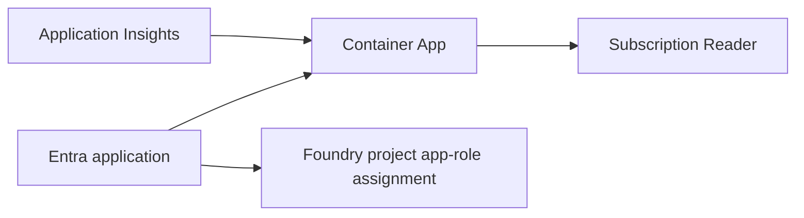

# `infra/azure-mcp-server/infra`

[프로젝트 README](../../../README.md) > [Azure MCP Server](../README.md) > `infra`

Azure MCP Server에 필요한 Azure와 Entra 리소스를 조합하는 Bicep root입니다.
[`main.bicep`](main.bicep)이 module output을 연결하고 [`bicepconfig.json`](bicepconfig.json)이
Microsoft Graph Bicep extension version을 고정합니다.

## Module 흐름



| 입력 | 의미 |
|---|---|
| `foundryProjectResourceId` | 호출 주체가 되는 Foundry project identity를 찾을 ARM ID |
| `targetSubscriptionId` | MCP의 read-only 도구가 조회할 subscription |
| `azureMcpImage` | schema/live 검증을 마친 공식 image tag |
| `appInsightsConnectionString` | 기존 component 재사용 또는 빈 값으로 전용 component 생성 |

## 사용 예시

```powershell
& .\.venv\Scripts\Activate.ps1; az bicep build --file infra\azure-mcp-server\infra\main.bicep --stdout
```

개발용 parameter 형태는 [`main.parameters.json`](main.parameters.json)을 참고하되 실제 tenant,
subscription, secret 값을 문서나 Git에 저장하지 않습니다.

## 불변식

- Graph extension과 resource API version을 검토 없이 자동 상향하지 않습니다.
- connection string parameter/output은 `@secure()`를 유지합니다.
- Entra application, service principal, identifier URI와 app role은 한 deployment에서 일관되게
  연결되어야 합니다.
- Bicep compile 성공은 Graph 권한, tenant policy, RBAC 전파 완료를 보장하지 않습니다.
