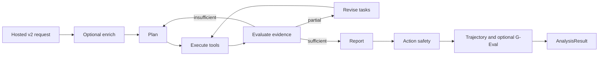

# `src/agent`

[프로젝트 README](../../README.md) > [`src`](../README.md) > `agent`

Azure Update 한 건을 근거 기반 `AnalysisResult`로 바꾸는 핵심 계층입니다. Foundry Hosted Agent
안에서 LangGraph를 실행하고, persisted Prompt Agent와 read-only tool을 호출하며, 결과의 품질과
실행 안전성을 검증합니다.

## 구성 지도

| 파일/디렉터리 | 책임 |
|---|---|
| [`analyzer.py`](analyzer.py) | Pydantic domain model과 Plan-Execute-Evaluate-Report LangGraph |
| [`foundry_backend.py`](foundry_backend.py) | Prompt Agent Responses adapter와 optional enrichment pipeline |
| [`hosted_contract.py`](hosted_contract.py) | 제어면과 Hosted Agent 사이의 strict v2 wire model |
| [`hosted_client.py`](hosted_client.py) | Entra token으로 Hosted endpoint를 호출하는 control-plane proxy |
| [`tools.py`](tools.py) | LangChain `BaseTool`, Pydantic input, KQL 실행·복구, tool registry |
| [`context_store.py`](context_store.py) | budget 초과 tool result를 `[ref=Rn]`으로 검색 가능하게 보존 |
| [`resilience.py`](resilience.py) | backoff, circuit breaker, deadline, output recovery, concurrency partition |
| [`action_verification.py`](action_verification.py) | action item의 정적·LLM·policy 3계층 안전 gate |
| [`geval.py`](geval.py) | 최종 보고서의 의미적 품질 평가 |
| [`trajectory.py`](trajectory.py) | 도구 성공률·retry·revision을 보는 결정론적 process 평가 |
| [`telemetry.py`](telemetry.py) | trace/span과 token/tool observability |
| [`kql_knowledge.py`](kql_knowledge.py) | 성공 query와 schema 지식의 재사용 |
| [`history.py`](history.py) | retirement와 과거 분석 이력 보조 데이터 |
| [`pattern_memory.py`](pattern_memory.py) | 반복 분석 pattern의 best-effort 로컬 저장 |
| [`prompts/`](prompts/README.md) | phase, 언어, category별 prompt 조립 |

## 분석 흐름



각 continue node는 기존 `AgentState`를 in-place로 바꾸지 않고 새 partial state dict를 반환합니다.
평가 결과가 invalid하거나 필수 LLM이 응답하지 않으면 `model_error`로 닫히며 근거가 충분한 것처럼
보고서를 만들지 않습니다.

## Tool 실행과 근거 완전성

`get_all_tools()`가 runtime registry입니다. `partition_tool_calls()`는 읽기 전용이며 concurrency
safe한 연속 호출만 병렬 batch로 묶고, mutation 도구 또는 판정 실패 도구는 직렬화합니다. 현재
`WRITE_TOOL_NAMES`는 비어 있지만 fail-closed 기본값은 유지됩니다.

8,000자를 넘는 결과는 `context_store`에 전체 보관하고 prompt에는 preview와 ref를 넣습니다.
Evaluator는 preview만으로 부재를 결론 내리지 않고 `query_tool_result`의 full search를 task로
요청할 수 있습니다. 한 entry는 최대 2M chars, store 전체는 16M chars이며 oldest-first로
퇴출됩니다. entry가 자체 cap에 걸리면 검색 실패도 “부재 확정”으로 표현할 수 없습니다.

## 사용 예시

네트워크 호출 없이 hosted contract의 최소 분석 요청을 만들 수 있습니다.

```python
from src.agent.hosted_contract import HostedAnalysisRequest, HostedUpdate

request = HostedAnalysisRequest(
    update=HostedUpdate(id="update-1", title="Example Azure update"),
    trace_id="local-contract-check",
)
assert request.contract_version == "2"
```

핵심 경계를 함께 검증합니다.

```powershell
& .\.venv\Scripts\Activate.ps1; python -m pytest tests\test_analyzer.py tests\test_context_store.py tests\test_hosted_contract.py tests\test_action_verification.py -o "addopts=" -q
```

## 불변식

- 제어면은 이 디렉터리의 analyzer를 직접 만들지 않습니다. `src.hosted_agent`만 graph를 소유합니다.
- 외부 RSS/Web 결과는 untrusted input이며 tenant payload를 Web Search로 보내지 않습니다.
- 필수 Prompt Agent 실패는 local chat model이나 direct OpenAI endpoint로 우회하지 않습니다.
- KQL task는 codex role을 우선하고 availability 오류에서만 primary role로 낮춥니다. fast role로
  보내지 않습니다.
- action verification 실패 시 copy-paste 가능한 command를 그대로 노출하지 않습니다.
- 분석 완료 시 trace에 속한 context-store entry를 정리해 동시 분석의 근거가 섞이지 않게 합니다.
- history/pattern 저장 실패는 완성된 분석 결과를 버리는 이유가 되지 않습니다.
