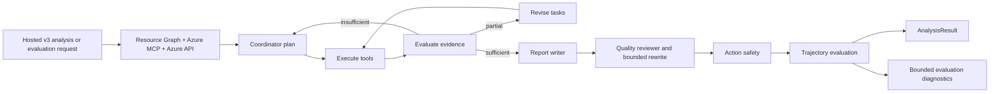

# `src/agent`

[프로젝트 README](../../README.md) > [`src`](../README.md) > `agent`

Azure Update 한 건을 근거 기반 `AnalysisResult`로 바꾸는 핵심 계층입니다. Foundry Hosted Agent
안에서 LangGraph를 실행하고, 여섯 specialist Prompt Agent와 role-scoped read-only tool을
호출하며, 결과의 품질과 실행 안전성을 검증합니다.

## 구성 지도

| 파일/디렉터리 | 책임 |
|---|---|
| [`analyzer.py`](analyzer.py) | Pydantic domain model과 Plan-Execute-Evaluate-Report LangGraph |
| [`foundry_backend.py`](foundry_backend.py) | Prompt Agent Responses adapter와 specialist collaboration |
| [foundry_instructions.py](foundry_instructions.py) | Foundry 전용 운영 지침과 여섯 역할 매핑; Copilot 스킬을 읽지 않음 |
| [`hosted_contract.py`](hosted_contract.py) | 분석·맞춤화·출시 전 평가를 위한 strict v3 wire model과 기존 v2 비범위 요청 호환 |
| [`scope.py`](scope.py) | Management Group/Subscription/Resource Group 분석 범위와 비동기 context 격리 |
| [`hosted_client.py`](hosted_client.py) | Entra token으로 Hosted endpoint를 호출하는 control-plane proxy |
| [`tools.py`](tools.py) | LangChain `BaseTool`, Pydantic input, KQL 실행·복구, tool registry |
| [`context_store.py`](context_store.py) | budget 초과 tool result를 `[ref=Rn]`으로 검색 가능하게 보존 |
| [documentation.py](documentation.py) | Learn more 본문·1단계 링크 자동 수집, 질문 기반 2단계 조회, 분석별 출처·예산·공백 관리 |
| [`resilience.py`](resilience.py) | backoff, circuit breaker, deadline, output recovery, concurrency partition |
| [`action_verification.py`](action_verification.py) | action item의 정적·LLM·policy 3계층 안전 gate |
| [`geval.py`](geval.py) | 최종 보고서의 의미적 품질 평가 |
| [`trajectory.py`](trajectory.py) | 도구 성공률·retry·revision을 보는 결정론적 process 평가 |
| [`telemetry.py`](telemetry.py) | 모든 런타임의 Entra 기반 OTel 초기화, 마스킹한 예외·span과 종료 시 flush |
| [`kql_knowledge.py`](kql_knowledge.py) | tenant-neutral seed를 읽고 runtime query/schema 지식은 ignored data 경로에 저장 |
| [`history.py`](history.py) | retirement와 과거 분석 이력 보조 데이터 |
| [`pattern_memory.py`](pattern_memory.py) | 반복 분석 pattern의 best-effort 로컬 저장 |
| [`prompts/`](prompts/README.md) | phase, 언어, category별 prompt 조립 |

## 분석 흐름

Foundry의 standing instruction은 역할별 기본 계약과 `foundry_instructions.py`의 운영 정책을
`scripts/provision_foundry_agents.py`가 합쳐 게시합니다. `prompts/`의 요청별 계약은 Hosted에서
전달합니다. `.github/skills`는 개발용 Copilot 절차만 담고, 운영 지침 조립의 입력이 아닙니다.
KQL·작성·언어·평가 정책을 바꾸면 새 Prompt Agent 버전을 게시하고, Hosted 프롬프트나 코드를
바꾸면 Hosted도 배포해야 합니다. 로컬 테스트 통과를 배포된 버전의 검증으로 간주하지 않습니다.


```mermaid
flowchart LR
  I[Hosted v3 analysis or evaluation request] --> E[Resource Graph + Azure MCP + Azure API]
  E --> P[Coordinator plan]
    P --> X[Execute tools]
    X --> V[Evaluate evidence]
    V -->|partial| T[Revise tasks]
    T --> X
    V -->|insufficient| P
    V -->|sufficient| R[Report writer]
    R --> Q[Quality reviewer and bounded rewrite]
    Q --> A[Action safety]
    A --> TQ[Trajectory evaluation]
    TQ --> O[AnalysisResult]
    TQ --> D[Bounded evaluation diagnostics]
```

각 continue node는 기존 `AgentState`를 in-place로 바꾸지 않고 새 partial state dict를 반환합니다.
평가 결과가 invalid하거나 필수 LLM이 응답하지 않으면 `model_error`로 닫히며 근거가 충분한 것처럼
보고서를 만들지 않습니다.

`HostedAnalysisRequest.scope`는 조사 범위를 명시합니다. 범위 제한이 있으면 Resource Graph는
SDK/KQL 경계에서 이를 강제하고, 전체 범위를 적용할 수 없는 MCP/API 도구는 조회를 넓히지 않고
명시적인 gap을 반환합니다. 구독자별 범위 분석 결과는 이메일 전용이며 공유 canonical Archive나
기본 분석의 memory에 섞지 않습니다. 호환 배포는 Hosted v3를 먼저 게시한 뒤 제어면을 갱신합니다.

## Tool 실행과 근거 완전성

Learn more 대상 문서 최대 3개(깊이 0)와 각 문서의 본문 링크 최대 2개(깊이 1)를 자동 수집합니다.
전체 본문은 ref로 보관하고 3,000자 미리보기와 별도로 내부 링크·출처·깊이를 전달합니다.
미해결 질문이 있을 때만 `fetch_documentation_link(parent_url, url, question)`로 실제 발견한
링크를 조회하며 깊이 2를 넘지 않습니다. 사전 수집과 후속 조회는 12회 시도·누적 조회 90초·
근거 100만 자를 공유하고, 중복·순환·임의 URL을 차단합니다. 계획 단계의 ref 검색 발췌도
평가·보고서·judge까지 보존하며, 실패·생략을 읽은 근거로 간주하지 않습니다.
문서 도구는 Coordinator의 로컬 요청 bridge와 실행 단계에서만 사용하며 evidence specialist의
FunctionTool 목록을 늘리지 않습니다. 취소·실패 시에도 분석별 context와 ref를 정리합니다.

`get_all_tools()`가 runtime registry입니다. `partition_tool_calls()`는 읽기 전용이며 concurrency
safe한 연속 호출만 병렬 batch로 묶고, mutation 도구 또는 판정 실패 도구는 직렬화합니다. 현재
`WRITE_TOOL_NAMES`는 비어 있지만 fail-closed 기본값은 유지됩니다.

8,000자를 넘는 결과는 `context_store`에 전체 보관하고 prompt에는 preview와 ref를 넣습니다.
Evaluator는 preview만으로 부재를 결론 내리지 않고 `query_tool_result`의 full search를 task로
요청할 수 있습니다. 한 entry는 최대 2M chars, store 전체는 16M chars이며 oldest-first로
퇴출됩니다. entry가 자체 cap에 걸리면 검색 실패도 “부재 확정”으로 표현할 수 없습니다.

Tool input 이름은 실행 계약입니다. `find_related_resources`는 `keyword` 배열을 받고,
`query_azure_resources.query`는 실제 ARG table로 시작하는 KQL이어야 합니다. Revision이 자연어
query와 `resource_type`을 함께 반환하면 analyzer가 rich builder query로 복구합니다.
`query_tool_result.ref`는 `[ref=Rn]`의 `Rn`만 허용하며 specialist claim ID는 거부합니다.

Resource Graph Prompt Agent는 strict evidence envelope를 사용하므로 repair 호출은 server-side
tool을 `tool_choice=none`으로 끄고 claim의 `text`에서 KQL을 추출합니다. Gap-only JSON을 KQL로
실행하거나 다른 specialist로 fallback하지 않습니다.

대량 대상은 [resource_evidence.py](resource_evidence.py)의 실행별 카탈로그로 전달합니다.
작성 모델은 모든 행이 같은 적용 조건을 충족하는 조회의 `reference`와 `reason`만 선택하고,
파서는 전체 ARM 식별 목록을 복원합니다. 최대 64개 조회·20,000개 수집 행을 보존하며 중복 ID는
합칩니다. 부분 페이지·ID 누락·take/limit은 전체 건수로 표시하지 않습니다. `resource_queries`는
선택적 전달 메타데이터이며, 구독자 맞춤화는 사유만 번역합니다. 분석 범위를 좁히면 더 넓은 조회
링크는 제거합니다. 이메일과 평가기는 20개 초과 시 같은 요약을 쓰고, Archive v1은 메타데이터와
행별 `id`/`query_refs`를 제외한 기존 전체 리소스 필드를 저장합니다. 이 변경을 배포할 때는 호환되는
App/Job 이미지를 먼저 적용한 뒤 새 Prompt Agent 지침과 Hosted 출력을 활성화합니다.

## 사용 예시

네트워크 호출 없이 hosted contract의 최소 분석 요청을 만들 수 있습니다.

```python
from src.agent.hosted_contract import HostedAnalysisRequest, HostedUpdate

request = HostedAnalysisRequest(
    update=HostedUpdate(id="update-1", title="Example Azure update"),
    trace_id="local-contract-check",
)
assert request.contract_version == "3"
```

핵심 경계를 함께 검증합니다.

```powershell
& .\.venv\Scripts\Activate.ps1; python -m pytest tests\test_analyzer.py tests\test_context_store.py tests\test_hosted_contract.py tests\test_action_verification.py -o "addopts=" -q
```

`HostedEvaluationRequest`는 같은 분석을 실행한 뒤 report-quality, trajectory, action-safety 요약만
반환합니다. 원시 evidence와 judge reasoning은 Hosted runtime 밖으로 내보내지 않습니다. 모든
Prompt Agent lifecycle과 평가 결과 event는 campaign `trace_id`로 연결됩니다.

## 불변식

- 제어면은 이 디렉터리의 analyzer를 직접 만들지 않습니다. `src.hosted_agent`만 graph를 소유합니다.
- 외부 RSS/Web 결과는 untrusted input이며 tenant payload를 Web Search로 보내지 않습니다.
- 여섯 Prompt Agent 이름은 모두 고유해야 하며 누락이나 중복은 Hosted 시작 시 fail closed합니다.
- specialist 실패는 다른 역할로 우회하지 않습니다. KQL은 Resource Graph specialist 뒤에서
  deterministic sanitizer/builder 복구만 허용하며, 실패하면 gap으로 남깁니다.
- action verification 실패 시 copy-paste 가능한 command를 그대로 노출하지 않습니다.
- 비파괴 평가 action은 `advisory_review`로 분류합니다. CLI 부재만으로 실행 보류하지 않으며,
  command 또는 상태를 바꾸는 Portal 절차는 기존대로 fail-closed 검증합니다.
- 분석 완료 시 trace에 속한 context-store entry를 정리해 동시 분석의 근거가 섞이지 않게 합니다.
- history/pattern 저장 실패는 완성된 분석 결과를 버리는 이유가 되지 않습니다.
- 평가용 진단은 고객 report schema나 canonical archive document에 섞지 않습니다.
- `kql_knowledge_base.json`에는 일반화된 seed만 commit합니다. 실행 중 발견한 schema/query와 실패
  오류는 `AZBRIEF_DATA_DIR` 또는 ignored `data/` 아래 runtime cache에 기록합니다.
